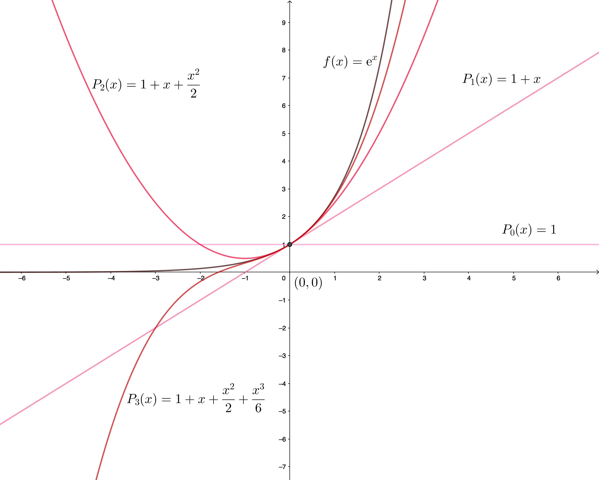

```{r setup, include=FALSE}
knitr::opts_chunk$set(echo = TRUE)
reticulate::use_python("/usr/bin/python")
#reticulate::py_install("sympy")
```

# Preliminares

## Introducción

* En este capítulo vamos a recordar un conjunto de **preliminares matemáticos** con el **cálculo matemático** que vamos a utilizar durante el curso.

* Un conocimiento sólido de cálculo es esencial para comprender el análisis de las técnicas numéricas.

## Introducción

* Concretamente veremos un repaso de los conceptos y resultados matemáticos siguientes:
    * **Límite** de una función en un punto.
    * Límite de una **sucesión**.
     * **Continuidad**.
        * Teorema de **Bolzano** y su versión generalizada.
    * **Diferenciabilidad**:
        * Teorema de **Rolle**.
        * Teorema del **Valor medio**.
        * Teorema de los **valores extremos**.
        * Teorema de **Rolle** generalizado.
        * Teorema del **valor intermedio**.

## Introducción
*
    * **Integración**.
        * Teorema del **valor medio para integrales**.
    * Teorema de Taylor.

# Límites y continuidad

## Límite de una función en un punto
<l class="definition"> Definición de límite de una función en un punto.</l>
Sea $f$ definida en un conjunto $D\subseteq\mathbb{R}$ y $x_0\in D$. Diremos que el límite de la función $f$ es $L$ cuando $x$ tiende a $x_0$, escribiendo:
$$
\lim_{x\to x_0} f(x)=L,
$$
si dado cualquier valor $\epsilon >0$, existe un valor real $\delta >0$ tal que si $x$ verifica que $0<|x-x_0|<\delta$, entonces $|f(x)-L|<\epsilon$.

## Límite de una función en un punto
<div class="center">
```{r, echo=FALSE, out.width="50%",  fig.cap="Límite de una función en un punto."}
knitr::include_graphics("01Preliminares_files/limitefx.png")
```
</div>


## Continuidad
<l class="definition"> Definición de continuidad de una función en un punto.</l>
Sea $f$ definida en un conjunto $D\subseteq\mathbb{R}$ y $x_0\in D$. Diremos que la función $f(x)$ es **continua** en el punto $x_0$ si 
$$
\lim_{x\to x_0} f(x)=f(x_0).
$$
En general, una función $f(x)$ es **continua** en todo el **dominio** $D$ si es continua en cualquier punto $x\in D$.

El conjunto formado por las funciones $f(x)$ que son **continuas** en un determinado dominio $D$ se denota por ${\cal C}(D)$.


## Límite de una sucesión
<l class="definition"> Definición de límite de una sucesión.</l>
Sean $(x_n)_{n=1}^\infty$ una **sucesión de números reales**. Diremos que el límite de la sucesión anterior vale $x$ y escribiremos:
$$
\lim_{n\to\infty}x_n =x,
$$
si para todo valor $\epsilon >0$, existe un valor $n_0$ tal que para todo valor $n\geq n_0$, todos los elementos de la sucesión $x_n$ están en el intervalo $(x-\epsilon,x+\epsilon)$, es decir, $|x_n-x|<\epsilon$.

## Ejemplo
<div class="example">
Consideremos la sucesión $x_n=1+\frac{1}{n}$. Tenemos que $\displaystyle\lim_{n\to\infty}1+\frac{1}{n}=1$. Veámoslo:

sea $\epsilon >0$, hemos que hallar un valor $n_0$ tal que si $n\geq n_0$, $|x_n-1|=\left|1+\frac{1}{n}-1\right|=\frac{1}{n}<\epsilon$.

Consideremos como valor $n_0$ el primer entero que supera $\frac{1}{\epsilon}$, es decir $n_0 >\frac{1}{\epsilon}$.

Así, si $n\geq n_0$, se cumplirá que $\frac{1}{n}\leq \frac{1}{n_0}<\epsilon$, tal como queríamos ver.

</div>

## Continuidad y límite de sucesiones
<l class="prop"> Teorema. </l>
Sea $f$ una función definida en un dominio $D\subseteq\mathbb{R}$ y $x_0\in D$. Entonces, las siguientes afirmaciones son equivalentes:

* $f$ es **continua** en $x_0$,
* Si $(x_n)_{n=1}^\infty$ es una **sucesión de números reales** con límite $x_0$, entonces $\displaystyle\lim_{n\to\infty} f(x_n)=f(x_0)$. 

## Ejemplo
<div class="example">

Veamos usando el teorema anterior que la función $f(x)=\sin\left(\frac{1}{x}\right)$, si $x\neq 0$ y $f(0)=0$, no es continua en $x_0=0$. 

Para verlo, construiremos dos sucesiones $x_n$ e $y_n$, ambas con $\displaystyle\lim_{n\to \infty}x_n =\lim_{n\to\infty}y_n=0$, pero $\displaystyle\lim_{n\to\infty}f(x_n)\neq \lim_{n\to\infty}f(y_n)$. Como debe verificarse que para toda sucesión $z_n$ con $\displaystyle\lim_{n\to \infty}z_n =0$, $\displaystyle\lim_{n\to\infty}f(z_n)=f(0)$, llegamos a una contradicción.

Sea $x_n =\frac{1}{\pi n}$. La sucesión $x_n$ cumple $\displaystyle\lim_{n\to \infty}x_n=0$ pero  $\displaystyle\lim_{n\to \infty} f(x_n)=\lim_{n\to \infty} \sin\left(\frac{1}{x_n}\right)=\lim_{n\to \infty} \sin\left(\frac{1}{\frac{1}{\pi n}}\right)=\lim_{n\to \infty}\sin (\pi n)=0.$

Sea ahora $y_n=\frac{1}{\frac{\pi}{2}+2\pi n}$. La sucesión $y_n$ cumple $\displaystyle\lim_{n\to \infty}y_n=0$ pero  $\displaystyle\lim_{n\to \infty} f(y_n)=\lim_{n\to \infty} \sin\left(\frac{1}{y_n}\right)=\lim_{n\to \infty} \sin\left(\frac{1}{\frac{1}{\frac{\pi}{2}+2\pi n}}\right)=\lim_{n\to \infty}\sin \left(\frac{\pi}{2}+2\pi n\right)=1.$


</div>

## Continuidad
<l class="prop">Teorema de Bolzano.</l>

Sea $f:[a,b]\longrightarrow \mathbb{R}$ una función continua tal que $f(a)\cdot f(b)<0$. Entonces existe un punto $c\in (a,b)$ tal que $f(c)=0$.

<l class="prop">Teorema de Bolzano generalizado.</l>

Sea $f:[a,b]\longrightarrow \mathbb{R}$ una función continua. Sean $x_1,\ldots,x_k$, $k$ puntos en el intervalo $[a,b]$. Sean $\alpha_1,\ldots,\alpha_k$, $k$ valores estrictamente positivos con $\alpha =\displaystyle\sum_{i=1}^k \alpha_i$. Entonces existe un valor $x\in <x_1,\ldots,x_k>$ (mínimo intervalo que contiene los puntos $x_1,\ldots,x_k$) tal que
$$
\sum_{i=1}^k \alpha_i f(x_i)=\alpha f(x).
$$

## Continuidad
<div class="dem">
**Demostración**

Consideramos la función $\displaystyle g(x)=\sum_{i=1}^k \alpha_i f(x_i)-\alpha f(x)$.

Sea el punto $x_m$ tal que 
$$
f(x_m)=\min_{i=1,\ldots,k} f(x_i),
$$ 
y $x_M$ tal que
$$
f(x_M)=\max_{i=1,\ldots,k} f(x_i).
$$ 
Entonces,
$$
g(x_m)=\sum_{i=1}^k \alpha_i f(x_i)-\alpha f(x_m)\geq \sum_{i=1}^k \alpha_i f(x_m)-\alpha f(x_m)=0.
$$

</div>

## Continuidad
<div class="dem">
**Demostración** (continuación)

Si $g(x_m)=0$ ya hemos acabado, el punto $x$ buscado sería $x=x_m$ ya que, en este caso:
$$
\sum_{i=1}^k \alpha_i f(x_i)=\alpha f(x_m).
$$
Supongamos que estamos en el otro caso, es decir $g(x_m)>0$.

El valor de $g(x_M)$ cumple:
$$
g(x_M)=\sum_{i=1}^k \alpha_i f(x_i)-\alpha f(x_M)\leq \sum_{i=1}^k \alpha_i f(x_M)-\alpha f(x_M)=0.
$$

Si $g(x_M)=0$ ya hemos acabado, el punto $x$ buscado sería $x=x_M$ ya que, en este caso:
$$
\sum_{i=1}^k \alpha_i f(x_i)=\alpha f(x_M).
$$
Supongamos que estamos en el otro caso, es decir $g(x_M)<0$.

</div>


## Continuidad
<div class="dem">
**Demostración** (continuación)

Como $g(x_m)>0$ y $g(x_M)<0$, aplicando el **Teorema de Bolzano** a la función $g(x)$, tenemos que existe un valor $x\in <x_m,x_M>$ tal que $g(x)=0$ o, dicho en otras palabras,
$$
\sum_{i=1}^k \alpha_i f(x_i)=\alpha f(x).
$$
</div>

<l class="observ">Observación.</l>

Aplicando el Teorema anterior, suponiendo que la función $f$ es continua y $x_1$ y $x_2$ son valores dentro del intervalo de definición de $f$, podemos afirmar que existen valores $x_3$ y $x_4$ tales que:

$$
\begin{align*}
f(x_1)+f(x_2)=& 2f(x_3),\\
\frac{2}{3}f(x_1)+\frac{5}{4}f(x_2)= & \frac{23}{12} f(x_4).
\end{align*}
$$

# Derivabilidad

## Introducción
Para definir funciones *suaves* necesitamos el concepto de diferenciabilidad:


<l class="definition"> Definición de derivada en un punto. </l>
Sea $f:(a,b)\longrightarrow \mathbb{R}$ una función real de variable real. Sea $x_0\in (a,b)$. Diremos que $f$ es **derivable** en $x_0$ o que **existe la derivada de $f$ en $x_0$** cuando existe el límite siguiente:
$$
\lim_{x\to x_0}\frac{f(x)-f(x_0)}{x-x_0},
$$
y, en caso en que exista, llamaremos a dicho límite **derivada de la función $f$ en $x_0$** escrita matemáticamente como $f'(x_0)$.

## Derivabilidad
<div class="center">
```{r, echo=FALSE, out.width="50%",  fig.cap="Derivada de una función en un punto."}
knitr::include_graphics("01Preliminares_files/derivada1.png")
```
</div>

## Relación derivabilidad y continuidad
<l class="prop"> Teorema. </l>
Sea $f$ una función definida en un dominio $D\subseteq\mathbb{R}$ y $x_0\in D$. Entonces, si $f$ es derivable en $x_0$, $f$ es continua en $x_0$.

El conjunto formado por las funciones que son $n$ veces **derivables** en un dominio $D\subseteq\mathbb{R}$ se denota por ${\cal C}^n (D)$. 

El conjunto formado por las funciones que admiten cualquier **derivada** en un dominio $D\subseteq\mathbb{R}$ se denota por ${\cal C}^\infty (D)$. 

## Teoremas de Rolle y del valor medio
Los teoremas que vienen a continuación son claves para estimar el **error** cometido al evaluar funciones reales de variable real.

<l class="prop">Teorema de Rolle. </l>
Suponga que $f\in {\cal C}([a,b])$ y $f$ es derivable en $(a,b)$. Si $f(a)=f(b)$, entonces existe un número $c$ en $(a,b)$ tal que $f'(c)=0$.

## Teoremas de Rolle y del valor medio

<div class="center">
```{r, echo=FALSE,fig.cap="Teorema de Rolle",out.width = "50%"}
knitr::include_graphics("01Preliminares_files/Rolle.png")
```
</div>

## Ejemplo
<div class="example">

Consideremos la función $f(x)=\sin x$ definida en el intervalo $[0,\pi]$. 

Tenemos que $f(0)=f(\pi)=0$. 

Por tanto existe un punto $c\in (0,\pi)$ tal que $f'(c)=\cos c=0$. 

Este punto $c$ vale $c=\frac{\pi}{2}$ ya que $\cos\left(\frac{\pi}{2}\right)=0$.
</div>

## Teoremas de Rolle y del valor medio
<l class="prop">Teorema del valor medio. </l>
Supongamos que $f\in {\cal C}([a,b])$ y $f$ es derivable en $(a,b)$. 

Si $f(a)=f(b)$, entonces existe un número $c$ en $(a,b)$ tal que $f'(c)=\frac{f(b)-f(a)}{b-a}$.

## Teoremas de Rolle y del valor medio

<div class="center">
```{r, echo=FALSE, fig.cap="Teorema del valor medio",out.width = "50%"}
knitr::include_graphics("01Preliminares_files/ValorMedio1.png")
```
</div>


## Ejemplo
<div class="example">

Consideremos la función $f(x)=x^2 \sin x$ definida en el intervalo $\left[-\frac{\pi}{2},\frac{\pi}{2}\right]$. 

Por tanto existe un punto $c\in \left(-\frac{\pi}{2},\frac{\pi}{2}\right)$ tal que 
$$
f'(c)=\frac{f\left(\frac{\pi}{2}\right)-f\left(-\frac{\pi}{2}\right)}{\frac{\pi}{2}-\left(-\frac{\pi}{2}\right)}=\frac{\frac{\pi^2}{4}+\frac{\pi^2}{4}}{\pi}=\frac{\frac{\pi^2}{2}}{\pi}=\frac{\pi}{2}.
$$ 

Usando que $f'(c)=2c\sin c+c^2\cos c=\frac{\pi}{2}$, el valor de $c$ será un cero de la ecuación $2c\sin c+c^2\cos c-\frac{\pi}{2}=0$.

Durante el curso veremos técnicas para hallar soluciones aproximadas de ecuaciones de este tipo. Hay dos valores de $c$ en el intervalo $\left(-\frac{\pi}{2},\frac{\pi}{2}\right)$ que cumplen la condición anterior y valen aproximadamente $c\approx\pm 0.792863$.
</div>

## Teorema de los valores extremos
<l class="prop">Teorema de los valores extremos. </l>
Sea $f\in {\cal C}([a,b])$. Entonces existen dos valores $c_1,c_2\in [a,b]$  tal que los valores de $f(x)$ para todo $x\in [a,b]$ están entre $f(c_1)$ y $f(c_2)$, es decir $f(c_1)\leq f(x)\leq f(c_2)$, para cualquier $x\in [a,b]$. Además, si $f$ es derivable en $(a,b)$, los valores $c_1$ y $c_2$, o están en los extremos del intervalo, (es decir, $c_i=a$ o $c_i=b$, con $i=1,2$), o son extremos relativos de la función $f$ y, por tanto $f'(c_1)=f'(c_2)=0$.

## Teorema de los valores extremos

<div class="center">
```{r, echo=FALSE,fig.cap="Teorema de los valores extremos",out.width = "50%"}
knitr::include_graphics("01Preliminares_files/ValoresExtremos.png")
```
</div>

## Teorema de Rolle generalizado
El siguiente teorema se demuestra aplicando sucesivamente el **Teorema de Rolle** a las funciones $f,\ f',\ldots,f^{(n-1)}$:

<l class="prop">Teorema de Rolle generalizado. </l>
Sea $f\in {\cal C}^n ([a,b])$. Supongamos que existen $a\leq x_0 < x_1 < \cdots < x_{n}\leq b$, $n+1$ puntos distintos en el intervalo $[a,b]$ con $f(x_i)=0$, $i=0,1,\ldots,n$. Entonces existe un punto $c\in (x_0,x_n)$ tal que $f^{(n)}(c)=0$, es decir, la derivada $n$-ésima en el punto $c$ se anula.

## Teorema de Rolle generalizado.
<div class="dem">
**Demostración**.

Para demostrar el **Teorema de Rolle generalizado** hay que aplicar el Teorema de Rolle a las funciones $f,\ f',\ldots, f^{(n-1)}$ en el sentido siguiente:

* Paso $1$: como $f(x_0)=f(x_1)=\cdots =f(x_n)=0$, aplicando el Teorema de Rolle a la función $f$, existen $x_1^{(1)}<x_2^{(1)}<\cdots <x_{n}^{(1)}$, $n$ puntos en los que $f'(x_i^{(1)})=0$, $i=1,\ldots, n$.
* Paso $2$: como $f'(x_1^{(1)})=f'(x_2^{(1)})=\cdots =f'(x_n^{(1)})=0$, aplicando el Teorema de Rolle a la función $f'$, existen $x_1^{(2)}<x_2^{(2)}<\cdots <x_{n-1}^{(2)}$, $n-1$ puntos en los que $f''(x_i^{(2)})=0$, $i=1,\ldots, n-1$.
* Y así sucesivamente hasta llegar al paso $n$,...
* Paso $n$: como $f^{(n-1)}(x_1^{(n-1)})=f^{(n-1)}(x_2^{(n-1)})=0$, aplicando el Teorema de Rolle a la función $f^{(n-1)}$, existe un valor $c=x_1^{(n)}$ tal que $f^{(n)}(c)=0$, tal como queríamos demostrar.


</div>

## Ejemplo

<div class="example">

Consideremos la función $f(x)=(x-x_0) (x-x_1) (x-x_2) (x-x_3)$, con $x_0<x_1<x_2<x_3$ definida en el intervalo $\left[x_0,x_3\right]$. 

Como $f(x_0)=f(x_1)=f(x_2)=f(x_3)=0$, existirá un punto $c\in (x_0,x_3)$ tal que $f'''(c)=0$. Veamos cuál es este punto $c$.

El valor de $f'''(x)$ vale:
$$
f'''(x)=24 x-6(x_0+x_1+x_2+x_3).
$$
Haciendo $f'''(c)=0$, tenemos que el valor $c$ vale: $\displaystyle c=\frac{x_0+x_1+x_2+x_3}{4}$.

</div>

## Teorema del valor intermedio
El **Teorema del valor intermedio** nos dice que si una función es continua, dicha función alcanza todos los valores entre $f(a)$ y $f(b)$:

<l class="prop">Teorema del valor intermedio. </l>
Suponga que $f\in {\cal C}([a,b])$ y $k$ es cualquier valor entre $f(a)$ y $f(b)$, entonces existe un número $c$ en $(a,b)$ tal que $f(c)=k$.


## Ejemplo
<div class="example">

Consideremos la función anterior $f(x)=x^2 \sin x$ definida en el intervalo $\left[-\frac{\pi}{2},\frac{\pi}{2}\right]$. 

Tenemos que $f\left(-\frac{\pi}{2}\right)=-\frac{\pi^2}{4}$, $f\left(\frac{\pi}{2}\right)=\frac{\pi^2}{4}$.

El **Teorema del valor intermedio** nos dice que para cualquier $k\in\left(-\frac{\pi^2}{4},\frac{\pi^2}{4}\right)$, existe un valor $c\in \left(-\frac{\pi}{2},\frac{\pi}{2}\right)$ tal que $f(c)=c^2\sin c=k$. 

* Por ejemplo, si $k=0$, el valor de $c$ sería $c=0$; 
* si $k=\frac{\pi}{2}\in \left(-\frac{\pi^2}{4},\frac{\pi^2}{4}\right)$, existe un valor $c\in\left(-\frac{\pi}{2},\frac{\pi}{2}\right)$ tal que $c^2\sin c=\frac{\pi}{2}$. 

Dicho valor se tiene que hallar usando métodos numéricos, concretamente usando técnicas de **cálculo aproximado de ceros de funciones** como veremos más adelante. 

</div>

# Integración

## Integración de Riemann
La integral de Riemann se define básicamente para formalizar el cálculo de áreas de funciones:

<l class="prop">Definición de integral de Riemann. </l>
Sea $f:[a,b]\longrightarrow\mathbb{R}$ una función real de variable real. Diremos que la **integral de Riemann** de la función $f$ existe en el intervalo $[a,b]$ si el límite siguiente existe y escribiremos:
$$
\int_a^b f(x)\, dx =\lim_{\delta(P)\to 0}\sum_{i=1}^{n} f(z_i)\cdot (x_i-x_{i-1}).
$$
donde $P=\{a=x_0<x_1<\cdots <x_n=b\}$ es una partición del intervalo $[a,b]$, $\delta(P)=\max_{i=1,\ldots,n}(x_i-x_{i-1})$ es el llamado **diámetro de la partición** y $z_i$ es un valor cualquiera entre $x_{i-1}$ y $x_i$, $z\in [x_{i-1},x_i]$.

## Integración de Riemann

Para ver si una función es integrable se definen las **sumas superiores** y las **sumas inferiores** asociadas a una partición y si el **ínfimo** de las primeras coincide con el **supremo** de las segundas, la función es integrable.

<l class="prop">Teorema. </l>

Si una función es **continua** en un intervalo $[a,b]$, es **integrable** en dicho intervalo.

## Integración de Riemann

```{r echo=FALSE}
#
# This is a Shiny web application. You can run the application by clicking
# the 'Run App' button above.
#
# Find out more about building applications with Shiny here:
#
#    http://shiny.rstudio.com/
#

# Define UI for application that draws a histogram
ui <- fluidPage(

    # Application title
    titlePanel("Área de una curva"),

    # Sidebar with a slider input for number of bins 
    sidebarLayout(
        sidebarPanel(
            sliderInput(inputId = "x0",
                        label="valor de x:",
                        min = 1,
                        max = 50,
                        step = 1,
                        value = 2,
                        animate = animationOptions(interval = 300, loop = TRUE))
        ),

        # Show a plot of the generated distribution
        mainPanel(
           plotOutput("grafico")
        )
    )
)

# Define server logic required to draw a histogram
server <- function(input, output) {

    output$grafico <- renderPlot({
        # generate bins based on input$bins from ui.R
        # x0 <- seq(0,5,0.1)

        # draw the histogram with the specified number of bins
        xmin=0
        xmax=10
        ymin=0
        ymax=10
        tolx=0.01*(xmax-xmin)
        toly=0.05*(ymax-ymin)
        quantsx=10
        quantsy=10
        f = function(x){-(1/2.5)*x*(x - 10)}
        plot(c(xmin-tolx,xmax+tolx,xmin-tolx,xmax+tolx),c(ymin-toly,ymin-toly,ymax+toly,ymax+toly),type="n",xlab="",ylab="",xaxt="n",
             yaxt="n",axes=FALSE)
        x=seq(from=0,to=10,length.out = input$x0)
        x2=seq(from=0,to=10,by=0.01)
        #points(x,f(x),type="l")
        lines(c(0,0),c(ymin,ymax))
        lines(c(xmin,xmax),c(0,0))
        text(xmax-tolx,-15*tolx,"x")
        text(toly/10,ymax+toly/2,"y")
        for (i in 0:(quantsx)){
            if(xmin+((xmax-xmin)/quantsx)*i != 0){
                lines(rep(xmin+((xmax-xmin)/quantsx)*i,2),c(-0.15*toly,+0.15*toly))
        #             text(xmin+((xmax-xmin)/quantsx)*i,-1*toly,xmin+((xmax-xmin)/quantsx)*i,cex=0.75)
             }
         }
        
        for (i in 0:(quantsy)){
            lines(c(-tolx/2,tolx/2),ymin+rep(((ymax-ymin)/quantsy)*i,2))
    #         text(-1.5*tolx,ymin+((ymax-ymin)/quantsy)*i,ymin+((ymax-ymin)/quantsy)*i,cex=0.75)
        }
        lines(x2,f(x2))
        for (i in 1:(length(x)-1)){
            rect(x[i],0,x[i+1],min(f(x[i]),f(x[i+1])),lty="solid",col="red")
        }
       
        # for (j in 1:length(x)){
        #     lines(c(x[j],x[j]),c(0,f(x[j])),col="green")
        # }
        # text(x[1],-3*toly,"x",cex=2,col="red")
        # text(x[length(x)],-3*toly,expression(x^2),cex=2,col="red")
    },  height = 500, width = 600
   )
}

# Run the application 
shinyApp(ui = ui, server = server)

```

## Integración de Riemann

```{r echo=FALSE}
#
# This is a Shiny web application. You can run the application by clicking
# the 'Run App' button above.
#
# Find out more about building applications with Shiny here:
#
#    http://shiny.rstudio.com/
#

# Define UI for application that draws a histogram
ui <- fluidPage(

    # Application title
    titlePanel("Área de una curva"),

    # Sidebar with a slider input for number of bins 
    sidebarLayout(
        sidebarPanel(
            sliderInput(inputId = "x0",
                        label="valor de x:",
                        min = 1,
                        max = 50,
                        step = 1,
                        value = 2,
                        animate = animationOptions(interval = 300, loop = TRUE))
        ),

        # Show a plot of the generated distribution
        mainPanel(
           plotOutput("grafico")
        )
    )
)

# Define server logic required to draw a histogram
server <- function(input, output) {

    output$grafico <- renderPlot({
        # generate bins based on input$bins from ui.R
        # x0 <- seq(0,5,0.1)

        # draw the histogram with the specified number of bins
        xmin=0
        xmax=10
        ymin=0
        ymax=10
        tolx=0.01*(xmax-xmin)
        toly=0.05*(ymax-ymin)
        quantsx=10
        quantsy=10
        f = function(x){-(1/2.5)*x*(x - 10)}
        plot(c(xmin-tolx,xmax+tolx,xmin-tolx,xmax+tolx),c(ymin-toly,ymin-toly,ymax+toly,ymax+toly),type="n",xlab="",ylab="",xaxt="n",
             yaxt="n",axes=FALSE)
        x=seq(from=0,to=10,length.out = input$x0)
        x2=seq(from=0,to=10,by=0.01)
        #points(x,f(x),type="l")
        lines(c(0,0),c(ymin,ymax))
        lines(c(xmin,xmax),c(0,0))
        text(xmax-tolx,-15*tolx,"x")
        text(toly/10,ymax+toly/2,"y")
        for (i in 0:(quantsx)){
            if(xmin+((xmax-xmin)/quantsx)*i != 0){
                lines(rep(xmin+((xmax-xmin)/quantsx)*i,2),c(-0.15*toly,+0.15*toly))
        #             text(xmin+((xmax-xmin)/quantsx)*i,-1*toly,xmin+((xmax-xmin)/quantsx)*i,cex=0.75)
             }
         }
        
        for (i in 0:(quantsy)){
            lines(c(-tolx/2,tolx/2),ymin+rep(((ymax-ymin)/quantsy)*i,2))
    #         text(-1.5*tolx,ymin+((ymax-ymin)/quantsy)*i,ymin+((ymax-ymin)/quantsy)*i,cex=0.75)
        }
        lines(x2,f(x2))
        for (i in 1:(length(x)-1)){
            rect(x[i],0,x[i+1],max(f(x[i]),f(x[i+1])),density=25,col="green")
        }
       
        # for (j in 1:length(x)){
        #     lines(c(x[j],x[j]),c(0,f(x[j])),col="green")
        # }
        # text(x[1],-3*toly,"x",cex=2,col="red")
        # text(x[length(x)],-3*toly,expression(x^2),cex=2,col="red")
    },  height = 500, width = 600
   )
}

# Run the application 
shinyApp(ui = ui, server = server)

```


## Teorema del valor medio para integrales
El **Teorema del valor medio para integrales** nos transforma la integral del producto de dos funciones en la integral de una sola función. Este Teorema nos será útil cuando tratemos de estimar los errores cometidos en las **fórmulas de integración númerica.**

<l class="prop">Teorema del valor medio para integrales. </l>
Supongamos que $f\in {\cal C}([a,b])$ y $g:[a,b]\longrightarrow \mathbb{R}$ es una función integrable en $[a,b]$. Supongamos además que la función $g(x)$ no cambia su signo en el intervalo $[a,b]$. Entonces, existe un valor $c\in (a,b)$ tal que:
$$
\int_a^b f(x) g(x)\, dx=f(c)\cdot \int_a^b g(x)\, dx.
$$

## Teorema del valor medio para integrales
<l class="observ">Observación. </l>

En el caso en que $g(x)=1$ para todo $x\in [a,b]$, el teorema anterior es el **Teorema clásico del valor medio para integrales**: existe un valor $c\in (a,b)$ tal que:
$$
\int_a^b f(x)\, dx=f(c)\cdot \int_a^b 1\, dx=f(c)\cdot (b-a),\ \Rightarrow f(c)=\frac{1}{b-a}\int_a^b f(x)\, dx.
$$

# Fórmula de Taylor

## Teorema de Taylor y polinomios de Taylor
Los polinomios de Taylor nos dan una manera de aproximar una función $f$ por un polinomio en un entorno de un punto $x_0$ del dominio de $f$.

<l class="prop">Teorema de Taylor. </l>
Supongamos que $f\in {\cal C}^n([a,b])$ para un cierto natural $n$, tal que $f^{(n+1)}$ existe en el intervalo $[a,b]$. Sea $x_0\in [a,b]$. Para cada $x\in [a,b]$ existe un valor $\xi(x)$ entre los valores $x_0$ y $x$, $\xi(x)\in <x_0,x>$ tal que:
$$
f(x)=P_n(x)+R_n(x),
$$

## Teorema de Taylor y polinomios de Taylor
donde $P_n(x)$ es el llamado polinomio de Taylor de grado $n$ de $f$ alrededor de $x=x_0$:
$$
\begin{aligned}
P_n(x)  = & f(x_0)+f'(x_0)(x-x_0)+\frac{f''(x_0)}{2}(x-x_0)^2+\cdots \\ & +\frac{f^{(n)}(x_0)}{n!}(x-x_0)^n  =\sum_{k=0}^n \frac{f^{(k)}(x_0)}{k!}(x-x_0)^k,
\end{aligned}
$$
con $f^{(0)}=f$ y el error $R_n(x)$ se puede expresar como:
$$
R_n(x)=\frac{f^{(n+1)}(\xi(x))}{(n+1)!}(x-x_0)^{n+1}.
$$

## Teorema de Taylor y polinomios de Taylor
El polinomio $P_n(x)$ es el llamado **polinomio de Taylor** para $f$ de grado $n$ alrededor de $x_0$ y $R_n(x)$ es el **término del error**, es decir, el error cometido, en la aproximación de $f(x)$ por $P_n(x)$ para $x$ en un entorno de $x_0$.

En el caso en que $x_0=0$, el polinomio de Taylor se llama **polinomio de Maclaurin** o **desarollo de Maclaurin** de la función $f$ alrededor de $x_0$.

## Ejemplo: cálculo de $\mathrm{e}$
<div class="example">

Vamos a calcular $\mathrm{e}$ con 6 cifras decimales exactas.

Para ello vamos a calcular el polinomio de Taylor de la función $f(x)=\mathrm{e}^x$ para $x_0=0$, $P_n(x)$ y aproximaremos $f(1)=\mathrm{e}$ por $P_n(1)$ cometiendo un error menor que $0.000001$.

Para calcular el polinomio de Taylor de $f(x)=\mathrm{e}^x$, hemos de calcular $f^{k}(x)$ para cualquier valor $k$ natural. En este caso, observamos que $f^{(k)}(x)=\mathrm{e}^x$ siempre vale lo mismo. Por tanto:
$$
P_n(x)=\sum_{k=0}^n \frac{f^{(k)}(0)}{k!}\cdot x^k = \sum_{k=0}^n \frac{x^k}{k!},
$$
ya que $f^{(k)}(0)=\mathrm{e}^0=1.$

Seguidamente vamos a calcular el valor que $n$ que nos asegure que el error cometido para $x=1$ usando la expresión anterior $P_n(1)$ en lugar de $f(1)=\mathrm{e}$ es menor que $e=0.000001$.
</div>


## Ejemplo (continuación)
<div class="example">
Recordemos la expresión de la fórmula del error:
$$
|f(x)-P_n(x)|=|R_n(x)|=\left|\frac{f^{n+1}(c)}{(n+1)!}\cdot x^{n+1}\right|\leq \max_{c\in <0,x>}\left|f^{n+1}(c)\right|\cdot \frac{|x|^{n+1}}{(n+1)!}.
$$
La expresión anterior para $x=1$ vale:
$$
\begin{array}{rl}
|f(1)-P_n(1)| & =|R_n(1)|=\left|\frac{f^{n+1}(c)}{(n+1)!}\cdot 1^{n+1}\right|\leq \max_{c\in (0,1)}\left|f^{n+1}(c)\right|\cdot \frac{1}{(n+1)!}=\max_{c\in (0,1)}\mathrm{e}^c\cdot \frac{1}{(n+1)!}\\ & =\frac{\mathrm{e}}{(n+1)!}.
\end{array}
$$
En la última igualdad hemos usado que la función $f(x)=\mathrm{e}^x$ es creciente y por tanto $\displaystyle\max_{c\in (0,1)}\mathrm{e}^c=\mathrm{e}^1=\mathrm{e}$.

Vemos que la cota del error depende del valor de $\mathrm{e}$ que es precisamente el valor que queremos calcular.

No sabemos el valor exacto de $\mathrm{e}$ pero podemos usar que es menor que $3$: $\mathrm{e}<3$.

La cota anterior será, pues:
$$
|f(1)-P_n(1)|=|R_n(1)|=\frac{\mathrm{e}}{(n+1)!}<\frac{3}{(n+1)!}.
$$

</div>

## Ejemplo (continuación)
<div class="example">
La función siguiente nos calcula la $n$ dado el error en `python`:
```{python}
import math
def ne(error):
 m=2
 while(3./math.factorial(m+1) >=error):
   m=m+1
 return(m)
```
El valor de $n$ para un error de $0.000001$ vale:
```{python}
ne(0.000001)
```
</div>

##  Ejemplo (continuación)
<div class="example">
El valor de $\mathrm{e}$ con 6 cifras decimales exactas será:
$$
\mathrm{e}\approx 1+1+\frac{1}{2!}+\frac{1}{3!}+\frac{1}{4!}+\frac{1}{5!}+\frac{1}{6!}+\frac{1}{7!}+\frac{1}{8!}+\frac{1}{9!}.
$$
Si calculamos su valor en `python`, obtenemos:
```{python}
valor_e_aproximado =1
for i in range(1,10):
  valor_e_aproximado=valor_e_aproximado+1./math.factorial(i)
valor_e_aproximado
```
Comprobamos que efectivamente tiene 6 cifras decimales exactas:
```{python}
math.exp(1)
```
</div>


##  Ejemplo (continuación)
<div class="center">
```{r, echo=FALSE, fig.cap="Polinomios de Maclaurin de la función exponencial",out.width = "50%"}

```
</div>