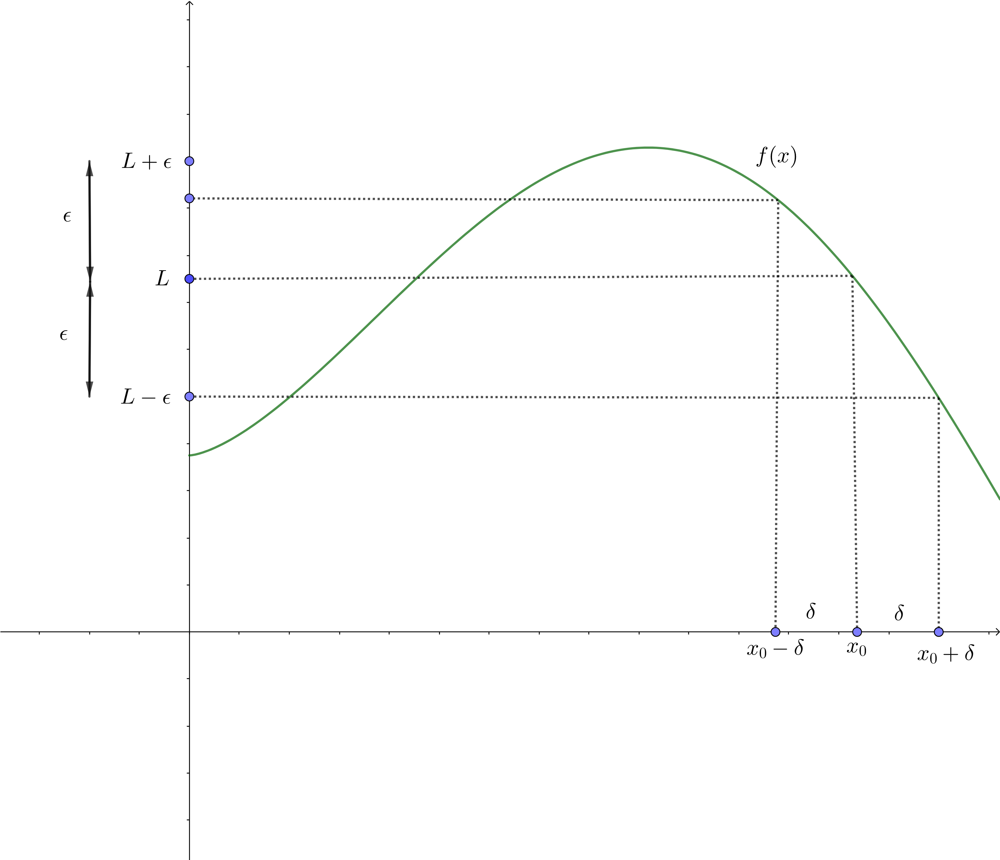
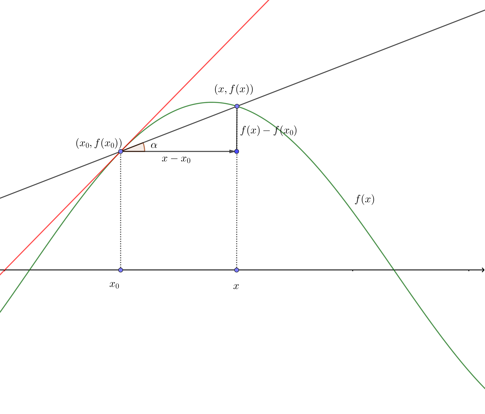
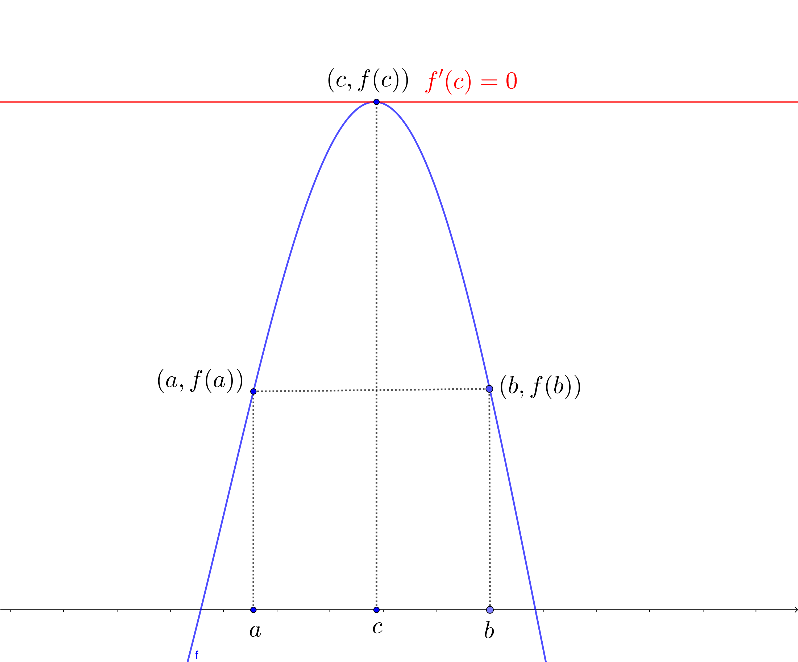
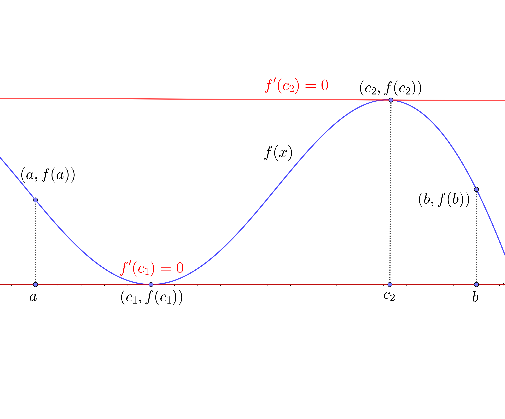

# Preliminares

## Introducción

* En este capítulo vamos a recordar un conjunto de **preliminares matemáticos** con el **cálculo matemático** que vamos a utilizar durante el curso.

* Un conocimiento sólido de cálculo es esencial para comprender el análisis de las técnicas numéricas.

## Introducción

* Concretamente veremos un repaso de los conceptos y resultados matemáticos siguientes:
    * **Límite** de una función en un punto.
    * **Continuidad**.
    * Límite de una **sucesión**.
    * **Diferenciabilidad**:
        * Teorema de **Rolle**.
        * Teorema del **Valor medio**.
        * Teorema de los **valores extremos**.
        * Teorema de **Rolle** generalizado.
        * Teorema del **valor intermedio**.

## Introducción
*
    * **Integración**.
        * Teorema del **valor medio para integrales**.
    * Teorema de Taylor.
    
## Límite de una función en un punto
<l class="definition"> Definición de límite de una función en un punto.</l>
Sea $f$ definida en un conjunto $D\subseteq\mathbb{R}$ y $x_0\in D$. Diremos que el límite de la función $f$ es $L$ cuando $x$ tiende a $x_0$, escribiendo:
$$
\lim_{x\to x_0} f(x)=L,
$$
si dado cualquier valor $\epsilon >0$, existe un valor real $\delta >0$ tal que si $x$ verifica que $0<|x-x_0|<\delta$, entonces $|f(x)-L|<\epsilon$.

## Límite de una función en un punto

Límite de una función en un punto

## Continuidad
<l class="definition"> Definición de continuidad de una función en un punto.</l>
Sea $f$ definida en un conjunto $D\subseteq\mathbb{R}$ y $x_0\in D$. Diremos que la función $f(x)$ es **continua** en el punto $x_0$ si 
$$
\lim_{x\to x_0} f(x)=f(x_0).
$$
En general, una función $f(x)$ es **continua** en todo el **dominio** $D$ si es continua en cualquier punto $x\in D$.

El conjunto formado por las funciones $f(x)$ que son **continuas** en un determinado dominio $D$ se denota por ${\cal C}(D)$.

## Límite de una sucesión
<l class="definition"> Definición de límite de una sucesión.</l>
Sean $(x_n)_{n=1}^\infty$ una **sucesión de números reales**. Diremos que el límite de la sucesión anterior vale $x$ y escribiremos:
$$
\lim_{n\to\infty}x_n =x,
$$
si para todo valor $\epsilon >0$, existe un valor $n_0$ tal que para todo valor $n\geq n_0$, todos los elementos de la sucesión $x_n$ están en el intervalo $(x-\epsilon,x+\epsilon)$, es decir, $|x_n-x|<\epsilon$.

## Límite de una sucesión

**Ejemplo**

Consideremos la sucesión $x_n=1+\frac{1}{n}$. Tenemos que $\displaystyle\lim_{n\to\infty}1+\frac{1}{n}=1$. Veámoslo:

sea $\epsilon >0$, hemos que hallar un valor $n_0$ tal que si $n\geq n_0$, $|x_n-1|=\left|1+\frac{1}{n}-1\right|=\frac{1}{n}<\epsilon$.

Consideremos como valor $n_0$ el primer entero que supera $\frac{1}{\epsilon}$, es decir $n_0 >\frac{1}{\epsilon}$.

Así, si $n\geq n_0$, se cumplirá que $\frac{1}{n}\leq \frac{1}{n_0}<\epsilon$, tal como queríamos ver.

## Continuidad y límite de sucesiones
<l class="prop"> Teorema. </l>
Sea $f$ una función definida en un dominio $D\subseteq\mathbb{R}$ y $x_0\in D$. Entonces, las siguientes afirmaciones son equivalentes:

* $f$ es **continua** en $x_0$,
* Si $(x_n)_{n=1}^\infty$ es una **sucesión de números reales** con límite $x_0$, entonces $\displaystyle\lim_{n\to\infty} f(x_n)=f(x_0)$. 

## Continuidad y límite de sucesiones

**Ejemplo**

Veamos usando el teorema anterior que la función $f(x)=\sin\left(\frac{1}{x}\right)$, si $x\neq 0$ y $f(0)=0$, no es continua en $x_0=0$. 

Para verlo, construiremos dos sucesiones $x_n$ e $y_n$, ambas con $\displaystyle\lim_{n\to \infty}x_n =\lim_{n\to\infty}y_n=0$, pero $\displaystyle\lim_{n\to\infty}f(x_n)\neq \lim_{n\to\infty}f(y_n)$. Como debe verificarse que para toda sucesión $z_n$ con $\displaystyle\lim_{n\to \infty}z_n =0$, $\displaystyle\lim_{n\to\infty}f(z_n)=f(0)$, llegamos a una contradicción.

Sea $x_n =\frac{1}{\pi n}$. La sucesión $x_n$ cumple $\displaystyle\lim_{n\to \infty}x_n=0$ pero  $\displaystyle\lim_{n\to \infty} f(x_n)=\lim_{n\to \infty} \sin\left(\frac{1}{x_n}\right)=\lim_{n\to \infty} \sin\left(\frac{1}{\frac{1}{\pi n}}\right)=\lim_{n\to \infty}\sin (\pi n)=0.$

Sea ahora $y_n=\frac{1}{\frac{\pi}{2}+2\pi n}$. La sucesión $y_n$ cumple $\displaystyle\lim_{n\to \infty}y_n=0$ pero  $\displaystyle\lim_{n\to \infty} f(y_n)=\lim_{n\to \infty} \sin\left(\frac{1}{y_n}\right)=\lim_{n\to \infty} \sin\left(\frac{1}{\frac{1}{\frac{\pi}{2}+2\pi n}}\right)=\lim_{n\to \infty}\sin \left(\frac{\pi}{2}+2\pi n\right)=1.$

## Derivabilidad
Para definir funciones *suaves* necesitamos el concepto de diferenciabilidad:

<l class="definition"> Definición de derivada en un punto. </l>
Sea $f:(a,b)\longrightarrow \mathbb{R}$ una función real de variable real. Sea $x_0\in (a,b)$. Diremos que $f$ es **derivable** en $x_0$ o que **existe la derivada de $f$ en $x_0$** cuando existe el límite siguiente:
$$
\lim_{x\to x_0}\frac{f(x)-f(x_0)}{x-x_0},
$$
y, en caso en que exista, llamaremos a dicho límite **derivada de la función $f$ en $x_0$** escrita matemáticamente como $f'(x_0)$.

## Derivabilidad

Derivada de una función en un punto

## Relación derivabilidad y continuidad
<l class="prop"> Teorema. </l>
Sea $f$ una función definida en un dominio $D\subseteq\mathbb{R}$ y $x_0\in D$. Entonces, si $f$ es derivable en $x_0$, $f$ es continua en $x_0$.

El conjunto formado por las funciones que son $n$ veces **derivables** en un dominio $D\subseteq\mathbb{R}$ se denota por ${\cal C}^n (D)$. 

El conjunto formado por las funciones que admiten cualquier **derivada** en un dominio $D\subseteq\mathbb{R}$ se denota por ${\cal C}^\infty (D)$. 

## Teoremas de Rolle y del valor medio
Los teoremas que vienen a continuación son claves para estimar el **error** cometido al evaluar funciones reales de variable real.

<l class="prop">Teorema de Rolle. </l>
Suponga que $f\in {\cal C}([a,b])$ y $f$ es derivable en $(a,b)$. Si $f(a)=f(b)$, entonces existe un número $c$ en $(a,b)$ tal que $f'(c)=0$.

## Teoremas de Rolle y del valor medio

Teorema de Rolle

## Teoremas de Rolle y del valor medio

**Ejemplo**

Consideremos la función $f(x)=\sin x$ definida en el intervalo $[0,\pi]$. 

Tenemos que $f(0)=f(\pi)=0$. 

Por tanto existe un punto $c\in (0,\pi)$ tal que $f'(c)=\cos c=0$. 

Este punto $c$ vale $c=\frac{\pi}{2}$ ya que $\cos\left(\frac{\pi}{2}\right)=0$.

## Teoremas de Rolle y del valor medio
<l class="prop">Teorema del valor medio. </l>
Suponga que $f\in {\cal C}([a,b])$ y $f$ es derivable en $(a,b)$. Si $f(a)=f(b)$, entonces existe un número $c$ en $(a,b)$ tal que $f'(c)=\frac{f(b)-f(a)}{b-a}$.

## Teoremas de Rolle y del valor medio

Teorema del valor medio

## Teoremas de Rolle y del valor medio

**Ejemplo**

Consideremos la función $f(x)=x^2 \sin x$ definida en el intervalo $\left[-\frac{\pi}{2},\frac{\pi}{2}\right]$. 

Por tanto existe un punto $c\in \left(-\frac{\pi}{2},\frac{\pi}{2}\right)$ tal que $f'(c)=\frac{f\left(\frac{\pi}{2}\right)-f\left(-\frac{\pi}{2}\right)}{\frac{\pi}{2}-\left(-\frac{\pi}{2}\right)}=\frac{\frac{\pi^2}{4}+\frac{\pi^2}{4}}{\pi}=\frac{\frac{\pi^2}{2}}{\pi}=\frac{\pi}{2}$. 

Usando que $f'(c)=2c\sin c+c^2\cos c=\frac{\pi}{2}$, el valor de $c$ será un cero de la ecuación $2c\sin c+c^2\cos c-\frac{\pi}{2}=0$.

Durante el curso veremos técnicas para hallar soluciones aproximadas de ecuaciones de este tipo. Hay dos valores de $c$ en el intervalo $\left(-\frac{\pi}{2},\frac{\pi}{2}\right)$ que cumplen la condición anterior y valen aproximadamente $c\approx\pm 0.792863$.

## Teorema de los valores extremos
<l class="prop">Teorema de los valores extremos. </l>
Sea $f\in {\cal C}([a,b])$. Entonces existen dos valores $c_1,c_2\in [a,b]$  tal que los valores de $f(x)$ para todo $x\in [a,b]$ están entre $f(c_1)$ y $f(c_2)$, es decir $f(c_1)\leq f(x)\leq f(c_2)$, para cualquier $x\in [a,b]$. Además, si $f$ es derivable en $(a,b)$, los valores $c_1$ y $c_2$, o están en los extremos del intervalo, (es decir, $c_i=a$ o $c_i=b$, con $i=1,2$), o son extremos relativos de la función $f$ y, por tanto $f'(c_1)=f'(c_2)=0$.

## Teorema de los valores extremos

Teorema de los valores extremos

## Teorema de Rolle generalizado
El siguiente teorema se demuestra aplicando sucesivamente el **Teorema de Rolle** a las funciones $f,\ f',\ldots,f^{(n-1)}$:

<l class="prop">Teorema de Rolle generalizado. </l>
Suponga que $f\in {\cal C}^n ([a,b])$. Supongamos que existen $a\leq x_0 < x_1 < \cdots < x_{n}\leq b$, $n+1$ puntos distintos en el intervalo $[a,b]$ con $f(x_i)=0$, $i=0,1,\ldots,n$. Entonces existe un punto $c\in (x_0,x_n)$ tal que $f^{(n)}(c)=0$, es decir, la derivada $n$-ésima en el punto $c$ se anula.

## Teorema de Rolle generalizado.

**Demostración**.

Para demostrar el **Teorema de Rolle generalizado** hay que aplicar el Teorema de Rolle a las funciones $f,\ f',\ldots, f^{(n-1)}$ en el sentido siguiente:

* Paso $1$: como $f(x_0)=f(x_1)=\cdots =f(x_n)=0$, aplicando el Teorema de Rolle a la función $f$, existen $x_1^{(1)}<x_2^{(1)}<\cdots <x_{(n)}^{(1)}$, $n$ puntos en los que $f'(x_i^{(1)})=0$, $i=1,\ldots, n$.
* Paso $2$: como $f'(x_1^{(1)})=f(x_2^{(1)})=\cdots =f(x_n^{(1)})=0$, aplicando el Teorema de Rolle a la función $f'$, existen $x_1^{(2)}<x_2^{(1)}<\cdots <x_{(n-1)}^{(2)}$, $n$ puntos en los que $f''(x_i^{(2)})=0$, $i=1,\ldots, n-1$.
Y así sucesivamente hasta llegar al paso
* Paso $n$: como $f^{(n-1)}(x_1^{(n-1)})=f^{(n-1)}(x_2^{(n-1)})=0$, aplicando el Teorema de Rolle a la función $f^{(n-1)}$, existe un valor $c=x_1^{(n)}$ tal que $f^{(n)}(c)=0$, tal como queríamos demostrar.

## Teorema de Rolle generalizado

**Ejemplo**

Consideremos la función $f(x)=(x-x_0) (x-x_1) (x-x_2) (x-x_3)$, con $x_0<x_1<x_2<x_3$ definida en el intervalo $\left[x_0,x_3\right]$. 

Como $f(x_0)=f(x_1)=f(x_2)=f(x_3)=0$, existirá un punto $c\in (x_0,x_3)$ tal que $f'''(c)=0$. Veamos cuál es este punto $c$.

El valor de $f'''(x)$ vale:
$$
f'''(x)=24 x-6(x_0+x_1+x_2+x_3).
$$
Haciendo $f'''(c)=0$, tenemos que el valor $c$ vale: $\displaystyle c=\frac{x_0+x_1+x_2+x_3}{4}$.

## Teorema del valor intermedio
El **Teorema del valor intermedio** nos dice que si una función es continua, dicha función alcanza todos los valores entre $f(a)$ y $f(b)$:

<l class="prop">Teorema del valor intermedio. </l>
Suponga que $f\in {\cal C}([a,b])$ y $k$ es cualquier valor entre $f(a)$ y $f(b)$, entonces existe un número $c$ en $(a,b)$ tal que $f(c)=k$.

## Teorema del valor intermedio

**Ejemplo**

Consideremos la función anterior $f(x)=x^2 \sin x$ definida en el intervalo $\left[-\frac{\pi}{2},\frac{\pi}{2}\right]$. 

Tenemos que $f\left(-\frac{\pi}{2}\right)=-\frac{\pi^2}{4}$, $f\left(\frac{\pi}{2}\right)=\frac{\pi^2}{4}$.

El **Teorema del valor intermedio** nos dice que para cualquier $k\in\left(-\frac{\pi^2}{4},\frac{\pi^2}{4}\right)$, existe un valor $c\in \left(-\frac{\pi}{2},\frac{\pi}{2}\right)$ tal que $f(c)=c^2\sin c=k$. 

Por ejemplo, si $k=0$, el valor de $c$ sería $c=0$; si $k=\frac{\pi}{2}\in \left(-\frac{\pi^2}{4},\frac{\pi^2}{4}\right)$, existe un valor $c\in\left(-\frac{\pi}{2},\frac{\pi}{2}\right)$ tal que $c^2\sin c=\frac{\pi}{2}$. Dicho valor se tiene que hallar usando métodos numéricos, concretamente usando técnicas de **cálculo aproximado de ceros de funciones** como veremos más adelante. 

## Integración de Riemann
La integral de Riemann se define básicamente para formalizar el cálculo de áreas de funciones:

<l class="prop">Definición de integral de Riemann. </l>
Sea $f:[a,b]\longrightarrow\mathbb{R}$ una función real de variable real. Diremos que la **integral de Riemann** de la función $f$ existe en el intervalo $[a,b]$ si el límite siguiente existe y escribiremos:
$$
\int_a^b f(x)\, dx =\lim_{\delta(P)\to 0}\sum_{i=1}^{n} f(z_i)\cdot (x_i-x_{i-1}).
$$
donde $P=\{a=x_0<x_1<\cdots <x_n=b\}$ es una partición del intervalo $[a,b]$, $\delta(P)=\max_{i=1,\ldots,n}(x_i-x_{i-1})$ es el llamado **diámetro de la partición** y $z_i$ es un valor cualquiera entre $x_{i-1}$ y $x_i$, $z\in [x_{i-1},x_i]$.
