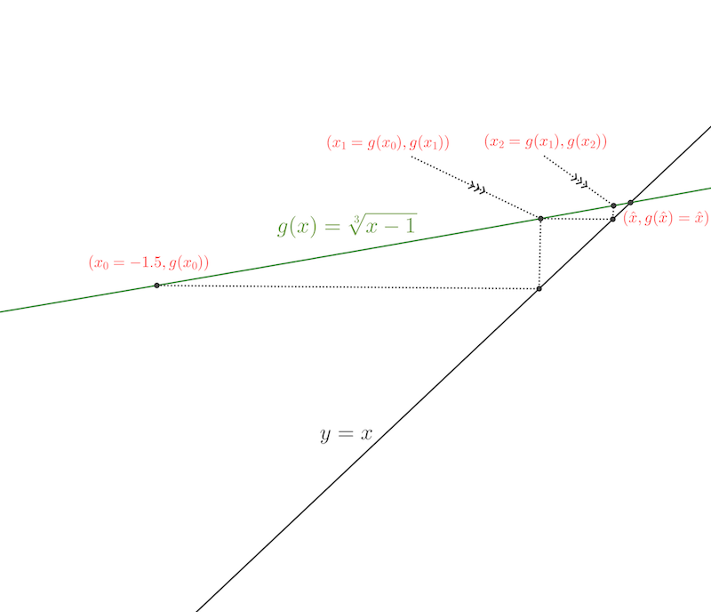

```{r setup, include=FALSE}
knitr::opts_chunk$set(echo = TRUE)
reticulate::use_python("/opt/anaconda3/bin/python")
```

# Introducción

## Introducción

En muchos problemas de ingeniería, inteligencia artificial u otras disciplinas afines tenemos que resolver ecuaciones del tipo $f(x)=0$, donde $f$ es una función que dada una cantidad $x$, nos devuelve $f(x)$. 

Al valor $\hat{x}$ que cumple que $f(\hat{x})=0$ se le llama **solución** de la ecuación, **raíz de la función** o **cero** de la misma.

En dichos problemas, saber explícitamente la función $f$ en muchos casos no es posible, sólo tenemos un algoritmo que dado un valor $x$, nos devuelve $f(x)$.

## Introducción

Entonces, dependiendo de nuestro conocimiento de la función $f$, podremos aplicar un método numérico u otro.

Todos los métodos numéricos que hallan aproximaciones de **ceros** construyen una sucesión $(x_n)_n$ que queremos que converja hacia el cero $\hat{x}$ de la función $f$.

Cuanto mayor sea la **velocidad de convergencia** de la sucesión $(x_n)_n$, mejor será el método usado.


# Método de la bisección

## Introducción

Vamos a empezar por el "peor" método de todos por lo que hace a la **velocidad de convergencia**. Sin embargo, dicha **convergencia** está asegurada.

El método está basado en el **Teorema de Bolzano** donde recordemos que dice que si la función $f$ es **continua** y tenemos dos valores $a$ y $b$ ($a<b$) tal que $f(a)\cdot f(b)<0$, o sea, hay un cambio de signo entre $a$ y $b$ o en el intervalo $(a,b)$, podemos asegurar que existe un valor $\hat{x}$ tal que $f(\hat{x})=0$.

## Introducción
El método, también llamado **método de los intervalos encajados**, va construyendo una sucesión de intervalos encajados:
$$
[a_0,b_0] \supset [a_1,b_1] \supset \cdots \supset [a_n,b_n]\supset \cdots,
$$
tal que el **cero** $\hat{x}$ siempre está en todos los intervalos $[a_n,b_n]$ y la longitud de cada intervalo $[a_n,b_n]$ vale $\frac{b_0-a_0}{2^n}$. De esta manera el **cero** $\hat{x}$ se calcula de forma más precisa.

## Intervalos encajados
¿Cómo se construyen los intervalos $[a_n,b_n]$?

El primer intervalo $[a_0,b_0]$ vale $[a_0,b_0]=[a,b]$. 

A continuación, sea $c=\frac{a_0+b_0}{2}$ el punto medio del intervalo $[a_0,b_0]$. 

Si $f(a_0)\cdot f(c)<0$, consideramos $b_1=c$ y $[a_1,b_1]=[a_0,c]$ y si $f(b_0)\cdot f(c)<0$, consideramos $a_1=c$ y $[a_1,b_1]=[c,b_0]$.

## Intervalos encajados
En general, veamos cómo construir $[a_{n+1},b_{n+1}]$ en función del intervalo $[a_n,b_n]$. Fijaos que se cumplirá siempre que $f(a_n)\cdot f(b_n)<0$.

Sea $c=\frac{a_n+b_n}{2}$ el punto medio del intervalo $[a_n,b_n]$.
Si $f(a_n)\cdot f(c)<0$, consideramos $b_{n+1}=c$ y $[a_{n+1},b_{n+1}]=[a_n,c]$ y si $f(b_n)\cdot f(c)<0$, consideramos $a_{n+1}=c$ y $[a_{n+1},b_{n+1}]=[c,b_n]$.

## Descripción gráfica
<div class="center">
```{r, echo=FALSE, label=urna2,fig.cap="Método de la bisección",out.width = "500px"}
knitr::include_graphics("03Ceros_files/bolzano.png",dpi=400)
```
</div>


## Pseudocódigo 1

* `INPUT a, b, TOL.` (damos los valores $a$ y $b$ con $f(a)\cdot f(b)<0$ y la tolerancia admitida donde el cero aproximado $\hat{x}$ tiene que cumplir $|f(\hat{x})|\leq \mathrm{TOL}$)  
* `While |f((a+b)/2)|>=TOL do` (mientras el punto medio del intervalo en cuestión no cumpla la condición de cero aproximado...)  
    * `Set c=(a+b)/2.` (consideramos el punto medio del intervalo)
    * `If f(a)*f(c)<0` (si $f(a)\cdot f(c)<0$, hemos que definir el nuevo $b$ como $c$)  
        * `Set b=c.`  
    * `Else` (en caso contrario, el nuevo $a$ será $c$)  
        * `Set a=c.`
* `Set x=c.` (damos como valor aproximado del cero el último valor de $c$ hallado)

## Intervalos encajados
La sucesión $(x_n)_n$ del método de la bisección serán los puntos medios de los **intervalos encajados**, $x_n=\frac{a_n+b_n}{2}$.

Como $x_n,\hat{x}\in [a_n,b_n]$ tendremos que $|x_n-\hat{x}|\leq b_n-a_n =\frac{b-a}{2^n}$.

Por tanto el orden de convergencia de la sucesión $(x_n)_n$ será la de la sucesión $\frac{1}{2^n}$:
$$
|x_n-\hat{x}|\leq K\cdot \frac{1}{2^n},
$$
con $K=b-a$.


## Pseudocódigo 2
Vamos a considerar otro pseudocódigo para el método cambiando el criterio de parada. Consideraremos que si $|x_{n+1}-x_n|\leq \mathrm{TOL}$, entonces ya hemos llegado a la aproximación deseada.

* `INPUT a, b, TOL.` (damos los valores $a$ y $b$ con $f(a)\cdot f(b)<0$ y la tolerancia admitida donde la sucesión que tiende al cero aproximado $\hat{x}$ tiene que cumplir $|x_{n+1}-x_n|\leq \mathrm{TOL}$).
* `Set x=(a+b)/2.` (definimos el valor $x_0$)
* `Set y=x+1.` (el valor $y$ será donde guardaremos el siguiente elemento de la sucesión. Añadiendo un $1$, nos aseguramos que "entre" en el bucle `While`)


## Pseudocódigo 2

* `While abs(x-y)>=TOL do` (mientras el punto medio del intervalo en cuestión no cumpla la condición de cero aproximado...)  
    * `Set x=(a+b)/2.`  (consideramos el punto medio del intervalo)
    * `If f(a)*f(x)<0` (si $f(a)\cdot f(x)<0$, hemos que definir el nuevo $b$ como $x$)  
        * `Set b=x.`
    * `Else` (en caso contrario, el nuevo $a$ será $x$)  
        * `Set a=x.`
    * `Set y=(a+b)/2.` (definimos el nuevo miembro de la sucesión)
* `Set cero=x.` (damos como valor aproximado del cero el último valor de $x$ hallado)

## Criterios de parada
¿Cuál de los dos métodos de parada es el mejor?

Los dos métodos son equivalentes pero en el caso en que evaluar la función $f$ sea muy costoso es mejor usar el segundo método de parada ya que nos evita una evaluación de la función $f$.

En cambio, si evaluar la función $f$ no es costoso, podemos usar cualquiera de los dos métodos indistintamente.


## Ejemplo
<div class="example">


Vamos a aproximar el cero de la función $f(x)=x^3-x+1$ entre $x=-2$ y $x=-1$, o sea, vamos a aproximar el valor $\hat{x}\in (-2,-1)$ tal que $f(\hat{x})=\hat{x}^3-\hat{x}+1=0.$

```{r,echo=FALSE}
f=function(x){x^3-x+1}

bolzano=function(a,b,tol,f){
  x=(a+b)/2;
  while(abs(f(x)) >=tol){
    x=(a+b)/2;
    if(f(a)*f(x)<0){b=x}
    if(f(a)*f(x)>0){a=x}
  }
return(x)
}

pas.bolzano=function(xn,yn,f){
  c=(xn+yn)/2;
  if(f(xn)*f(c)<0){yn1=c;xn1=xn}
  if(f(xn)*f(c)>0){xn1=c;yn1=yn}
  return(c(xn1,yn1))
}

an=c(-2)
bn=c(-1)
iteracions=25
for (i in 1:iteracions){
  n=length(an);
  aux=pas.bolzano(an[n],bn[n],f)
  an=c(an,aux[1])
  bn=c(bn,aux[2])
}
options(scipen=999)
xn=(an+bn)/2
```
Comprobemos que hay un cambio de signo entre $x=-2$ y $x=-1$: 
$$
f(-2)=(-2)^3-(-2)+1=-8+2+1=`r f(-2)`, \quad f(-1)=(-1)^3-(-1)+1=-1+1+1=`r f(-1)`.
$$
</div>

## Ejemplo (continuación)
<div class="example">
 

Aplicando el método de bisección, obtenemos los valores siguientes:

<div class="center">
|$n$|$a_n$|$b_n$|$x_n=\frac{a_n+b_n}{2}$|$|f(x_n)|$|$|x_n-x_{n-1}|$
|:---:|:---|:---|:---|:---|:---|
|$0$|$`r an[1]`$|$`r bn[1]`$|$`r xn[1]`$|$`r round(abs(f(xn[1])),6)`$||
|$1$|$`r an[2]`$|$`r bn[2]`$|$`r xn[2]`$|$`r round(abs(f(xn[2])),6)`$|$`r round(abs(xn[2]-xn[1]),6)`$|
|$2$|$`r an[3]`$|$`r bn[3]`$|$`r xn[3]`$|$`r round(abs(f(xn[3])),6)`$|$`r round(abs(xn[3]-xn[2]),6)`$|
|$3$|$`r an[4]`$|$`r bn[4]`$|$`r xn[4]`$|$`r round(abs(f(xn[4])),6)`$|$`r round(abs(xn[4]-xn[3]),6)`$|
|$4$|$`r an[5]`$|$`r bn[5]`$|$`r xn[5]`$|$`r round(abs(f(xn[5])),6)`$|$`r round(abs(xn[5]-xn[4]),6)`$|
|$5$|$`r an[6]`$|$`r bn[6]`$|$`r xn[6]`$|$`r round(abs(f(xn[6])),6)`$|$`r round(abs(xn[6]-xn[5]),6)`$|
</div>

</div>


## Ejemplo (continuación)
<div class="example">
 

<div class="center">
|$n$|$a_n$|$b_n$|$x_n=\frac{a_n+b_n}{2}$|$|f(x_n)|$|$|x_n-x_{n-1}|$
|:---:|:---|:---|:---|:---|:---|
|$6$|$`r an[7]`$|$`r bn[7]`$|$`r xn[1]`$|$`r round(abs(f(xn[7])),6)`$|$`r round(abs(xn[7]-xn[6]),6)`$|
|$7$|$`r an[8]`$|$`r bn[8]`$|$`r xn[2]`$|$`r round(abs(f(xn[8])),6)`$|$`r round(abs(xn[8]-xn[7]),6)`$|
|$8$|$`r an[9]`$|$`r bn[9]`$|$`r xn[3]`$|$`r round(abs(f(xn[9])),6)`$|$`r round(abs(xn[9]-xn[8]),6)`$|
|$9$|$`r an[10]`$|$`r bn[10]`$|$`r xn[4]`$|$`r round(abs(f(xn[10])),6)`$|$`r round(abs(xn[10]-xn[9]),6)`$|
|$10$|$`r an[11]`$|$`r bn[11]`$|$`r xn[5]`$|$`r round(abs(f(xn[11])),6)`$|$`r round(abs(xn[11]-xn[10]),6)`$|
|$11$|$`r an[12]`$|$`r bn[12]`$|$`r xn[6]`$|$`r round(abs(f(xn[12])),6)`$|$`r round(abs(xn[12]-xn[11]),6)`$|
</div>

</div>

## Ejemplo (continuación)
<div class="example">
 

Observaciones:

* Vemos que el método, tal como comentamos antes, es lento. Por ejemplo, para pasar de un error menor que $0.1$ a un error menor que $0.01$, usando el método de parada $|f(x_n)|<\epsilon$, necesitamos cuatro iteraciones (de la iteración $n=3$ a la iteración $n=7$), o sea, necesitamos cuatro iteraciones para "ganar" una cifra significativa en la aproximación del cero.

* Los dos criterios de parada (dos últimas columnas) son equivalentes en el sentido que necesitan aproximadamente el mismo número de iteraciones para que se "gane" una cifra significativa en el cero. Además, los valores que se obtienen con los dos criterios son del mismo orden, es decir, que si en la iteración $n$, $|f(x_n)|\approx c_1\cdot 10^{-k}$, entonces $|x_n-x_{n-1}|\approx c_2\cdot 10^{-k}$; por ejemplo para $n=10$, $|f(x_{10})|\approx 4.7\cdot 10^{-5}$ y $|x_{10}-x_9|\approx 4.9\cdot 10^{-5}$.

<div class="center">
[{width=10%}](https://colab.research.google.com/drive/1uhh9B_bGunrVSF9HlWm2NbmgwJ8L_ET2#scrollTo=4Lc81bqXZ_VR&line=1&uniqifier=1)
</div>

</div>

# Método del punto fijo

## Introducción
El **método del punto fijo** consiste en transformar la ecuación $f(x)=0$ en la ecuación $x=g(x)$ mediante **operaciones algebraicas "básicas"**. 

Entonces el **cero** de la ecuación $f(x)=0$ se transforma en lo que llamamos un **punto fijo** de la función $g(x)$:

<l class="definition">Definición de punto fijo.</l>
Sea $g$ una función real de variable real. Diremos que $\hat{x}$ es un **punto fijo** de la función $g$ si $g(\hat{x})=\hat{x}$.

<l class="observ">Observación:</l> Gráficamente, un punto fijo resulta de la intersección de la recta diagonal $\color{red}{y=x}$ y de la función $\color{red}{y=g(x)}$.

La idea es considerar la sucesión definida de forma recurrente como $x_n = g(x_{n-1})$ y ver bajo qué condiciones la sucesión $(x_n)_n$ converge hacia el **punto fijo** $\hat{x}$ de $g$ que recordemos será el **cero** de la función $f$ buscado.

## Ejemplo
<div class="example">


Para resolver la ecuación anterior $x^3-x+1=0$, podemos realizar las siguientes transformaciones:
$$
\begin{align*}
x^3-x+1= & 0,\ \Rightarrow x=x^3+1=g_1(x),\\
x^3-x+1= & 0,\ \Rightarrow x=\sqrt[3]{x-1}=g_2(x).
\end{align*}
$$
Entonces hallar un punto fijo de la función $g_1$ o $g_2$ es equivalente a hallar un cero de la función $f(x)=x^3-x+1$.

</div>

## Ejemplo

<div class="center">
```{r,echo=FALSE,fig.align='center'}
xmin=-2
xmax=2
ymin=-4
ymax=4
tolx=0.01*(xmax-xmin)
toly=0.05*(ymax-ymin)
quantsx=4
quantsy=4
f = function(x){x^3+1}
g = function(x){ifelse(x-1>=0,(x-1)^(1/3),-(1-x)^(1/3))}
h = function(x){x}
plot(c(xmin-tolx,xmax+tolx,xmin-tolx,xmax+tolx),c(ymin-toly,ymin-toly,ymax+toly,ymax+toly),type="n",xlab="",ylab="",xaxt="n",yaxt="n",axes=FALSE)
x=seq(from=xmin,to=xmax,by=0.01)
#points(x,f(x),type="l")
lines(c(0,0),c(ymin,ymax))
lines(c(xmin,xmax),c(0,0))
text(xmax-3*tolx,-7*tolx,"x")
text((1/2)*toly,ymax+toly/2,"y")
for (i in 0:(quantsx)){
  lines(rep(xmin+((xmax-xmin)/quantsx)*i,2),c(-0.5*toly,+0.5*toly))
  text(xmin+((xmax-xmin)/quantsx)*i,-1.5*toly,xmin+((xmax-xmin)/quantsx)*i,cex=0.75)
  }


for (i in 0:(quantsy)){
  lines(c(-tolx,tolx),ymin+rep(((ymax-ymin)/quantsy)*i,2))
  text(3*tolx,ymin+((ymax-ymin)/quantsy)*i,ymin+((ymax-ymin)/quantsy)*i,cex=0.75)
}
lines(x,f(x),col='firebrick2')
lines(x,g(x),col='blue')
lines(x,h(x),col='green')
text(0.75,2.5,expression(paste("g"[1],"(x)=x"^3,"+1")),col="firebrick2")
text(0.65,-1,expression(paste("g"[2],"(x)=",sqrt(x-1,3))),col="blue")
text(1.75,2,expression("y=x"),col="green")
```
</div>


## Existencia del punto fijo
El teorema siguiente nos dice cuáles son las condiciones de existencia del punto fijo de una función $g$:

<l class="prop">Teorema.</l>

* Sea $g\in {\cal C}([a,b])$ una función continua dentro de un intervalo $[a,b]$ tal que $g(x)\in [a,b]$, es decir, la función $g$ está definida de la forma siguiente:
$$
g: [a,b]\longrightarrow [a,b].
$$
Entonces $g$ tiene al menos un **punto fijo** $\hat{x}$ en el intervalo $[a,b]$, es decir, existe $\hat{x}\in [a,b]$ tal que $g(\hat{x})=\hat{x}.$

* Si además $g\in {\cal C}^1([a,b])$ tal que existe una constante $k<1$ con $|g'(x)|\leq k$, para todo valor $x\in (a,b)$. Entonces el punto fijo en el intervalo $[a,b]$ es único, es decir, existe un único $\hat{x}\in [a,b]$ tal que $g(\hat{x})=\hat{x}.$

## Existencia del punto fijo
<div class="dem">
**Demostración**

* Supongamos que $g(x)\in [a,b]$, para todo $x\in [a,b]$. Consideramos la función $h(x)=g(x)-x$. 

El valor de $h(a)$ cumple $h(a)=g(a)-a\geq 0$, ya que $g(a)\geq a$ al cumplirse $g(a)\in [a,b]$. 

Si $h(a)=0$, ya hemos acabado ya que en este caso, $g(a)=a$ y el punto fijo buscado sería $\hat{x}=a$. Por tanto, suponemos que $h(a)>0$.

El valor de $h(b)$ cumple $h(b)=g(b)-b\leq 0$, ya que $g(b)\leq b$ al cumplirse $g(b)\in [a,b]$. 

Si $h(b)=0$, ya hemos acabado ya que en este caso, $g(b)=b$ y el punto fijo buscado sería $\hat{x}=b$. Por tanto, suponemos que $h(b)<0$.

Por tanto, $h(a)>0$ y $h(b)<0$, y como $h$ es continua, usando el **Teorema de Bolzano**, existe un valor $\hat{x}\in (a,b)$ tal que $h(\hat{x})=0$, o lo que es lo mismo, $g(\hat{x})=\hat{x}$.

En resumen, siempre existe un valor $\hat{x}\in [a,b]$ tal que $g(\hat{x})=\hat{x}$, tal como queríamos demostrar.
</div>


## Existencia del punto fijo
<div class="dem">
**Demostración**

* Supongamos ahora que además $|g'(x)|\leq k<1$, para todo $x\in [a,b]$. Veamos que el punto fijo $\hat{x}$ es único.

Supongamos que existen dos puntos fijos $\hat{x}_1$ y $\hat{x}_2$ con $\hat{x}_1 < \hat{x}_2$. Si aplicamos el **Teorema del valor medio** a la función $g$ tenemos que existe un valor $c\in (\hat{x}_1,\hat{x}_2)$ tal que:
$$
\hat{x}_2-\hat{x}_1= g(\hat{x}_2)-g(\hat{x}_1)=g'(c)\cdot (\hat{x}_2-\hat{x}_1).
$$
Por tanto,
$$
\hat{x}_2-\hat{x}_1=|g(\hat{x}_2)-g(\hat{x}_1)|=|g'(c)|\cdot (\hat{x}_2-\hat{x}_1)\leq k\cdot (\hat{x}_2-\hat{x}_1)<\hat{x}_2-\hat{x}_1.
$$
Llegamos a una contradicción ya que un número, $\hat{x}_2-\hat{x}_1$ no puede ser menor estrictamente que él mismo.

Por tanto, nuestra suposición es falsa y $\hat{x}_1 = \hat{x}_2$, tal como queríamos ver.


</div>

## Ejemplo
<div class="example">


Sigamos con el ejemplo anterior, considerando las funciones $g_1(x)=x^3+1$ y $g_2(x)=\sqrt[3]{x-1}$.

Observando el gráfico de las funciones anteriores se observa que $g_2(x)\in [-2,-1]$ si $x\in [-2,-1]$ ya que:
$$
-2\leq x\leq -1,\Leftrightarrow -3\leq x-1\leq -2,\Leftrightarrow -2< `r round(-3^(1/3),3)`\approx\sqrt[3]{-3}\leq \sqrt[3]{x-1}\leq \sqrt[3]{-2}\approx `r round(-2^(1/3),3)`<-1.
$$
En cambio, con la función $g_1(x)=x^3+1$, no es cierto que $g_1(x)\in [-2,-1]$ si $x\in [-2,-1]$ como puede observarse en el gráfico. 

Sólo podemos aplicar el teorema anterior a la función $g_2(x)=\sqrt[3]{x-1}$. Veamos si además podemos asegurar su unicidad:
$$
g_2'(x)=\frac{1}{3}\cdot (x-1)^{-\frac{2}{3}}=\frac{1}{3\cdot\sqrt[3]{(x-1)^2}}.
$$


Si $-2\leq x\leq -1$, 
$$
`r round(1/(3*9^(1/3)),3)`\approx \frac{1}{3\sqrt[3]{9}}\leq \frac{1}{3\cdot\sqrt[3]{(x-1)^2}}\leq \frac{1}{3\sqrt[3]{4}}\approx `r round(1/(3*4^(1/3)),3)`.
$$

Entonces existe un valor $k=\frac{1}{3\sqrt[3]{4}}<1$ tal que $|g_2'(x)|\leq k$, para todo $x\in [-2,-1]$. Por tanto, usando el teorema anterior, podemos asegurar que el punto fijo $\hat{x}$ es único.
</div>

## Teorema del punto fijo
Para resolver la ecuación $x=g(x)$ o para hallar un **punto fijo** de la función $g$, definimos la sucesión $x_n =g(x_{n-1})$. El Teorema siguiente nos dice bajo qué condiciones la sucesión anterior converge hacia el punto fijo $\hat{x}$: $\displaystyle \lim_{n\to\infty}x_n =\hat{x}$.

<l class="prop">Teorema del punto fijo.</l>
Sea $g\in {\cal C}([a,b])$ una función continua dentro de un intervalo $[a,b]$ tal que $g(x)\in [a,b]$. Supongamos, ademas, que existe $g'(x)$, para todo $x\in [a,b]$ y que existe una constante $k$, $0<k<1$, tal que $\displaystyle |g'(x)|\leq k$, para todo $x\in [a,b]$. 

Sea $x_0\in [a,b]$. Definimos la sucesión $(x_n)_n$ de forma recurrente como $x_n=g(x_{n-1})$, $n\geq 1$. Entonces $x_n$ converge hacia el único punto fijo $\hat{x}$ de $g(x)$. Es decir $\displaystyle \lim_{n\to\infty}x_n =\hat{x}$, con $g(\hat{x})=\hat{x}$.

## Teorema del punto fijo
<div class="dem">
**Demostración**

Es sencillo ver que si la sucesión $(x_n)_n$ converge, lo hace necesariamente hacia el punto fijo $\hat{x}$ ya que como $x_n=g(x_{n-1})$, tomando límites y usando que la función $g$ es continua, tenemos que:
$$
\lim_{n\to\infty} x_n =   \lim_{n\to\infty} g(x_{n-1}),\ \Rightarrow 
L =  g(L),
$$
lo que significa que el límite $L$ de la sucesión $(x_n)_n$ es un punto fijo de la función $g$ y como éste és único, $L=\hat{x}$.

Veamos a continuación que la sucesión $(x_n)_n$ es convergente. Usando el **Teorema del valor medio** tenemos que existe un valor $c_n\in <x_n,\hat{x}>$ tal que:
$$
|x_n-\hat{x}|=|g(x_{n-1})-\hat{x}|=|g'(c_n)|\cdot |x_{n-1}-\hat{x}|\leq k\cdot |x_{n-1}-\hat{x}|.
$$
</div>

## Teorema del punto fijo
<div class="dem">
**Demostración** (continuación)


Aplicando la desigualdad anterior $n$ veces, tenemos que:
$$
|x_n-\hat{x}|\leq k\cdot |x_{n-1}-\hat{x}|\leq k^2\cdot |x_{n-2}-\hat{x}|\leq \cdots\leq k^n\cdot |x_{0}-\hat{x}|.
$$
Aplicando el **criterio del sandwich** tenemos que:
$$
0\leq \lim_{n\to\infty} |x_n-\hat{x}|\leq \lim_{n\to\infty} k^n\cdot |x_{0}-\hat{x}|=0,
$$
ya que $0<k<1$. Por tanto, $\displaystyle \lim_{n\to\infty} |x_n-\hat{x}|=0$, condición que equivale a $\displaystyle \lim_{n\to\infty} x_n =\hat{x}$, tal como queríamos demostrar.
</div>


## Pseudocódigo

* `INPUT x0, TOL, N`. (damos el valor inicial, la tolerancia permitida y el número máximo de iteraciones)  
* `Set iter=1.` (`iter` será un contador que nos dirá el valor de $n$ en la sucesión $x_n$)  

## Pseudocódigo
* `While iter <= N do`  (mientras no llegemos al máximo de iteraciones hacer lo siguiente)  
  * `Set x=g(x0).` (calculamos el siguiente término de la sucesión $x_n$)  
  * `If |x-x0| < TOL then` (miramos si el valor $x_n$ cumple la condición de la tolerancia permitida)  
    * `print (x);` (damos la solución)  
    * `stop.` (acabamos)  
  * `iter++.` (aumentamos el valor $n$ de la sucesión)  
  * `Set x0=x` (actualizamos el valor $x_n$)  
* `Print('El método ha fallado después de N iteraciones')` (si hemos llegado hasta aquí significa que hemos alcanzado el número máximo de iteraciones sin que se cumpla la condición de la tolerancia)

## Ejemplo
```{r,echo=FALSE}
cuber=function(x){ifelse(x>=0,x^(1/3),-(-x)^(1/3))}
g = function(x){cuber(x-1)}
xn=-1.5
niter=20
for (i in 1:niter){xn=c(xn,g(xn[length(xn)]))}
k=1/(3*4^(1/3))
```

<div class="example">


Apliquemos el método del punto fijo a la función $g_2=\sqrt[3]{1-x}$ vista anteriormente para $x\in [-2,-1]$. Los resultados obtenidos son los siguientes:

<div class="center">
|$n$|$x_{n}$|$|x_n-x_{n-1}|$
|:---:|:---|:---|
|$0$|$`r xn[1]`$||
|$1$|$`r xn[2]`$|$`r abs(xn[2]-xn[1])`$|
|$2$|$`r xn[3]`$|$`r abs(xn[3]-xn[2])`$|
|$3$|$`r xn[4]`$|$`r abs(xn[4]-xn[3])`$|
|$4$|$`r xn[5]`$|$`r abs(xn[5]-xn[4])`$|
</div>
</div>


## Ejemplo (continuación)
<div class="example">
 

<div class="center">
|$n$|$x_{n-1}$|$|x_n-x_{n-1}|$
|:---:|:---|:---|
|$5$|$`r xn[6]`$|$`r abs(xn[6]-xn[5])`$|
|$6$|$`r xn[7]`$|$`r abs(xn[7]-xn[6])`$|
|$7$|$`r xn[8]`$|$`r abs(xn[8]-xn[7])`$|
|$8$|$`r xn[9]`$|$`r abs(xn[9]-xn[8])`$|
|$9$|$`r xn[10]`$|$`r abs(xn[10]-xn[9])`$|
</div>
</div>

## Ejemplo (continuación)
<div class="example">
 

Observaciones:

* El método anterior converge más rápidamente que el método de la bisección ya que aproximadamente en cada iteración "ganamos" una cifra significativa del valor $\hat{x}$, es decir, fijarse que en la iteración $n$, existe una constante $c_n$, $0<c_n<10$, tal que $|x_n-x_{n-1}|\approx c_n\cdot 10^{n-2}$.

* La **velocidad de convergencia** de la sucesión $x_n$ será aproximadamente equivalente a la **velocidad de convergencia** de la sucesión $k^n$, donde $k$ recordemos que es la constante tal que $|g'(x)|\leq k$, para todo $x\in [a,b]$. En el ejemplo que nos ocupa, recordemos que $k$ valía:
$k=\frac{1}{3\sqrt[3]{4}}\approx `r round(1/(3*4^(1/3)),4)`$. Por tanto, la sucesión $(x_n)_n$ tendrá una **velocidad de convergencia** equivalente a la **velocidad de convergencia** de la sucesión $\left(\frac{1}{3\sqrt[3]{4}}\right)^n$.

<div class="center">
[{width=10%}](https://colab.research.google.com/drive/1uhh9B_bGunrVSF9HlWm2NbmgwJ8L_ET2#scrollTo=L2bnvjDSaQNR)
</div>
<div>


## Ejemplo
<div class="center">
```{r, echo=FALSE,fig.cap="Método del punto fijo"}

```
</div>

## Estimación del error cometido
En la demostración del Teorema del punto fijo vimos una estimación del error cometido con la aproximación $x_n$ con respecto al punto fijo $\hat{x}$:
$$
|x_n-\hat{x}|\leq k^n\cdot |x_0-\hat{x}|.
$$
Dicha estimación no es útil ya que al no conocer $\hat{x}$, tampoco conocemos $|x_0-\hat{x}|.$

La proposición siguiente nos da una estimación del error $|x_n-\hat{x}|$ en función de los extremos del intervalo $[a,b]$, $x_0$ y de $x_1$ que son valores conocidos.

## Estimación del error cometido
<l class="prop">Proposición. Estimación del error cometido.</l>
En las condiciones del Teorema del punto fijo, se cumple:
$$
|x_n-\hat{x}|\leq k^n\cdot\max\{x_0-a,b-x_0\},\quad |x_n-\hat{x}|\leq \frac{k^n}{1-k}\cdot |x_1-x_0|, 
$$
para todo $n\geq 1$, si $x_0\in [a,b]$.

## Estimación del error cometido
<div class="dem">
**Demostración**

En la demostración del Teorema del punto fijo vimos que:
$$
|x_n-\hat{x}|\leq k^n\cdot |\hat{x}-x_0|,
$$
pero como $x_0,\hat{x}\in [a,b]$, podemos considerar dos casos:

* $a\leq \hat{x}\leq x_0$. En este caso $|\hat{x}-x_0|\leq x_0-a\leq \max\{x_0-a,b-x_0\}$.
* $x_0\leq \hat{x}\leq b$. En este caso $|\hat{x}-x_0|\leq b-x_0\leq \max\{x_0-a,b-x_0\}$.

Por tanto, queda demostrada la primera desigualdad.

</div>

## Estimación del error cometido
<div class="dem">
**Demostración**

Para demostrar la segunda, primero acotamos $|x_{n+1}-x_n|$ de la forma siguiente:
$$
|x_{n+1}-x_n|=|g(x_n)-g(x_{n-1})|\leq k\cdot |x_n-x_{n-1}|\leq k^2\cdot |x_{n-1}-x_{n-2}|\leq \cdots \leq k^n\cdot |x_1-x_0|,
$$
si $n\geq 1$. Por tanto, si $m>n\geq 1$, tenemos que:
$$
\begin{align*}
|x_m-x_n|= & |x_m-x_{m-1}+x_{m-1}-\cdots +x_{n+1}-x_n|\\ \leq &  |x_m-x_{m-1}|+|x_{m-1}-x_{m-2}|+\cdots +|x_{n+1}-x_n|\\ \leq & k^{m-1}\cdot |x_1-x_0|+k^{m-2}\cdot |x_1-x_0|+\cdots + k^n\cdot |x_1-x_0|\\ = & k^n\cdot |x_1-x_0| \left(1+k+\cdots + k^{m-n-1}\right).
\end{align*}
$$
Como la expresión anterior es cierta para toda $m>n$, haciendo $m\to\infty$, obtenemos:
$$
|\hat{x}-x_n|\leq k^n\cdot |x_1-x_0|\cdot\sum_{i=0}^\infty k^i =k^n\cdot |x_1-x_0|\cdot\frac{1}{1-k}=\frac{k^n}{1-k}\cdot |x_1-x_0|,
$$
y ya tenemos demostrada la segunda desigualdad
</div>

## Ejemplo
<div class="example">


Apliquemos las desigualdades anteriores a los datos de nuestro ejemplo.

De cara a la primera desigualdad, el valor de $\max\{x_0-a,b-x_0\}$ será en nuestro caso:
$$
\max\{x_0-a,b-x_0\} =\max\{-1.5-(-2),-1-(-1.5)\}=\max\{0.5,0.5\}=0.5.
$$
Recordemos que $k=\frac{1}{3\sqrt[3]{4}}$.
</div>

## Ejemplo
<div class="example">


<div class="center">
|$n$|$x_{n}$|$0.5\cdot k^n$|$\frac{k^n}{1-k}\cdot |x_1-x_0|$
|:---:|:---|:---|:---|
|$0$|$`r xn[1]`$|$`r 0.5* k^0`$|$`r (k^0/(1-k))*abs(x[2]-x[1])`$|
|$1$|$`r xn[2]`$|$`r 0.5* k^1`$|$`r (k^1/(1-k))*abs(x[2]-x[1])`$|
|$2$|$`r xn[3]`$|$`r 0.5* k^2`$|$`r (k^2/(1-k))*abs(x[2]-x[1])`$|
|$3$|$`r xn[4]`$|$`r 0.5* k^3`$|$`r (k^3/(1-k))*abs(x[2]-x[1])`$|
|$4$|$`r xn[5]`$|$`r 0.5* k^4`$|$`r (k^4/(1-k))*abs(x[2]-x[1])`$|
</div>
Vemos que con $4$ iteraciones ya tenemos tres cifras exactas de la aproximación de $\hat{x}$.
</div>


# Método de Newton-Raphson

## Introducción

El **método de Newton-Raphson** es uno de los métodos más conocidos y más **potentes** en el sentido de su **velocidad de convergencia**. Sin embargo, al contrario que el **método de la bisección**, su **convergencia** no está **asegurada**.

Veamos gráficamente en qué consiste el método de Newton-Raphson:

## Introducción
<div class="center">
```{r, echo=FALSE, label=urna4,fig.cap="Método de Newton-Raphson"}
knitr::include_graphics("03Ceros_files/NewtonRaphson.png",dpi=400)
```
</div>

## Introducción
En el gráfico anterior vemos que tratamos de hallar un cero $\hat{x}$ marcado en rojo de la función $f(x)=\mathrm{e}^{-x}-\frac{1}{2}\ln x$. 

Para ello, empezamos con el valor inicial $x_0=1$. A continuación hallamos la **recta tangente** a la función $f(x)$ en el punto $(x_0,f(x_0))=\left(1,\mathrm{e}^{-1}\right)\approx (1,`r round(exp(-1),6)`)$.

Seguidamente, miramos dónde corta dicha **recta tangente** al eje de las $X$. Dicho punto de corte, será el siguiente elemento de la sucesión $x_1$.

## Introducción
El paso siguiente es hacer con el punto $x_1$ lo mismo que hemos hecho con el punto $x_0$: hallar la **recta tangente** a la función $f(x)$ en el punto $(x_1,f(x_1))$ y mirar dónde corta dicha **recta tangente** al eje de las $X$ para hallar $x_2$ y así sucesivamente.

De esta forma obtenemos una sucesión $x_0,x_1,x_2,\ldots$ cuyo límite como puede observarse en el gráfico es el cero $\hat{x}$.

Como puede verse en el gráfico, la velocidad de convergencia es muy rápida ya que con dos iteraciones, tenemos un valor $x_2$ muy próximo al cero $\hat{x}$.

## Pasos del método
El método de **Newton-Raphson** que nos da el valor de $x_{n}$ en función de $x_{n-1}$ se deduce de realizar los pasos siguientes:

* Desarrollamos por **Taylor** la función $f$ que suponemos de clase ${\cal C}^2[a,b]$ en un cierto intervalo de la que queremos hallar el **cero** en el punto $x_{n-1}$ usando el **polinomio de Taylor de grado $1$** y usando la expresión del **resto de Lagrange**:
$$
f(x)=f(x_{n-1})+f'(x_{n-1})\cdot (x-x_{n-1})+\frac{f''(\xi(x_{n-1}))}{2}\cdot (x-x_{n-1})^2,
$$
donde $\xi(x_{n-1})\in <x,x_{n-1}>$.

## Pasos del método
* Si usamos la aproximación anterior en el cero $\hat{x}$, como $f(\hat{x})=0$, tenemos que:
$$
0=f(\hat{x})=f(x_{n-1})+f'(x_{n-1})\cdot (\hat{x}-x_{n-1})+\frac{f''(\xi(x_{n-1}))}{2}\cdot (\hat{x}-x_{n-1})^2.
$$

* Si suponemos que $|\hat{x}-x_{n-1}|$ es pequeño podemos despreciar el término del resto de Lagrange y obtenemos:
$$
0=f(x_{n-1})+f'(x_{n-1})\cdot (x-x_{n-1}),
$$
donde hemos escrito $x$ en lugar de $\hat{x}$ ya que el valor que cumple la condición anterior no és el cero $\hat{x}$ sino un valor aproximado $x$. Dicho **valor aproximado** será el siguiente valor de la sucesión $x_n$:

## Pasos del método
* Si despejamos $x=x_n$ de la ecuación anterior, hallamos la relación buscada:
$$
x_n =x_{n-1}-\frac{f(x_{n-1})}{f'(x_{n-1})}.
$$

<l class="observ">Observación:</l> 
Los pasos anteriores equivalen a buscar la **recta tangente** en el punto $(x_{n-1},f(x_{n-1}))$, cuya ecuación es $y=f(x_{n-1})+f'(x_{n-1})\cdot (x-x_{n-1})$, y buscar el corte de dicha recta con el eje $X$, es decir, resolver $y=0$, para hallar el punto $x_n$, tal como comentamos en la introducción del método.

<l class="observ">Observación:</l> 
El método de **Newton-Raphson** es un caso particular de usar el **metódo del punto fijo**, con la función $g(x)=x-\frac{f(x)}{f'(x)}$. Observar que el valor $x_n$ se calcular de la forma siguiente en función de la función $g$: $x_n=g(x_{n-1})$.

## Pseudocódigo
* `INPUT x0, TOL, N.` (damos el valor inicial $x_0$, la tolerancia permitida y el número máximo de iteraciones $N$)  
* `Set n=1.` ($n$ será el contador para las iteraciones realizadas)  

## Pseudocódigo
* `While n<=N do` (mientras no llegemos al número máximo de interaciones hacer lo siguiente)  
    * `Set x=x0-f(x0)/f'(x0).` (calculamos el siguiente valor de la iteración)  
    * `If |x-x0|< TOL then` (si la diferencia entre los dos valores verifica la condición de la tolerancia...)
        * `Print(x);` (dar la aproximación del cero)  
        * `STOP.` (acabar)  
    * `Set n++.` (si no acabamos aumentar el contador del número de iteraciones en $1$)  
    * `Set x0=x` (actualizamos el valor de x0)
* `Print ('el método ha fallado después de N iteraciones)` (si hemos llegado hasta aquí significa que el método no converge en nuestro caso)  
* `STOP`. 


## Ejemplo
<div class="example">


Vamos a hallar el cero de la función $f(x)=\mathrm{e}^{-x}-\frac{1}{2}\ln x$ que aparece en el gráfico que ilustra el **método de Newton-Raphson**.

El valor inicial es $x_0=1$. 

Usando que $f'(x)=-\mathrm{e}^{-x}-\frac{1}{2x}$, los demás valores se hallarán usando la recurrencia siguiente:
$$
x_n=x_{n-1}-\frac{\mathrm{e}^{-x_{n-1}}-\frac{1}{2}\ln x_{n-1}}{-\mathrm{e}^{-x_{n-1}}-\frac{1}{2x_{n-1}}}=\frac{x_{n-1} \left(2 x_{n-1}+e^{x_{n-1}}-e^{x_{n-1}} \ln
   (x_{n-1})+2\right)}{2 x_{n-1}+e^{x_{n-1}}}.
$$
</div>


## Ejemplo (continuación)
<div class="example">
 
```{r,echo=FALSE}
f=function(x){exp(-x)-(1/2)*log(x)}
f1 = function(x){-exp(-x)-1/(2*x)}
xn=1
n.iter = 10
for (i in 1:n.iter){
  n=length(xn)
  x=xn[n]-f(xn[n])/f1(xn[n])
  xn=c(xn,x)
}
```

La sucesión de valores obtenidos son los siguientes:

<div class="center">
|$n$|$x_n$|$|f(x_n)|$|$|x_n-x_{n-1}|$
|:---:|:---|:---|:---|
|$0$|$`r xn[1]`$|$`r abs(f(xn[1]))`$||
|$1$|$`r xn[2]`$|$`r abs(f(xn[2]))`$|$`r abs(xn[2]-xn[1])`$|
|$2$|$`r xn[3]`$|$`r abs(f(xn[3]))`$|$`r abs(xn[3]-xn[2])`$|
|$3$|$`r xn[4]`$|$`r abs(f(xn[4]))`$|$`r abs(xn[4]-xn[3])`$|
|$4$|$`r xn[5]`$|$0.00000000002173273$|$`r abs(xn[5]-xn[4])`$|
</div>
</div>

## Ejemplo (continuación)
<div class="example">
 

Observaciones:

* Observamos que $4$ iteraciones hemos llegado a una tolerancia de $\approx 10^{`r round(log10(abs(xn[5]-xn[4])))`}$ si usamos el criterio de parada $|x_n-x_{n-1}|\leq 10^{`r round(log10(abs(xn[5]-xn[4])))`}$. Es decir, el método converge muy rápido hacia la solución $\hat{x}$.

* El criterio de parada $|x_n-x_{n-1}|\leq$ `TOL` es más "duro" que el criterio de parada $|f(x_n)|\leq$ `TOL` en el sentido que se necesitan más iteraciones para que se cumple con la misma tolerancia `TOL`.

<div class="center">
[{width=10%}](https://colab.research.google.com/drive/1uhh9B_bGunrVSF9HlWm2NbmgwJ8L_ET2#scrollTo=QImUs2oIayCa)
</div>
</div>

## Convergencia del método de Newton-Raphson
Ya hemos comentado que no tenemos **asegurada la convergencia** del método de Newton-Raphson. Sin embargo, el Teorema siguiente nos dice bajo qué condiciones podemos tener **convergencia**:

<l class="prop">Teorema.</l>
Sea $f\in {\cal C}^2([a,b])$. Sea $\hat{x}$ un cero de la función $f$, $f(\hat{x})=0$ con $f'(\hat{x})\neq 0$, es decir $\hat{x}$ es un **cero simple** de $f$. Entonces existe un valor $\delta >0$ tal que la sucesión generada por el **método de Newton-Raphson**, $(x_n)_n$ converge a $\hat{x}$ para todo valor inicial $x_0\in (\hat{x}-\delta,\hat{x}+\delta)$.

## Convergencia del método de Newton-Raphson
<div class="dem">
**Demostración**

Recordemos que el **método de Newton-Raphson** es un caso particular del **método del punto fijo** con $g(x)=x-\frac{f(x)}{f'(x)}$.

Sea $k$ con $0<k<1$. La demostración consistirá en hallar $\delta >0$ tal que la función $g$ cumple:

* $g(x)\in [\hat{x}-\delta,\hat{x}+\delta]$ para todo $x\in [\hat{x}-\delta,\hat{x}+\delta]$.
* $|g'(x)|\leq k$.

Entonces, usando el **Teorema del punto fijo**, podemos afirmar que la sucesión $(x_n)_n$ converge hacia la solución $\hat{x}$.

Hallemos pues el valor $\delta >0$. Como $f'$ es continua y $f'(\hat{x})\neq 0$, existe un valor $\delta_1 >0$ tal que $f'(x)\neq 0$, para todo $x\in (\hat{x}-\delta_1,\hat{x}+\delta_1)\subseteq [a,b]$. 

El valor de $g'(x)$ si $x\in (\hat{x}-\delta_1,\hat{x}+\delta_1)$ vale:
$$
g'(x)=1-\frac{f'(x)^2-f(x)\cdot f''(x)}{f'(x)^2}=\frac{f(x)\cdot f''(x)}{f'(x)^2}.
$$
</div>


## Convergencia del método de Newton-Raphson
<div class="dem">
**Demostración** (continuación)

La expresión anterior tiene sentido ya que $f'(x)\neq 0$ para todo valor $x\in (\hat{x}-\delta_1,\hat{x}+\delta_1)$. Además, $g'(\hat{x})=0$ ya que $\hat{x}$ es un cero de la función $f$: $f(\hat{x})=0$.

Como $g'(x)$ es continua y $g'(\hat{x})=0$, para el valor de $k$ existe un valor $\delta >0$, tal que $|g'(x)|\leq k$, para todo $x\in (\hat{x}-\delta,\hat{x}+\delta)$. Ya tenemos verificada la segunda condición.

Hemos de verificar la primera, es decir, hemos de ver que si $x\in [\hat{x}-\delta,\hat{x}+\delta]$, $g(x)\in [\hat{x}-\delta,\hat{x}+\delta]$. 

Sea pues un valor $x\in [\hat{x}-\delta,\hat{x}+\delta]$. Entonces, usando el **Teorema del valor medio**, podemos afirmar que existe un valor $c\in <x,\hat{x}>\subseteq (\hat{x}-\delta,\hat{x}+\delta)$ tal que:
$$
|g(x)-\hat{x}|=|g(x)-g(\hat{x})|=|g'(c)|\cdot |x-\hat{x}|\leq k\cdot |x-\hat{x}| <|x-\hat{x}| \leq \delta.
$$
Como $|g(x)-\hat{x}|<\delta$, tenemos que $g(x)\in (\hat{x}-\delta,\hat{x}+\delta)$ tal como queríamos ver.
</div>

## Convergencia del método de Newton-Raphson
El teorema anterior nos dice que el método de Newton-Raphson **converge** siempre que el cero $\hat{x}$ sea **simple**, es decir, $f'(\hat{x})\neq 0$.

La velocidad de convergencia dependerá de la cota $k$ de la función $g'(x)=\frac{f(x)\cdot f''(x)}{f'(x)^2}$ en un entorno de radio $\delta$ del cero $\hat{x}$. Dicho valor $k$ en general será desconocido y hallarlo es un problema mucho más difícil que hallar el cero $\hat{x}$. 

Por tanto, en la práctica, se realiza un gráfico aproximado de la función $f(x)$ y se elige un punto $x_0$ cerca del valor de corte de la función $f$ con el eje $X$. 

# Método de la secante

## Introducción

El método de Newton es un método muy potente pero tiene un inconveniente: necesitamos conocer la **función derivada** $f'(x)$. 

En muchos problemas de análisis numérico, dicho conocimiento es un lujo. Sabemos cómo evaluar la función $f$ pero no hay forma de tener una expresión de la función derivada $f'$. En estos casos, el **metodo de Newton-Raphson** no es aplicable.


## Introducción
Para solventar esta dificultad, podemos usar el cociente incremental como aproximación a $f'(x_{n-1})$:
$$
f'(x_{n-1})\approx \frac{f(x_{n-1})-f(x_{n-2})}{x_{n-1}-x_{n-2}},
$$
si $x_{n-2}$ y $x_{n-1}$ están próximos, la aproximación anterior tendrá poco error.

Si sustituimos la expresión anterior de $f'(x_{n-1})$ en el método de Newton-Raphson, obtenemos el denominado **metodo de la secante**:
$$
x_n =x_{n-1}-\frac{f(x_n)}{\frac{f(x_{n-1})-f(x_{n-2})}{x_{n-1}-x_{n-2}}}=x_{n-1}-\frac{f(x_{n-1})\cdot (x_{n-1}-x_{n-2})}{f(x_{n-1})-f(x_{n-2})}.
$$

## Pasos del método
El método de la secante también puede deducirse siguiendo los pasos siguientes:

* Dados los puntos $(x_{n-2},f(x_{n-2}))$ y $(x_{n-1},f(x_{n-1}))$, consideramos la recta que pasa por dichos puntos de ecuación:
$$
y-f(x_{n-1})=\frac{f(x_{n-1})-f(x_{n-2})}{x_{n-1}-x_{n-2}}\cdot (x-x_{n-1}).
$$

* Hallamos la intersección de dicha recta con el eje $X$ resolviendo $y=0$ y el punto de intersección será el punto siguiente de la sucesión $x_n$:
$$
y=0,\ \Rightarrow x=x_n=x_{n-1}-\frac{f(x_{n-1})\cdot (x_{n-1}-x_{n-2})}{f(x_{n-1})-f(x_{n-2})},
$$
obteniendo la misma expresión que anteriormente.

## Descripción gráfica
<div class="center">
```{r, echo=FALSE, label=urna5,fig.cap="Método de la secante",out.width = "550px"}
knitr::include_graphics("03Ceros_files/secante.png",dpi=400)
```
</div>

## Descripción gráfica
En el gráfico anterior vemos cómo funciona el método de la **secante**:

* Hemos considerado $x_0=0.5$ y $x_1=1$. Hallando la recta que pasa por los puntos $(0.5,f(0.5))$ y $(1,f(1))$ (en rojo de puntitos) y viendo dónde corta el eje de las $X$, hallamos el nuevo punto de la sucesión $x_2$.

* Hacemos lo mismo con los puntos $(x_1,f(x_1))=(1,f(1))$ y $(x_2,f(x_2))$, es decir, hallamos la recta que pasa por los puntos $(1,f(1))$ y $(x_2,f(x_2))$ (en rojo de puntitos) y viendo dónde corta el eje de las $X$, hallamos el nuevo punto de la sucesión $x_3$.

* Y asi sucesivamente, hasta llegar a una aproximación del cero $\hat{x}$.

## Pseudocódigo
* `INPUT x0, x1, TOL, N.` (Damos los valores iniciales $x_0$, $x_1$, la tolerancia `TOL` y el número máximo de iteraciones $N$)  
* `Set n=2.` (El valor $n$ nos da el subíndice del nuevo $x_n$ a calcular)  
* `Set y0=f(x0).` (Definimos $y_0=f(x_0)$)  
* `Set y1=f(x1).` (Definimos $y_0=f(x_1)$)  

## Pseudocódigo
* `While n <= N do`  (Mientras no lleguemos al número de máximo de iteraciones hacer lo siguiente...)  
    * `Set x=x1-y1*(x1-x0)/(y1-y0).` (Calculamos el nuevo valor $x_n$)  
    * `If |x-x1| < TOL then` (Si el valor $x_n$ cumple la condición de la tolerancia...)  
        * `Print(x)` (Damos $x_n$ como aproximación del cero $\hat{x}$)  
        * `STOP` (Acabamos)  
    * `Set n++.` (En caso contrario, aumentamos $n$ en $1$)  
    * `Set x0=x1.` (Actualizamos $x_0, x_1, y_0$ e $y_1$)  
    * `Set y0=y1.`  
    * `Set x1=x.`
    * `Set y1=f(x).`

## Pseudocódigo
* `Print ('El método ha fallado después de N iteraciones).` (Si hemos llegado hasta aquí significa que el método ha fallado y ha alcanzado el número máximo de iteraciones)  
* `STOP.` (Paramos)

## Ejemplo
<div class="example">


Vamos a hallar un cero de la función $f(x)=\mathrm{e}^{-x}-\frac{2}{x}+1$ con condiciones iniciales $x_0=0.5$ y $x_1=1$.

```{r,echo=FALSE}
f = function(x){exp(-x)-2/x+1}
xn=c(0.5,1)
n.iter=10
for (i in 1:n.iter){
  n=length(xn);
  x=xn[n]-f(xn[n])*(xn[n]-xn[n-1])/(f(xn[n])-f(xn[n-1]));
  xn=c(xn,x)
}
```

Los resultados se muestran en la tabla siguiente:
<div class="center">
|$n$|$x_n$|$|f(x_n)|$|$|x_n-x_{n-1}|$
|:---:|:---|:---|:---|
|$0$|$`r xn[1]`$|$`r abs(f(xn[1]))`$||
|$1$|$`r xn[2]`$|$`r abs(f(xn[2]))`$|$`r abs(xn[2]-xn[1])`$|
|$2$|$`r xn[3]`$|$`r abs(f(xn[3]))`$|$`r abs(xn[3]-xn[2])`$|
|$3$|$`r xn[4]`$|$`r abs(f(xn[4]))`$|$`r abs(xn[4]-xn[3])`$|
|$4$|$`r xn[5]`$|$`r abs(f(xn[5]))`$|$`r abs(xn[5]-xn[4])`$|
</div>

</div>

## Ejemplo (continuación)
<div class="example">
 

<div class="center">
|$n$|$x_n$|$|f(x_n)|$|$|x_n-x_{n-1}|$
|:---:|:---|:---|:---|
|$5$|$`r xn[6]`$|$`r abs(f(xn[6]))`$|$`r abs(xn[6]-xn[5])`$|
|$6$|$`r xn[7]`$|$`r abs(f(xn[7]))`$|$`r abs(xn[7]-xn[6])`$|
|$7$|$`r xn[8]`$|$`r abs(f(xn[8]))`$|$`r abs(xn[8]-xn[7])`$|
|$8$|$`r xn[9]`$|$0.0000000004353$|$`r abs(xn[9]-xn[8])`$|
|$9$|$`r xn[10]`$|$0.000000000000000666$|$0.000000000842$|
</div>
</div>

## Ejemplo (continuación)
<div class="example">
 

Observaciones:

* Vemos que el método de la **secante** es un poco más lento que el de **Newton-Raphson** ya que observamos que para alcanzar una tolerancia de $10^{-5}$ si usamos el criterio de parada $|x_n−x_{n−1}|\leq 10^{-5}$ necesitamos 8 iteraciones.

* Igual que pasaba en el método de **Newton-Raphson**, el criterio de parada $|x_n-x_{n-1}|\leq$ `TOL` es más "duro" que el criterio de parada $|f(x_n)\leq$ `TOL` en el sentido que se necesitan más iteraciones para que se cumple con la misma tolerancia `TOL`.

<div class="center">
[{width=10%}](https://colab.research.google.com/drive/1uhh9B_bGunrVSF9HlWm2NbmgwJ8L_ET2#scrollTo=GdWZKYV8bNx1&uniqifier=1)
</div>
</div>

# Método de regula falsi

## Introducción
Los métodos de **Newton-Raphson** y de la **secante** son método relativamente rápidos en cuanto a su **convergencia** pero tienen el inconveniente que no tenemos asegurada dicha convergencia.

Recordemos el Teorema donde nos dice si el **cero** es simple ($f'(\hat{x})\neq 0$), existe un **entorno del cero** $\hat{x}$ tal que para cualquier valor inicial $x_0$ perteneciente a dicho entorno, el método de **Newton-Raphson** es **convergente.** El problema es que hallar dicho entorno es un problema mucho más difícil que hallar el **cero** en sí.

Por dicho motivo, de cara a **asegurar la convergencia** de la sucesión $(x_n)_n$ tenemos el método de **regula falsi** que usa las ventajas de los métodos de la **bisección** y de la **secante**. 

## Introducción
En pocas palabras, el método de **regula falsi** supone que hay un cambio de signo entre $x_{n-2}$ y $x_{n-1}$, es decir, $f(x_{n-2})\cdot f(x_{n-1}) <0$ y halla $x_n$ usando el método de la secante. Como $x_n$ estará entre $x_{n-2}$ y $x_{n-1}$ habrá un cambio de signo de $f$ entre $x_{n-2}$ y $x_n$ o entre $x_{n-1}$ y $x_n$. Dependiendo de dónde esté el cambio de signo, cambia el valor de $x_{n-1}$.

## Pasos del método
Más concretamente, el método de **regula falsi** consiste en los pasos siguientes: (vamos a dar los pasos para pasar al paso $n$ desde el paso $n-1$)

* Sean $x_{n-2}$ y $x_{n-1}$ tal que $f(x_{n-2})\cdot f(x_{n-1})<0$. No suponemos ningún orden sobre $x_{n-2}$ y $x_{n-1}$, es decir, podemos tener $x_{n-2}<x_{n-1}$ o $x_{n-1}<x_{n-2}$.

* Calculamos $x_n$ según el método de la **secante**:
$$
x_n=x_{n-1}-\frac{f(x_{n-1})\cdot (x_{n-1}-x_{n-2})}{f(x_{n-1})-f(x_{n-2})}.
$$

## Pasos del método
* **Caso 1.** Si $f(x_n)\cdot f(x_{n-1})<0$, tenemos un cambio de signo de $f$ en el intervalo $<x_{n-1},x_n>$. En este caso, no hacemos nada y la sucesión quedará $\ldots,x_{n-2},x_{n-1},x_n,\ldots$
* **Caso 2.** Si $f(x_n)\cdot f(x_{n-2})<0$ tenemos un cambio de signo de $f$ en el intervalo $<x_{n-2},x_n>$. En este caso, cambiamos el orden de $x_{n-2}$ y $x_{n-1}$ y la sucesión quedará $\ldots,x_{n-1},x_{n-2},x_n,\ldots$
* Volvemos al paso inicial para hallar $x_{n+1}$.
* Y así sucesivamente.


## Descripción gráfica
<div class="center">
```{r, echo=FALSE, label=urna6,fig.cap="Método de la regula falsi",out.width = "850px"}
knitr::include_graphics("03Ceros_files/regula-falsi.png",dpi=400)
```
</div>


## Descripción gráfica
El gráfico anterior ilustra el método de **regula falsi**.

* Empezamos con $x_0=1$ y $x_1=2$ donde observamos que hay un cambio de signo de la función $f$. Más concretamente, $f(x_0)<0$ y $f(x_1)>0$.

* Hallamos el punto $x_2$ usando el método de la **secante** y vemos que estamos en el caso 2. La sucesión será por tanto $x_1=2,x_0=1,x_2,\ldots$

## Descripción gráfica
* Hallamos $x_3$ usando el método de la **secante** con los puntos $(x_0,f(x_0))=(1,f(1))$  y $(x_2,f(x_2))$ y vemos que volvemos a estar en el caso 2. La sucesión será por tanto $x_1=2,x_2,x_0=1,x_3$.

* Y así sucesivamente.

Observamos que de esta forma la sucesión $(x_n)_n$ siempre converge hacia el cero $\hat{x}$, hecho que no teníamos asegurado con el método de la **secante**.

## Pseudocódigo
* `INPUT x0, x1, TOL, N.` (Damos los valores iniciales x0 y x1, la tolerancia `TOL` y el número máximo de iteraciones $N$)  
* `Set n=2.` (El valor $n$ nos da el subíndice del nuevo $x_n$ a calcular)  
* `Set y0=f(x0).` (Definimos $y_0=f(x_0)$)  
* `Set y1=f(x1).` (Definimos $y_1=f(x_1)$)  

## Pseudocódigo
* `While n <= N do`  (Mientras no lleguemos al número de máximo de iteraciones hacer lo siguiente...)  
    * `Set x=x1-y1*(x1-x0)/(y1-y0).` (Calculamos el nuevo valor $x_2$)  
        * `If min(|x-x1|, |x-x0|) < TOL then` (Si el valor $x_2$ cumple la condición de la tolerancia...)  
        * `Print(x)` (Damos $x_2$ como aproximación del cero $\hat{x}$)  
        * `STOP` (Acabamos)  
    * `Set n++.` (En caso contrario, aumentamos $n$ en $1$) 
    * `Set y=f(x).` (Definimos $y_2=f(x_2)$) 

## Pseudocódigo
*
    * `If y*y1<0 then` (Si el cambio de signo está en el intervalo $<x_1,x_2>$)  
        * `Set x0=x1.` (El nuevo $x_0$ será el "viejo" $x_1$)  
        * `Set y0=y1.`
    * `Set x1=x.` (El nuevo $x_1$ será el valor de $x_2$)  
    * `Set y1=y.`  
* `Print ('El método ha fallado después de N iteraciones).` (Si hemos llegado hasta aquí significa que el método ha fallado y ha alcanzado el número máximo de iteraciones)  
* `STOP.` (Paramos)


## Pseudocódigo
El pseudocódigo necesita un poco de explicación respecto del algoritmo que hemos dados antes.

Básicamente, empezamos con dos valores `x0` y `x1` donde hay un cambio de signo de la $f$ y calculamos el nuevo valor `x`. 

A continuación, tenemos que redefinir los nuevos `x0` y `x1` dependiende de dónde esté el cambio de signo:

* Si estamos en el caso 1, es decir, $f(\mathtt{x1})\cdot f(\mathtt{x})<0$, basta que definamos el "nuevo" `x0` como `x1` y el "nuevo" `x1` como `x` y tendremos que volverá a haber un cambio de signo entre `x0` y `x1`.
* Si estamos en el caso 2, es decir, $f(\mathtt{x0})\cdot f(\mathtt{x})<0$, basta que definamos el "nuevo" `x1` como `x` y tendremos que volverá a haber un cambio de signo entre `x0` y `x1`.

## Ejemplo
<div class="example">


```{r,echo=FALSE}
f = function(x){exp(-x)-2/x+1}
xn=c(1,2)
n.iter=20
for (i in 1:n.iter){
  n=length(xn);
  x=xn[n]-f(xn[n])*(xn[n]-xn[n-1])/(f(xn[n])-f(xn[n-1]));
  y=f(x);
  if(f(x)*f(xn[n-1])<0){aux=xn[n-1];xn[n-1]=xn[n];xn[n]=aux};
  xn=c(xn,x)
}
```
Vamos a hallar un cero de la función $f(x)=\mathrm{e}^{-x}-\frac{2}{x}+1$ con condiciones iniciales $x_0=1$ y $x_1=2$ ya que existe un cambio de signo en el interalo $<x_0,x_1>$: $f(x_0)=f(1)=`r f(1)`$, $f(x_1)=f(2)=`r f(2)`.$
</div>


## Ejemplo (continuación)
<div class="example">
 

Los resultados se muestran en la tabla siguiente:
<div class="center">
|$n$|$x_n$|$|f(x_n)|$|$|x_n-x_{n-1}|$
|:---:|:---|:---|:---|
|$0$|$`r xn[1]`$|$`r abs(f(xn[1]))`$||
|$1$|$`r xn[2]`$|$`r abs(f(xn[2]))`$|$`r abs(xn[2]-xn[1])`$|
|$2$|$`r xn[3]`$|$`r abs(f(xn[3]))`$|$`r abs(xn[3]-xn[2])`$|
|$3$|$`r xn[4]`$|$`r abs(f(xn[4]))`$|$`r abs(xn[4]-xn[3])`$|
|$4$|$`r xn[5]`$|$`r abs(f(xn[5]))`$|$`r abs(xn[5]-xn[4])`$|
</div>
</div>


## Ejemplo (continuación)
<div class="example">
 

<div class="center">
|$n$|$x_n$|$|f(x_n)|$|$|x_n-x_{n-1}|$
|:---:|:---|:---|:---|
|$5$|$`r xn[6]`$|$`r abs(f(xn[6]))`$|$`r abs(xn[6]-xn[5])`$|
|$6$|$`r xn[7]`$|$`r abs(f(xn[7]))`$|$`r abs(xn[7]-xn[6])`$|
|$7$|$`r xn[8]`$|$`r abs(f(xn[8]))`$|$`r abs(xn[8]-xn[7])`$|
|$8$|$`r xn[9]`$|$`r abs(f(xn[9]))`$|$`r abs(xn[9]-xn[8])`$|
|$9$|$`r xn[10]`$|$`r abs(f(xn[10]))`$|$`r abs(xn[10]-xn[9])`$|
</div>


<div class="center">
[{width=10%}](https://colab.research.google.com/drive/1uhh9B_bGunrVSF9HlWm2NbmgwJ8L_ET2#scrollTo=bClCWmgUbpC1&uniqifier=1)
</div>
</div>

## Convergencia

Observamos que la convergencia es más lenta que el método de la **secante** debido básicamente a que tenemos que asegurarnos del cambio de signo en el intervalo $<x_{n-2},x_{n-1}>$.

Sin embargo, la **convergencia** está asegurada siempre, cosa que no podemos decir lo mismo del método de la **secante**.

# Análisis del error

## Orden de convergencia

Cuando un método numérico consiste en hallar una **sucesión** $(x_n)_n$ que converge hacia una solución $\hat{x}$, un concepto importante para medir lo rápido de converge es el **orden de convergencia** de la sucesión:

<l class="definition">Definición de orden de convergencia.</l>
Sea $(x_n)_n$ una sucesión de números reales convergente hacia $\hat{x}$, donde suponemos que $x_n\neq \hat{x}$, para cualquier $n$. Suponemos que existen constantes $\lambda >0$ y $\alpha>0$ tal que
$$
\lim_{n\to\infty} \frac{|x_{n+1}-\hat{x}|}{|x_n-\hat{x}|^\alpha} =\lambda.
$$
Entonces, diremos que $(x_n)_n$ converge hacia $\hat{x}$ **con orden $\alpha$** con **constante asintótica $\lambda$**.


## Orden de convergencia
* Cuando mayor es el orden $\alpha$, más rápido converge la sucesión $(x_n)_n$ hacia $\hat{x}$. La idea es que para $n$ grande, podemos aproximar el error en el término $n+1$ en función del error en el término $n$ de la forma siguiente:
$$
|x_{n+1}-\hat{x}|\approx \lambda |x_{n}-\hat{x}|^\alpha.
$$
Entonces para valores grandes de $\alpha$ el error irá disminuyendo muy rápidamente, acercándose la sucesión $(x_n)_n$ a su límite $\hat{x}$ de forma muy rápida.

* Si $\alpha=1$ y $\lambda\leq 1$, se dice que la sucesión $(x_n)_n$ **converge linealmente**. 
* Si $\alpha=2$, se dice que la sucesión $(x_n)_n$ **converge de forma cuadrática**.

## Orden de convergencia
* El **orden de convergencia** de la mayoría de las sucesiones que "tenemos en mente" tienen **convergencia lineal**:
    * $x_n = \frac{P(n)}{Q(n)}$, donde $P$ y $Q$ son dos polinomios del mismo grado en $n$, donde $\hat{x}=\frac{a}{b}$ siendo $a$ y $b$ los coeficientes de mayor grado de $P$ y $Q$, respectivamente y $\lambda=1$,
    * $x_n= a^n$, con $a<1$ donde $\hat{x}=0$ y $\lambda =a$,
    * $x_n=  \left(1+\frac{1}{n}\right)^n$, donde $\hat{x}=\mathrm{e}$ y $\lambda=1$.

* Los casos interesantes son aquellos en los que la sucesión de define por recurrencia como es el caso del **método del punto fijo**: $x_n=g(x_{n-1})$.


## Convergencia lineal
<l class="prop">Teorema.</l>
Sea $g\in {\cal C}[a,b]$ una función **continua** en el intervalo $[a,b]$ tal que $g(x)\in [a,b]$ para todo valor $x\in [a,b]$. 

Supongamos además que $g\in {\cal C}^1 (a,b)$ tiene **derivada continua** en el intervalo $(a,b)$ y que existe una **constante** $k<1$ tal que $|g'(x)|\leq k$, para todo valor $x\in (a,b)$. Sea $x_0\in [a,b]$, definimos la sucesión de forma recurrente $x_n=g(x_{n-1})$ que sabemos que es convergente hacia $\hat{x}\in [a,b]$. 

Entonces, si $g'(\hat{x})\neq 0$, la sucesión anterior $(x_n)_n$ converge de forma **lineal** hacia $\hat{x}$.


## Convergencia lineal
<div class="dem">
**Demostración**

Si aplicamos el **Teorema del valor medio** a la función $g$ en el intervalo $<x_n,\hat{x}>$, tenemos que existe un valor $c_n$ tal que:
$$
\frac{x_{n+1}-\hat{x}}{x_n-\hat{x}}=\frac{g(x_n)-g(\hat{x})}{x_n-\hat{x}}=g'(c_n),
$$
donde $c_n\in <x_n,\hat{x}>$.

Como $g'$ es continua en $(a,b)$, tenemos que $\displaystyle\lim_{n\to\infty} g'(c_n)=g'(\hat{x})$ ya que $\displaystyle\lim_{n\to\infty} c_n=\hat{x}$. Por tanto,
$$
\lim_{n\to\infty} \frac{|x_{n+1}-\hat{x}|}{|x_n-\hat{x}|}=\lim_{n\to\infty} |g'(c_n)|=|g'(\hat{x})|\leq k<1,
$$
tal como queríamos demostrar.

</div>

## Convergencia cuadrática
El teorema siguiente nos da las condiciones para que el **método del punto fijo** tenga convergencia **cuadrática**:

<l class="prop">Teorema.</l>
Sea $g\in {\cal C}[a,b]$ una función **continua** en el intervalo $[a,b]$.

Sea $\hat{x}$ una solución de la ecuación $x=g(x)$ tal que $g'(\hat{x})=0$. Supongamos además que $g\in {\cal C}^2 (a,b)$ tiene las dos **primeras derivadas continuas** en el intervalo $(a,b)$ y que existe una **constante** $M$ tal que $|g''(x)|< M$ en un intervalo abierto $I\subseteq (a,b)$ tal que $\hat{x}\in I$.

Entonces existe un valor $\delta >0$ tal que si $x_0\in (\hat{x}-\delta,\hat{x}+\delta)$, la sucesión definida de forma recurrente por $x_n=g(x_{n-1})$ converge en **orden cuadrático** hacia $\hat{x}$. Además, para $n$ suficientemente grande:
$$
|x_{n+1}-\hat{x}|< \frac{M}{2}\cdot |x_n-\hat{x}|^2.
$$


## Convergencia cuadrática
<div class="dem">
**Demostración**

Como $g'$ es continua y $g'(\hat{x})=0$, existe un $k$ un valor real con $0<k<1$, y un $\delta>0$ tal que para todo valor $x\in (\hat{x}-\delta,\hat{x}+\delta)$, tenemos que $|g'(x)|\leq k$.

Veamos a continuación que todos los términos de la sucesión $(x_n)_n$, $x_n\in (\hat{x}-\delta,\hat{x}+\delta)$. Hagamos la prueba por inducción:

* por hipótesis $x_0\in (\hat{x}-\delta,\hat{x}+\delta)$, 
* supongamos que $x_{n-1}\in (\hat{x}-\delta,\hat{x}+\delta)$. Usando el **Teorema del valor medio**, tenemos que existe un valor $c_n\in <x_{n-1},\hat{x}>\subset (\hat{x}-\delta,\hat{x}+\delta)$ tal que:
$$
|x_n-\hat{x}|=|g(x_{n-1})-g(\hat{x})|=|g'(c_n)|\cdot |x_{n-1}-\hat{x}|\leq k\cdot |x_{n-1}-\hat{x}|<|x_{n-1}-\hat{x}|<\delta.
$$
Por tanto, $x_n\in  (\hat{x}-\delta,\hat{x}+\delta)$, tal como queríamos ver.

</div>

## Convergencia cuadrática
<div class="dem">
**Demostración** (continuación)

Sea $x\in (\hat{x}-\delta,\hat{x}+\delta)$. Si desarrollamos por Taylor la función $g(x)$ alrededor de $\hat{x}$ usando el **polinomio de grado $1$ o lineal**, tenemos que existe un valor $\xi \in <x,\hat{x}>\subset (\hat{x}-\delta,\hat{x}+\delta)$ tal que:
$$
g(x)=g(\hat{x})+g'(\hat{x})\cdot (x-\hat{x})+\frac{g''(\xi)}{2}\cdot (x-\hat{x})^2 = \hat{x}+\frac{g''(\xi)}{2}\cdot (x-\hat{x})^2.
$$

Si aplicamos la expresión anterior a $x=x_n$, obtenemos:
$$
x_{n+1}=g(x_n)=\hat{x}+\frac{g''(\xi_n)}{2}\cdot (x_n-\hat{x})^2. 
$$
Por tanto,
$$
\frac{|x_{n+1}-\hat{x}|}{|x_n-\hat{x}|^2}=\frac{g''(\xi_n)}{2},
$$
con $\xi_n\in <x_n,\hat{x}>$. 

</div>

## Convergencia cuadrática
<div class="dem">
**Demostración** (continuación)

Como la función $g''$ es continua, tenemos que $\displaystyle\lim_{n\to\infty}g''(\xi_n)=g''(\hat{x})$ ya que $\displaystyle\lim_{n\to\infty}\xi_n =\hat{x}$.

En resumen,
$$
\lim_{n\to\infty} \frac{|x_{n+1}-\hat{x}|}{|x_n-\hat{x}|^2}=\frac{|g''(\hat{x})|}{2},
$$
tal como queríamos ver. Por tanto, la sucesión $(x_n)_n$ **converge cuadráticamente** hacia $\hat{x}$ si $g''(\hat{x})\neq 0$ y de **orden superior** si $g''(\hat{x})=0$.

Por último, usando el desarrollo de Taylor de $g(x_n)$, tenemos que:

$$
|x_{n+1}-\hat{x}|=|g(x_n)-\hat{x}|=\frac{|g''(\xi_n)|}{2}\cdot |x_n-\hat{x}|^2 < \frac{M}{2}\cdot |x_n-\hat{x}|^2,
$$
tal como queríamos ver.
</div>

## Estudio del tipo de convergencia
Veamos un resumen de la sección. 

Sea $g\in {\cal C}[a,b]$ una función continua en el intervalo $[a,b]$ tal que tiene las dos primeras derivadas continuas en $(a,b)$. Sea $x_0\in [a,b]$ y definimos $x_n=g(x_{n-1})$. Supongamos que $(x_n)_n$ es convergente hacia $\hat{x}\in [a,b]$. Entonces:

* Si $g'(\hat{x})\neq 0$ con $|g'(\hat{x})|<1$, la sucesión $(x_n)_n$ converge **linealmente** hacia $\hat{x}$.
* Si $g'(\hat{x})=0$ y $g''(\hat{x})\neq 0$, la sucesión $(x_n)_n$ converge **cuadráticamente** hacia $\hat{x}$.

## Convergencia del método de Newton-Raphson
Veamos en qué condiciones el método de **Newton-Raphson** converge **cuadráticamente** hacia el cero:

<l class="prop">Teorema.</l>
Sea $f\in {\cal C}^2([a,b])$. Sea $\hat{x}$ un cero de la función $f$, $f(\hat{x})=0$ con $f'(\hat{x})\neq 0$, es decir $\hat{x}$ es un **cero simple** de $f$. Entonces la sucesión $(x_n)_n$ generada por el método de Newton-Raphson converge al menos **cuadráticamente** hacia $\hat{x}$.

## Convergencia del método de Newton-Raphson
<div class="dem">
**Demostración**

Recordemos que el método de Newton-Raphson es un caso particular del método del punto fijo usando siguiente función $g$: $g(x)=x-\frac{f(x)}{f'(x)}$.

Para demostrar el teorema anterior, basta ver que $g'(\hat{x})=0$ ya que usando el Teorema sobre la convergencia **cuadrática** tendremos la tesis del teorema.

Calculemos $g'(x)$:
$$
g'(x)=1-\frac{f'(x)^2-f(x)\cdot f''(x)}{f'(x)^2}=\frac{f(x)\cdot f''(x)}{f'(x)^2}.
$$
Si evaluamos la expresión anterior en $x=\hat{x}$: $g'(\hat{x})=\frac{f(\hat{x})\cdot f''(\hat{x})}{f'(\hat{x})^2}=0$, ya que $f(\hat{x})=0$, al ser $\hat{x}$ un cero de $f$.
</div>

## Cálculo aproximado del orden de convergencia
Si nos dan un método iterativo para hallar ceros, como por ejemplo el de la **secante** o el de la **regula-falsi**, ¿existe una manera aproximada de calcular el **orden de convergencia** $\alpha$ del método anterior?

Supongamos que $x_n=g(x_{n-1})$. Si el **orden de convergencia** es $\alpha$, tendremos que:
$$
|x_{n+1}-\hat{x}|\approx \lambda\cdot |x_n-\hat{x}|^\alpha.
$$
Tomando logaritmos en la expresión anterior obtenemos:
$$
\ln |x_{n+1}-\hat{x}|\approx \ln \lambda +\alpha \ln |x_{n}-\hat{x}|.
$$

## Cálculo aproximado del orden de convergencia
Vemos por tanto que la sucesión $\ln |x_{n+1}-\hat{x}|$ depende linealmente de la sucesión $\ln |x_{n}-\hat{x}|$. 

Es decir, que si hallamos la **recta de regresión** de la sucesión $\ln |x_{n+1}-\hat{x}|$ como función de la sucesión $\ln |x_{n}-\hat{x}|$ la pendiente de dicha recta será aproximadamente el valor del **orden de convergencia** $\alpha$.

El método anterior tiene una pega: ¡no conocemos el cero $\hat{x}$! Ahora bien, como $\displaystyle\lim_{n\to\infty}x_n =\hat{x}$, podemos aproximar $\hat{x}\approx x_N$ con $N$ valor grande.

## Ejemplo
<div class="example">


Veamos qué orden de convergencia obtenemos con el método de Newton-Raphson usado anteriormente. 

La función era $f(x)=\mathrm{e}^{-x}-\frac{1}{2}\ln x$ con $x_0=1$.

```{r,echo=FALSE}
f=function(x){exp(-x)-(1/2)*log(x)}
f1 = function(x){-exp(-x)-1/(2*x)}
xn=1
n.iter = 20
for (i in 1:n.iter){
  n=length(xn)
  x=xn[n]-f(xn[n])/f1(xn[n])
  xn=c(xn,x)
}
xhat=xn[20]
yn=log(abs(xn-xhat))[1:4]
yn1=yn[-1]
yn1[4]=log(abs(xn-xhat))[5]
estudi.reg=lm(yn1 ~yn)
```
Tomamos $N=20$. El valor aproximado de $\hat{x}$ será $\hat{x}\approx x_{N}=x_{20}=`r xn[20]`.$
</div>

## Ejemplo (continuación)
<div class="example">
 
La tabla de valores de $\ln |x_{n+1}-\hat{x}|$ en función de $\ln |x_{n}-\hat{x}|$ para $n=0,1,2,3$ es la siguiente:

<div class="center">
|$n$|$\ln |x_{n}-\hat{x}|$|$\ln |x_{n+1}-\hat{x}|$|
|:---:|:---|:---|
|$0$|$`r yn[1]`$|$`r yn1[1]`$|
|$1$|$`r yn[2]`$|$`r yn1[2]`$|
|$2$|$`r yn[3]`$|$`r yn1[3]`$|
|$3$|$`r yn[4]`$|$`r yn1[4]`$|
</div>

Si calculamos la recta de regresión de $\ln |x_{n+1}-\hat{x}|$ en función de $\ln |x_{n}-\hat{x}|$ obtenemos una pendiente de 
$`r estudi.reg$coefficients[2]`$ confirmando que el método de Newton-Raphson tiene **orden de convergencia** $2$.

<div class="center">
[{width=10%}](https://colab.research.google.com/drive/1uhh9B_bGunrVSF9HlWm2NbmgwJ8L_ET2#scrollTo=pIIiIgh9n7x8)
</div>

</div>

## Ejemplo
<div class="example">


Veamos qué orden de convergencia obtenemos con el método de la secante usado anteriormente. 

La función era $f(x)=\mathrm{e}^{-x}-\frac{2}{x}+1$ con $x_0=0.5$ y $x_1=1$.

```{r,echo=FALSE}
f = function(x){exp(-x)-2/x+1}
xn=c(0.5,1)
n.iter=10
for (i in 1:n.iter){
  n=length(xn);
  x=xn[n]-f(xn[n])*(xn[n]-xn[n-1])/(f(xn[n])-f(xn[n-1]));
  xn=c(xn,x)
}
xhat=xn[10]
yn=log(abs(xn-xhat))[1:6]
yn1=yn[-1]
yn1[6]=log(abs(xn-xhat))[7]
estudi.reg=lm(yn1 ~yn)
```
Tomamos $N=10$. El valor aproximado de $\hat{x}$ será $\hat{x}\approx x_{N}=x_{10}=`r xn[10]`.$
</div>

## Ejemplo (continuación)
<div class="example">
 

La tabla de valores de $\ln |x_{n+1}-\hat{x}|$ en función de $\ln |x_{n}-\hat{x}|$ para $n=0,1,2,3,4,5$ es la siguiente:

<div class="center">
|$n$|$\ln |x_{n}-\hat{x}|$|$\ln |x_{n+1}-\hat{x}|$|
|:---:|:---|:---|
|$0$|$`r yn[1]`$|$`r yn1[1]`$|
|$1$|$`r yn[2]`$|$`r yn1[2]`$|
|$2$|$`r yn[3]`$|$`r yn1[3]`$|
|$3$|$`r yn[4]`$|$`r yn1[4]`$|
|$4$|$`r yn[5]`$|$`r yn1[5]`$|
|$5$|$`r yn[6]`$|$`r yn1[6]`$|
</div>


</div>

## Ejemplo (continuación)
<div class="example">
 

Si calculamos la recta de regresión de $\ln |x_{n+1}-\hat{x}|$ en función de $\ln |x_{n}-\hat{x}|$ obtenemos una pendiente de 
$`r estudi.reg$coefficients[2]`$. De hecho, el método de la **secante** tiene **orden de convergencia** $\frac{1+\sqrt{5}}{2}\approx `r (1+sqrt(5))/2`.$


<div class="center">
[{width=10%}](https://colab.research.google.com/drive/1uhh9B_bGunrVSF9HlWm2NbmgwJ8L_ET2#scrollTo=gYts3U_0oF-A)
</div>
</div>


# Raíces múltiples

## Introducción
Una raíz múltiple de una función $f$ es aquélla en la que la función y las derivadas hasta cierto orden son cero:

<l class="definition">Definición de raíz múltiple.</l>
Sea $f\in {\cal C}^{k}[a,b]$ una función de clase $k$ que significa que la función y las $k$ primeras derivadas son continuas. Diremos que $\hat{x}\in [a,b]$ es un **cero múltiple de multiplicidad $k$** si $f(\hat{x})=f'(\hat{x})=\ldots =f^{(k-1)}(\hat{x})=0$ y $f^{(k)}(\hat{x})\neq 0$. 

Los **ceros de multiplicidad $1$** se denominan **ceros simples**, son los que verifican que $f(\hat{x})=0$ pero $f'(\hat{x})\neq 0$.

Los **ceros de multiplicidad $2$** se denominan **ceros dobles**, son los que verifican que $f(\hat{x})=f'(\hat{x})=0$ pero $f''(\hat{x})\neq 0$.

## Raíces múltiples
<l class="observ">Observación.</l>
Otra forma de definir la multiplicidad de un cero $\hat{x}$ es decir que $\hat{x}$ es de **multiplicidad k** si, y sólo si, $f(x)=(x-\hat{x})^k q(x)$, si $x\neq \hat{x}$, con $q(\hat{x})\neq 0$.

La demostración de la equivalencia de las definiciones se basa en desarrollar por Taylor la función $f$ en un entorno de $\hat{x}$.

La velocidad de convergencia de un método depende de la **multiplicidad** del cero en cuestión. Por ejemplo, para que el método de **Newton-Raphson** tenga orden de convergencia $2$ necesitamos que $\hat{x}$ sea un cero simple tal como nos dice el Teorema correspondiente.

## Ejemplo
<div class="example">


La función $f(x)=1-\cos x$ tiene $\hat{x}=0$ como cero doble ya que $f(0)=1-\cos 0=0$, $f'(0)=\sin 0=0$ y $f''(0)=\cos 0=1\neq 0$. 

Veamos qué pasa si aplicamos el método de Newton-Raphson en este caso con $x_0=1$.

La sucesión $x_n$ estará definida por:
$$
x_n = x_{n-1}-\frac{1-\cos x_{n-1}}{\sin x_{n-1}}.
$$

```{r,echo=FALSE}
f=function(x){1-cos(x)}
f1 = function(x){sin(x)}
xn=1
n.iter = 20
for (i in 1:n.iter){
  n=length(xn)
  x=xn[n]-f(xn[n])/f1(xn[n])
  xn=c(xn,x)
}
xhat=xn[20]
yn=log(abs(xn-xhat))[1:4]
yn1=yn[-1]
yn1[4]=log(abs(xn-xhat))[5]
estudi.reg=lm(yn1 ~yn)
```
</div>

## Ejemplo (continuación)
<div class="example">
 

La tabla de valores de $x_n$ es la siguiente:

<div class="center">
|$n$|$x_n$|$|f(x_n)|$|$|x_n-x_{n-1}|$
|:---:|:---|:---|:---|
|$0$|$`r xn[1]`$|$`r abs(f(xn[1]))`$||
|$1$|$`r xn[2]`$|$`r abs(f(xn[2]))`$|$`r abs(xn[2]-xn[1])`$|
|$2$|$`r xn[3]`$|$`r abs(f(xn[3]))`$|$`r abs(xn[3]-xn[2])`$|
|$3$|$`r xn[4]`$|$`r abs(f(xn[4]))`$|$`r abs(xn[4]-xn[3])`$|
|$4$|$`r xn[5]`$|$`r abs(f(xn[5]))`$|$`r abs(xn[5]-xn[4])`$|
|$5$|$`r xn[6]`$|$`r abs(f(xn[6]))`$|$`r abs(xn[6]-xn[5])`$|
</div>


</div>


## Ejemplo (continuación)
<div class="example">
 

Vemos que la convergencia es mucho más lenta en este caso. De hecho, si intentamos hallar una aproximación del **orden de convergencia** usando el método visto anteriormente, obtenemos un valor de $\alpha\approx `r estudi.reg$coefficients[2]`.$

La convergencia parece que es **lineal**. De hecho lo es, es decir, que si aplicamos el método de **Newton-Raphson** para el cálculo de un cero doble la convergencia pasa de **cuadrática** a **lineal**:


<div class="center">
[{width=10%}](https://colab.research.google.com/drive/1uhh9B_bGunrVSF9HlWm2NbmgwJ8L_ET2#scrollTo=QC24_2TQc7R-&uniqifier=1)
</div>
</div>

<div class="exercise">
**Ejercicio**

Demostrar que si $f$ tiene un cero doble $\hat{x}$, $f(\hat{x})=f'(\hat{x})=0$, con $f''(\hat{x})\neq 0$, el método de **Newton-Raphson** para hallar el cero $\hat{x}$ tiene **convergencia lineal**.

Indicación: considerar $x_n =x_{n-1}-\frac{f(x_{n-1})}{f'(x_{n-1})}$, restar $\hat{x}$ a cada miembro de la expresión anterior obteniendo
$x_n-\hat{x}=x_{n-1}-\hat{x}-\frac{f(x_{n-1})}{f'(x_{n-1})}$, desarrollar por Taylor $f(x_{n-1})$ y $f'(x_{n-1})$ en un entorno de $\hat{x}$ y sacar factor común $x_{n-1}-\hat{x}$.
</div>

## Convergencia
Si observamos que un método de convergencia rápida como por ejemplo el método de **Newton-Raphson** tiene velocidad lenta a la hora de calcular un cero de una función $f$, podemos sospechar que el cero es una raíz múltiple de $f$. En estos casos, podemos considerar la función $\tilde{f}(x)=\frac{f(x)}{f'(x)}$ en lugar de la función $f$:

<l class="prop">Proposición.</l>
Sea $f\in {\cal C}^k (a,b)$ una función de clase ${\cal C}^k$ en el intervalo $(a,b)$ tal que $\hat{x}$ es una **raíz de multiplicidad** $k$. Entonces $\hat{x}$ es una **raíz simple** de la función $\tilde{f}(x)=\frac{f(x)}{f'(x)}$.

## Convergencia
<div class="dem">
**Demostración**

Si $\hat{x}$ es una **raíz de multiplicidad** $k$ de $f$, podemos escribir $f$ de la forma siguiente para $x\neq \hat{x}$:
$$
f(x)=(x-\hat{x})^k\cdot q(x), \mbox{ con }q(\hat{x})\neq 0.
$$
Entonces, $f'(x)$ valdrá:
$$
f'(x)=k(x-\hat{x})^{k-1}\cdot q(x)+(x-\hat{x})^k\cdot q'(x)=(x-\hat{x})^{k-1}\cdot \left(k\cdot q(x)+(x-\hat{x})\cdot q'(x)\right).
$$
La función $\tilde{f}(x)$ será, pues,
$$
\tilde{f}(x)=\frac{(x-\hat{x})\cdot q(x)}{k\cdot q(x)+(x-\hat{x})\cdot q'(x)}.
$$
Hemos escrito $\tilde{f}(x)$ como $\displaystyle \tilde{f}(x)=(x-\hat{x})\cdot \tilde{q}(x)$, con $\displaystyle \tilde{q}(x)=\frac{q(x)}{k\cdot q(x)+(x-\hat{x})\cdot q'(x)}$. 

Tenemos, pues, que $\tilde{f}(\hat{x})=0$ y $\displaystyle\tilde{q}(\hat{x})=\frac{q(\hat{x})}{k\cdot q(\hat{x})}=\frac{1}{k}\neq 0$, expresiones que demuestran que $\hat{x}$ es un **cero simple** de la función $\tilde{f}$.
</div>

## Convergencia
Usando la proposición anterior, el método de **Newton-Raphson** para calcular **ceros múltiples** se reduce a hallar una sucesión $(x_n)_n$ que verifica:
$$
\begin{align*}
x_n= & x_{n-1}-\frac{\tilde{f}(x_{n-1})}{\tilde{f}'(x_{n-1})}=x_{n-1}-\frac{\frac{f(x_{n-1})}{f'(x_{n-1})}}{\frac{f'(x_{n-1})^2-f(x_{n-1})\cdot f''(x_{n-1})}{f'(x_{n-1})^2}}\\ = & x_{n-1}-\frac{f(x_{n-1})\cdot f'(x_{n-1})}{f'(x_{n-1})^2-f(x_{n-1})\cdot f''(x_{n-1})}.
\end{align*}
$$


## Ejemplo
<div class="example">
**Ejemplo anterior**

Vamos a aplicar el método de **Newton-Raphson** anterior para hallar el **cero doble** de la función $f(x)=1-\cos x$, que recordemos que sabemos que vale $0$.

Este ejemplo es para verificar la velocidad de convergencia del método. 

El valor inicial recordemos que era $x_0=1$.

```{r,echo=FALSE}
f=function(x){1-cos(x)}
f1 = function(x){sin(x)}
f2 = function(x){cos(x)}
xn=1
n.iter = 20
for (i in 1:n.iter){
  n=length(xn)
  x=xn[n]-f(xn[n])*f1(xn[n])/(f1(xn[n])^2-f(xn[n])*f2(xn[n]))
  xn=c(xn,x)
}
```
La sucesión $x_n$ definida de forma recurrente será en este caso:
$$
x_n = x_{n-1}-\frac{(1-\cos x_{n-1})\cdot \sin x_{n-1}}{\sin^2 x_{n-1}-(1-\cos x_{n-1})\cdot \cos x_{n-1}}.
$$
</div>

## Ejemplo
<div class="example">
**Ejemplo anterior**

La tabla de valores de $x_n$ es la siguiente:

<div class="center">
|$n$|$x_n$|$|f(x_n)|$|$|x_n-x_{n-1}|$
|:---:|:---|:---|:---|
|$0$|$`r xn[1]`$|$`r abs(f(xn[1]))`$||
|$1$|$`r xn[2]`$|$`r abs(f(xn[2]))`$|$`r abs(xn[2]-xn[1])`$|
|$2$|$`r xn[3]`$|$`r abs(f(xn[3]))`$|$`r abs(xn[3]-xn[2])`$|
|$3$|$0.00000000004881069$|$\approx 0$|$`r abs(xn[4]-xn[3])`$|
</div>

Vemos que la velocidad de convergencia del cero ha aumentado considerablemente.

<div class="center">
[{width=10%}](https://colab.research.google.com/drive/1uhh9B_bGunrVSF9HlWm2NbmgwJ8L_ET2#scrollTo=anRO9BXzdUAM&uniqifier=1)
</div>
</div>

# Aceleración de la convergencia

## Introducción
Tener **convergencia cuadrática** en un método para hallar ceros de funciones no siempre es posible ya que puede pasar que el cero sea **múltiple** o que no sea posible evaluar las derivadas de la función. 

Por ejemplo, hay veces que aunque podamos evaluar la derivada primera de la función, no es posible o muy complicado evaluar las derivadas de orden superior.

Recordemos que si queremos aplicar el método de **Newton-Raphson** para el cálculo de **ceros múltiples**, es necesario poder evaluar la derivada primera y la segunda, cosas que en muchos casos es un lujo.

Por dichos motivos, vamos a ver dos métodos para acelerar la convergencia de sucesiones convergentes: el **método de Aitken** y el **método de Steffensen**.

## Método de Aitken
Sea $(x_n)_n$ una sucesión convergente hacia $\hat{x}$ con **convergencia lineal**.

Vamos a construir otra sucesión $y_n$ que converge más rápidamente que $x_n$ hacia $\hat{x}$.

Para ello, supongamos que para $n$ suficientemente grande, 
$$
\frac{x_{n+1}-\hat{x}}{x_n -\hat{x}}\approx \frac{x_{n+2}-\hat{x}}{x_{n+1} -\hat{x}}.
$$


## Método de Aitken
La suposición anterior no es descabellada ya que sabemos que 

* como $(x_n)_n$ es convergente, los signos de $x_{n+1}-\hat{x}$, $x_{n}-\hat{x}$, $x_{n+2}-\hat{x}$ coincidirán y 
* como tiene convergencia lineal, existe un valor $\lambda >0$ tal que
$$
\lim_{n\to \infty}\frac{|x_{n+1}-\hat{x}|}{|x_n -\hat{x}|}=\lim_{n\to \infty} \frac{x_{n+1}-\hat{x}}{x_n -\hat{x}} = \lim_{n\to \infty} \frac{x_{n+2}-\hat{x}}{x_{n+1} -\hat{x}}= \lambda >0
$$


## Método de Aitken
Por tanto, 
$$
\begin{align*}
(x_{n+1}-\hat{x})^2\approx & (x_{n+2}-\hat{x})\cdot (x_n-\hat{x}),\\
x_{n+1}^2-2x_{n+1}\hat{x}+\hat{x}^2 \approx & x_{n+2}x_n-(x_n+x_{n+2})\hat{x}+\hat{x}^2,\\
(x_{n+2}+x_n-2x_{n+1})\hat{x}\approx & x_{n+2}x_n-x_{n+1}^2,\\
\hat{x}\approx & \frac{x_{n+2}x_n-x_{n+1}^2}{x_{n+2}+x_n-2x_{n+1}} =x_n -\frac{(x_{n+1}-x_n)^2}{x_{n+2}-2x_{n+1}+x_n},
\end{align*}
$$
donde la última igualdad se demuestra haciendo manipulaciones algebraicas básicas.

## Método de Aitken
<l class="definition">Definición del método de Aitken.</l> 
El **método de Aitken** consiste en transformar la sucesión convergente $(x_n)_n$ hacia $\hat{x}$ en otra sucesión $(y_n)_n$ de la forma siguiente:
$$
y_n=x_n -\frac{(x_{n+1}-x_n)^2}{x_{n+2}-2x_{n+1}+x_n},
$$
cuya convergencia es más rápida que la sucesión original $(x_n)_n$.


Antes de pasar a demostrar que la sucesión $(y_n)_n$ converge más rápidamente que la sucesión $(x_n)_n$ vamos a introducir alguna notación:


## Diferencias hacia delante
<l class="definition">Definición de diferencia hacia delante $\Delta x_n$.</l>
Sea $(x_n)_n$ una sucesión de números reales. La sucesión de **diferencias hacia delante** $(\Delta x_n)_n$ se define como:
$$
\Delta x_n =x_{n+1}-x_n, \mbox{ para }n\geq 0,
$$
y la sucesión de **diferencias hacia delante de orden $k$**, para $k\geq 2$, $(\Delta^k x_n)_n$, se define de forma recurrente como:
$$
\Delta^k x_n = \Delta(\Delta^{k-1} x_n),\mbox{ para }n\geq 0.
$$

Por ejemplo, la sucesión de **diferencias hacia delante de orden $2$**, $(\Delta^2 x_n)_n$ sería:
$$
\begin{align*}
\Delta^2 x_n = &  \Delta(\Delta x_n)=\Delta x_{n+1}-\Delta x_n =(x_{n+2}-x_{n+1})-(x_{n+1}-x_n)\\ = & x_{n+2}-2 x_{n+1}+x_n,\mbox{ para }n\geq 0.
\end{align*}
$$

## Diferencias hacia delante
Usando la notación introducida anteriormente, la sucesión $(y_n)_n$ del método de Aitken se puede escribir como:
$$
y_n = x_n -\frac{(x_{n+1}-x_n)^2}{x_{n+2}-2x_{n+1}+x_n} =x_n-\frac{(\Delta x_n)^2}{\Delta^2 x_n}.
$$
La expresión anterior es el motivo por el que el método de Aitken se denomina **método $\Delta^2$ de Aitken**.

La proposición siguiente nos dice bajo qué condiciones la sucesión definida por el **método $\Delta^2$ de Aitken** converge más rápidamente que la sucesión original:

## Convergencia
<l class="prop">Proposición.</l>
Sea $(x_n)_n$ una sucesión convergente hacia $\hat{x}$ con **convergencia lineal** tal que
$$
\lim_{n\to\infty} \frac{x_{n+1}-\hat{x}}{x_n-\hat{x}}<1.
$$
Entonces la sucesión $(y_n)_n$ definida por el **método $\Delta^2$ de Aitken** converge más rápidamente hacia $\hat{x}$ en el sentido de que:
$$
\lim_{n\to\infty} \frac{y_{n}-\hat{x}}{x_n-\hat{x}}=0.
$$


## Convergencia
<div class="dem">
**Demostración**

La demostración se basa en la igualdad siguiente:
$$
\lim_{n\to\infty}\frac{x_{n+1}-\hat{x}}{x_n -\hat{x}}= \lim_{n\to\infty}\frac{x_{n+2}-\hat{x}}{x_{n+1} -\hat{x}}.
$$
Por tanto,
$$
\lim_{n\to\infty}\left(\frac{x_{n+1}-\hat{x}}{x_n -\hat{x}} - \frac{x_{n+2}-\hat{x}}{x_{n+1} -\hat{x}}\right)=0.
$$

</div>

## Convergencia
<div class="dem">
**Demostración** (continuación)

A continuación, podemos escribir $\frac{x_{n+1}-\hat{x}}{x_n -\hat{x}} - \frac{x_{n+2}-\hat{x}}{x_{n+1} -\hat{x}}$ en función de $y_n$ de la forma siguiente:
$$
\begin{align*}
& \frac{x_{n+1}-\hat{x}}{x_n -\hat{x}} - \frac{x_{n+2}-\hat{x}}{x_{n+1} -\hat{x}} = \frac{(x_{n+1}-\tilde{x})^2-(x_n-\tilde{x})\cdot (x_{n+2}-\tilde{x})}{(x_n-\tilde{x})\cdot (x_{n+1}-\tilde{x})} \\ & = \frac{x_{n+1}^2 +\tilde{x}^2-2x_{n+1}\tilde{x}-(x_n x_{n+2}-(x_n+x_{n+2})\tilde{x}+\tilde{x}^2)}{(x_n-\tilde{x})\cdot (x_{n+1}-\tilde{x})}\\ & =
\frac{\tilde{x}(x_{n+2}-2x_{n+1}+x_n)+x_{n+1}^2-x_n x_{n+2}}{(x_n-\tilde{x})\cdot (x_{n+1}-\tilde{x})} = \frac{\tilde{x}(x_{n+2}-2x_{n+1}+x_n)-y_n (x_{n+2}-2x_{n+1}+x_n)}{(x_n-\tilde{x})\cdot (x_{n+1}-\tilde{x})} \\ & = -\frac{(y_n-\tilde{x})}{(x_n-\tilde{x})}\cdot \frac{(x_{n+2}-2x_{n+1}+x_n)}{ (x_{n+1}-\tilde{x})}.
\end{align*}
$$
</div>

## Convergencia
<div class="dem">
**Demostración** (continuación)

Veamos seguidamente que la sucesión $\frac{(x_{n+2}-2x_{n+1}+x_n)}{ (x_{n+1}-\tilde{x})}$ es convergente:
$$
\frac{x_{n+2}-2x_{n+1}+x_n}{x_{n+1}-\tilde{x}}=\frac{(x_{n+2}-x_{n+1})}{(x_{n+1}-\tilde{x})}-\frac{(x_{n+1}-x_n)}{(x_{n+1}-\tilde{x})}.
$$
Recordemos que existe el límite de la sucesión $\displaystyle\frac{x_{n+1}-\hat{x}}{x_n-\hat{x}}$.

Por tanto, también existirá el límite de la sucesión $\displaystyle\frac{x_{n+2}-x_{n+1}}{x_{n+1}-\hat{x}}$ ya que:
$$
\frac{x_{n+2}-x_{n+1}}{x_{n+1}-\hat{x}} = \frac{x_{n+2}-\hat{x}}{x_{n+1}-\hat{x}}-1.
$$
</div>

## Convergencia
<div class="dem">
**Demostración** (continuación)

También existirá el límite de la sucesión $\frac{x_{n+1}-x_n}{x_{n+1}-\tilde{x}}$ ya que:
$$
\frac{x_{n+1}-x_n}{x_{n+1}-\tilde{x}}=1-\frac{x_n-\hat{x}}{x_{n+1}-\hat{x}}.
$$
En resumen, la sucesión $\frac{(x_{n+2}-2x_{n+1}+x_n)}{ (x_{n+1}-\tilde{x})}$ es convergente, tal como queríamos ver.
</div>

## Convergencia
<div class="dem">
**Demostración** (continuación)

En síntesis, hemos visto que: 

* $\displaystyle \frac{x_{n+1}-\hat{x}}{x_n -\hat{x}} - \frac{x_{n+2}-\hat{x}}{x_{n+1} -\hat{x}}=-\frac{(y_n-\tilde{x})}{(x_n-\tilde{x})}\cdot \frac{(x_{n+2}-2x_{n+1}+x_n)}{ (x_{n+1}-\tilde{x})}$,
* la sucesión $\displaystyle\frac{(x_{n+2}-2x_{n+1}+x_n)}{(x_{n+1}-\tilde{x})}$ es convergente y
* $\displaystyle \lim_{n\to \infty} \frac{x_{n+1}-\hat{x}}{x_n -\hat{x}} - \frac{x_{n+2}-\hat{x}}{x_{n+1} -\hat{x}}=0$.

De los visto anteriormente, deducimos que 
$$
\lim_{n\to\infty} \frac{y_n-\tilde{x}}{x_n-\tilde{x}}=0,
$$
tal como queríamos ver.
</div>

## Ejemplo
<div class="example">


Apliquemos el método de Aitken al ejemplo visto anteriormente donde hemos aplicado el método de la bisección.

La función donde queríamos hallar el cero era $f(x)=x^3-x+1$ con valores iniciales $x_0=-2$ y $x_1=-1$ en los que comprobamos que había un cambio de signo de la función $f$.

Sea $(x_n)_n$ la sucesión hallada por el método de la bisección.

La tabla siguiente muestra las sucesiones $(x_n)_n$ e $(y_n)_n$ y los errores cometidos respecto al cero $\tilde{x}$ con una muy buena aproximación. En general, se observa que en la mayoría de términos, los errores cometidos por la sucesión $(y_n)_n$ son más pequeños que los errores cometidos por la sucesión $(x_n)_n$

```{r,echo=FALSE}
f=function(x){x^3-x+1}

bolzano=function(a,b,tol,f){
  x=(a+b)/2;
  while(abs(f(x)) >=tol){
    x=(a+b)/2;
    if(f(a)*f(x)<0){b=x}
    if(f(a)*f(x)>0){a=x}
  }
return(x)
}

pas.bolzano=function(xn,yn,f){
  c=(xn+yn)/2;
  if(f(xn)*f(c)<0){yn1=c;xn1=xn}
  if(f(xn)*f(c)>0){xn1=c;yn1=yn}
  return(c(xn1,yn1))
}

an=c(-2)
bn=c(-1)
iteracions=50
for (i in 1:iteracions){
  n=length(an);
  aux=pas.bolzano(an[n],bn[n],f)
  an=c(an,aux[1])
  bn=c(bn,aux[2])
}
options(scipen=999)
xn=(an+bn)/2

xtilde=xn[iteracions]

nn=length(xn)-2
xn1=xn[-1]
xn2=xn[c(-1,-2)]
xn=xn[1:nn]
xn1=xn1[1:nn]
yn=xn-(xn1-xn)^2/(xn2-2*xn1+xn)
```

</div>

## Ejemplo (continuación)
<div class="example">
 

<div class="center">
|$n$|$x_n$|$y_n$|$|x_n-\hat{x}|$|$|y_n-\hat{x}|$|
|:---:|:---|:---|:---|:---|
|$0$|$`r xn[1]`$||$`r abs(xn[1]-xtilde)`$||
|$1$|$`r xn[2]`$||$`r abs(xn[2]-xtilde)`$||
|$2$|$`r xn[3]`$||$`r abs(xn[3]-xtilde)`$||
|$3$|$`r xn[4]`$|$`r yn[4]`$|$`r abs(xn[4]-xtilde)`$|$`r abs(yn[4]-xtilde)`$|
|$4$|$`r xn[5]`$|$`r yn[5]`$|$`r abs(xn[5]-xtilde)`$|$`r abs(yn[5]-xtilde)`$|
|$5$|$`r xn[6]`$|$`r yn[6]`$|$`r abs(xn[6]-xtilde)`$|$`r abs(yn[6]-xtilde)`$|
</div>

</div>

## Ejemplo (continuación)
<div class="example">
 

<div class="center">
|$n$|$x_n$|$y_n$|$|x_n-\hat{x}|$|$|y_n-\hat{x}|$|
|:---:|:---|:---|:---|:---|
|$6$|$`r xn[7]`$|$`r yn[7]`$|$`r abs(xn[7]-xtilde)`$|$`r abs(yn[7]-xtilde)`$|
|$7$|$`r xn[8]`$|$`r yn[8]`$|$`r abs(xn[8]-xtilde)`$|$`r abs(yn[8]-xtilde)`$|
|$8$|$`r xn[9]`$|$`r yn[9]`$|$`r abs(xn[9]-xtilde)`$|$`r abs(yn[9]-xtilde)`$|
|$9$|$`r xn[10]`$|$`r yn[10]`$|$`r abs(xn[10]-xtilde)`$|$`r abs(yn[10]-xtilde)`$|
|$10$|$`r xn[11]`$|$`r yn[11]`$|$`r abs(xn[11]-xtilde)`$|$`r abs(yn[11]-xtilde)`$|
|$11$|$`r xn[12]`$|$`r yn[12]`$|$`r abs(xn[12]-xtilde)`$|$`r abs(yn[12]-xtilde)`$|
</div>

<div class="center">
[{width=10%}](https://colab.research.google.com/drive/1uhh9B_bGunrVSF9HlWm2NbmgwJ8L_ET2#scrollTo=9bUcW2wNdlyG&uniqifier=1)
</div>

</div>

## Método de Steffensen

El **método de Steffensen** se aplica para acelerar la convergencia de sucesiones generadas usando el método del punto fijo. 

Es decir, suponemos que tenemos una sucesión $(x_n)_n$ convergente y una función $g$ tal que $x_n=g(x_{n-1})$. Entonces $(x_n)_n$ converge hacia un punto fijo $\hat{x}$ de $g(x)$: $g(\hat{x})=\hat{x}$.

El método genera una sucesión nueva $(y_n)_n$ pero no a partir de la original $(x_n)_n$ sino a partir de la función $g$. Veamos los pasos que sigue:

## Método de Steffensen

* Sean $x_0,x_1=g(x_0)$ y $x_2=g(x_1)$ los tres primeros términos de la sucesión $(x_n)_n$ a los que llamaremos $x_0^{(0)}$, $x_1^{(0)}$ y $x_2^{(0)}$, respectivamente.

* El primer término $x_0^{(1)}$ se calcula aplicando  el método de Aitken a los tres términos anteriores:
$$
x_0^{(1)}=x_0^{(0)}-\frac{(x_{1}^{(0)}-x_0^{(0)})^2}{x_{2}^{(0)}-2x_{1}^{(0)}+x_0^{(0)}}=x_0^{(0)}-\frac{(\Delta x_0^{(0)})^2}{\Delta^2 x_0^{(0)}}.
$$

* Calculamos $x_1^{(1)}=g(x_0^{(1)})$ e $x_2^{(1)}=g(x_1^{(1)})$.

## Método de Steffensen

* El segundo término $x_0^{(2)}$ se calcula aplicando  el método de Aitken a los tres términos anteriores:
$$
x_0^{(2)}=x_0^{(1)}-\frac{(x_{1}^{(1)}-x_0^{(1)})^2}{x_{2}^{(1)}-2x_{1}^{(1)}+x_0^{(1)}}=x_0^{(1)}-\frac{(\Delta x_0^{(1)})^2}{\Delta^2 x_0^{(1)}}.
$$

* Y así sucesivamente.

Los términos de la nueva sucesión $(y_n)_n$ serán, pues, $y_n=x_0^{(n)}$.


## Método de Steffensen

<l class="observ">Observación.</l>
Podría pasar que, usando el algoritmo anterior, $\Delta^2 x_0^{(n)}=0$ para algún $n$. 

En este caso, no podríamos continuar ya que tendríamos un cero en el denominador a la hora de calcular $y_{n+1}=x_0^{(n+1)}$.

Si esto sucediera, paramos y consideramos $x_0^{(n)}$ como la mejor aproximación del cero o del punto fijo de $g$.


## Convergencia
El siguiente resultado nos dice que el **método de Steffensen** es capaz de transformar una sucesión con **convergencia lineal** a **convergencia cuadrática**:

<l class="prop">Proposición.</l>
Sea $g\in {\cal C}^1(a,b)$ una función de classe ${\cal C}^1$ en un intervalo $(a,b)$. Supongamos que la ecuación $x=g(x)$ tiene como solución $\hat{x}$ con $g'(\hat{x})\neq 0$. 

Si existe un $\delta>0$ tal que $g\in {\cal C}^3(\hat{x}-\delta,\hat{x}+\delta)$, el **método de Steffensen** transforma la sucesión $x_n=g(x_{n-1})$ con $x_0\in (\hat{x}-\delta,\hat{x}+\delta)$ de límite $\hat{x}$ en una sucesión $(y_n)_n$ con **convergencia cuadrática**.

<l class="observ">Observación.</l>
La sucesión de $(x_n)_n$ tiene **convergencia lineal** ya que su límite verifica $g'(\hat{x})\neq 0$.


## Pseudocódigo

* `INPUT x0, TOL, N.` (Damos como valores iniciales el valor $x_0$, la tolerancia permitida y el número máximo de iteraciones)    
* `Set n=1.` ($n$ será el contador para las iteraciones realizadas)  
* `While n <= N do`  (mientras no llegemos al máximo de iteraciones hacer lo siguiente)  
    * `Set x1=g(x0).` (calculamos $x_1$)  
    * `Set x2=g(x1).` (calculamos $x_2$)  
    * `Set x=x0-(x1-x0)^2/(x2-2*x1+x0).` (calculamos $y_n=x_0^{(n)}$)  

## Pseudocódigo

*
    * `If |x-x0|<TOL then` (miramos si el valor $y_n$ cumple la condición de la tolerancia permitida)  
        * `Print(x);` (damos el valor de la aproximación de cero o del punto fijo)  
        * `STOP`.  (Acabamos)
    * `Set n++.` (si no acabamos aumentar el contador del número de iteraciones en $1$)  
    * `Set x0=x.` (actualizamos el valor de $x_0$)  
* `Print('El método ha fallado después de N iteraciones')` (si hemos llegado hasta aquí significa que hemos alcanzado el número máximo de iteraciones sin que se cumpla la condición de la tolerancia)


## Ejemplo

<div class="example">


Vamos a aplicar el método de Steffensen al ejemplo visto anteriormente de aplicación del punto fijo.

```{r,echo=FALSE}
cuber=function(x){ifelse(x>=0,x^(1/3),-(-x)^(1/3))}
g = function(x){cuber(x-1)}
xn=-1.5
niter=20
for (i in 1:niter){xn=c(xn,g(xn[length(xn)]))}
xtilde=xn[niter]
aitken=function(z0,z1,z2){z0-(z1-z0)^2/(z2-2*z1+z0)}
y0=aitken(xn[1],xn[2],xn[3])
yn=y0
for (i in 1:niter){
   y1=g(y0)
   y2=g(y1)
   y=aitken(y0,y1,y2)
   yn=c(yn,y)
   y0=y
}
k=1/(3*4^(1/3))
```


La función a la que le aplicábamos el método del punto fijo era $g(x)=\sqrt[3]{x-1}$ en el intervalo $[-2,-1]$ con $x_0=-1.5$.

La tabla siguiente muestra las sucesiones $(x_n)_n$ e $(y_n)_n$ y los errores cometidos respecto al cero $\tilde{x}$ con una muy buena aproximación. 
</div>

## Ejemplo (continuación)

<div class="example">
 

<div class="center">
|$n$|$x_n$|$y_n$|$|x_n-\hat{x}|$|$|y_n-\hat{x}|$|
|:---:|:---|:---|:---|:---|
|$0$|$`r xn[1]`$|$`r yn[1]`$|$`r abs(xn[1]-xtilde)`$|$`r abs(yn[1]-xtilde)`$|
|$1$|$`r xn[2]`$|$`r yn[2]`$|$`r abs(xn[2]-xtilde)`$|$0.0000000002097258$|
|$2$|$`r xn[3]`$|$`r yn[3]`$|$`r abs(xn[3]-xtilde)`$|$0.000000000000003330669$|
|$3$|$`r xn[4]`$|$`r yn[4]`$|$`r abs(xn[4]-xtilde)`$|$`r abs(yn[4]-xtilde)`$|
</div>

Observamos que no podemos calcular $y_3$ ya que $\Delta^2 x_0^{(2)}=0$ y tenemos que parar. Sin embargo, $y_3$ es una muy buena aproximación de $\hat{x}$.

<div class="center">
[{width=10%}](https://colab.research.google.com/drive/1uhh9B_bGunrVSF9HlWm2NbmgwJ8L_ET2#scrollTo=zq_vKl5wd9z9&uniqifier=1)
</div>
</div>

# Cálculo de ceros de polinomios

## Introducción
Un polinomio de grado $n$ tiene una expresión de la forma siguiente:
$$
P_n(x)=a_n x^n+a_{n-1}x^{n-1}+\cdots +a_1 x+a_0,
$$
con $a_n\neq 0$ para que tenga grado $n$. 

Los valores $a_i$, $i=0,1,\ldots,n$ se denominan **coeficientes** del polinomio $P_n$.

El grado de $P_n$ es el monomio ($a_i x^i$) de exponente $i$ mayor con $a_i\neq 0$. Si $a_n\neq 0$, el grado de $P_n$ será $n$. Dicho $a_n$ se llama **coeficiente principal** de $P_n$.

Todos los métodos vistos hasta ahora se pueden aplicar al **cálculo de ceros de polinomios** pero necesitamos conocer un método eficiente para evaluar un polinomio y su derivada en un valor cualquiera $z$ ya que, como veremos más adelante, si usamos su expresión teórica, el error cometido se dispara.

## Introducción

Primeramente, recordemos dos resultados de álgebra sobre los polinomios:

<l class="prop">Teorema fundamental del álgebra.</l>
Sean $P_n(x)$ un polinomio de grado $n$ con coeficientes **complejos**. Entonces la ecuación $P(x)=0$ **siempre** tiene una solución compleja. 

La demostración del Teorema anterior se sale de los objetivos de curso actual de **Métodos Numéricos**. 

## Introducción
<l class="prop">Corolario.</l>
Sean $P_n(x)$ un polinomio de grado $n$ con coeficientes **complejos** y coeficiente principal $a_n$. 
Entonces existen $k$ valores complejos $\alpha_1,\ldots,\alpha_k$ y $k$ naturales $m_1,\ldots,m_k$ tal que:
$$
P_n(x)=a_n(x-\alpha_1)^{m_1}(x-\alpha_2)^{m_2}\cdots (x-\alpha_k)^{m_k},
$$
con $\displaystyle\sum_{i=1}^k m_i=n$.

<l class="observ">Observación.</l>
Los valores $\alpha_i$, $i=1,\ldots,k$ son los ceros de multiplicidades $m_1,\ldots,m_k$, respectivamente, del polinomio $P_n(x)$.


## Introducción
<l class="prop">Corolario.</l>
Sean $P(x), Q(x)$ polinomios de grado como máximo $n$ tal que existen $k$ valores complejos con $k>n$, $x_1,\ldots, x_n$ tal que $P(x_i)=Q(x_i)$ para $i=1,\ldots,k$. Entonces $P(x)=Q(x)$ para todo valor complejo $x$.

<div class="dem">
**Demostración**

La demostración del corolario anterior es sencilla ya que si $P(x_i)=Q(x_i)$, para $i=1,\ldots, k$, resulta que el polinomio diferencia $D(x)=P(x)-Q(x)$ de grado menor o igual que $n$ tiene más de $n$ ceros y el único polinomio que verifica la condición anterior es el polinomio nulo. 

Por tanto, $P(x)-Q(x)=0$, para todo valor de $x$, lo que implica que $P(x)=Q(x)$, para todo valor de $x$.
</div>

## Método de Horner
Dado un polinomio $P(x)$ de la forma 
$$
P_n(x)=a_n x^n+a_{n-1}x^{n-1}+\cdots +a_1 x+a_0,
$$
y dado un valor $z$ real o complejo, para evaluar $P(z)$ no debemos usar la expresión anterior ya que elevar un número $x$ a una potencia cualquiera $i$ hace aumentar el error cometido.

## Método de Horner
Veamos por qué. Consideramos la función $g(x)=x^i$ y sea $e_a(z)$ el error absoluto del número $z$.

Aplicando la **fórmula de propagación del error** a la función $g(x)$ obtenemos:
$$
|g(z+e_a(z))-g(z)|\approx |g'(z)|\cdot e_a(z)=|i\cdot z^{i-1}|\cdot e_a(z).
$$
Es decir, el error al evaluar $z^i$ es aproximadamente igual al error de $z$ multiplicado por $i\cdot |z|^{i-1}$. Si $|z|>1$ y la potencia es grande, el error anterior se **magnifica**.

## Método de Horner
El método que debemos usar para evaluar $P(z)$ se denomina **regla de Horner** y se basa en la división del polinomio $P(x)$ por $x-z$ y mirar el resto de la división:
$$
P(x)=(x-z)\cdot Q(x)+R,
$$
donde $R$ es el resto de división anterior.

Evaluando la expresión anterior para $x=z$, obtenemos: $P(z)=R$. En otras palabras, el valor de $P(z)$ es precisamente el **resto** de la división anterior.

## Método de Horner
Para realizar la división de $P(x)$ entre $x-z$ podemos usar la **regla de Ruffini**:

<div class="center">
||$a_n$|$a_{n-1}$|$\ldots$|$a_{i+1}$|$\ldots$|$a_1$|$a_0$|
|:---:|:---|:---|:---:|:---|:---:|:---|:---|
|$z$||$b_{n-1}z$|$\ldots$|$b_{i+1}z$|$\ldots$|$b_1z$|$b_0 z$|
||$b_{n-1}=a_n$|$b_{n-2}=a_{n-1}+b_{n-1}z$|$\ldots$|$b_{i}=a_{i+1}+b_{i+1}z$|$\ldots$|$b_0=a_1+b_1z$|$R=P(z)=a_0+b_0z$||
</div>

El polinomio **cociente** $Q(x)$ será: 
$$
Q(x)=b_{n-1}x^{n-1}+b_{n-2}x^{n-2}+\cdots + b_0,
$$
y el resto $R$ de la división anterior será el valor de $P(z)$.

## Método de Horner
Los coeficientes $b_i$, $i=0,\ldots, n-1$ de $Q(x)$ se calculan de forma recurrente en función de los coeficientes $a_i$, $i=0,\ldots, n$ de $P(x)$ de la manera siguiente:
$$
b_{n-1}=a_n,\ b_i=a_{i+1}+b_{i+1}z,\ i=n-2,\ldots,0.
$$

De esta forma, evitamos elevar un número a una potencia.

## Ejemplo
<div class="example">


Nos piden hallar $P_5(2)$ donde $P_5(x)=3x^5-3 x^4+x^3+8x-9$.

Aplicando el **método de Horner** obtenemos:

<div class="center">
||$3$|$-3$|$1$|$0$|$8$|$-9$|
|:---:|:---:|:---|:---|:---|:---|:---|
|$2$||$3\cdot 2=6$|$3\cdot 2=6$|$7\cdot 2=14$|$14\cdot 2=28$|$36\cdot 2=72$|
||$3$|$-3+6=3$|$1+6=7$|$0+14=14$|$8+28=`r 28+8`$|$-9+72=`r -9+72`$|
</div>

El valor de $P_5(2)$ será $P_5(2)=`r -9+72`$ y el polinomio cociente $Q(x)$ será:
$$
Q(x)=3x^4+3x^3+7 x^2+14 x+36.
$$
</div>

## Cálculo de la derivada

El método de Horner no sólo nos permite calcular $P(z)$ sino también $P'(z)$. ¿Cómo calculamos $P'(z)$?

Pues aplicando el método de Horner una vez más al polinomio cociente $Q(x)$. 

Es decir que si dividimos $Q(x)$ por $x-z$, el resto de dicha división es precisamente $P'(z)$. Veamos por qué.

## Cálculo de la derivada

Recordemos que 
$$
P(x)=(x-z)\cdot Q(x)+P(z).
$$
Si derivamos la expresión anterior (respecto $x$), obtenemos:
$$
P'(x)=Q(x)+(x-z)\cdot Q'(x),
$$
y evaluando en $x=z$, obtenemos $P'(z)=Q(z)$, donde $Q(z)$ sería el valor del resto al dividir $Q(x)$ por $x-z$.

## Cálculo de la derivada

<div class="center">
||$a_n$|$a_{n-1}$|$\ldots$|$a_{i+1}$|$\ldots$|$a_2$|$a_1$|$a_0$|
|:---:|:---|:---|:---:|:---|:---:|:---|:---|:---|
|$z$||$b_{n-1}z$|$\ldots$|$b_{i+1}z$|$\ldots$|$b_2z$|$b_1z$|$b_0 z$|
||$b_{n-1}=a_n$|$b_{n-2}=a_{n-1}+b_{n-1}z$|$\ldots$|$b_{i}=a_{i+1}+b_{i+1}z$|$\ldots$|$b_1=a_2+b_2z$|$b_0=a_1+b_1z$|$P(z)$||
|$z$||$c_{n-2}z$|$\ldots$|$c_{i}z$|$\ldots$|$c_1 z$|$c_0z$||
||$c_{n-2}=b_{n-1}$|$c_{n-3}=b_{n-2}+c_{n-2}z$|$\ldots$|$c_{i-1}=b_i+c_iz$|$\ldots$|$c_0=b_1+c_1z$|$P'(z)=b_0+c_0z$||
</div>

## Ejemplo
<div class="example">
**Ejemplo anterior**

Calculemos también $P_5'(2)$:

<div class="center">
||$3$|$-3$|$1$|$0$|$8$|$-9$|
|:---:|:---:|:---|:---|:---|:---|:---|
|$2$||$3\cdot 2=6$|$3\cdot 2=6$|$7\cdot 2=14$|$14\cdot 2=28$|$36\cdot 2=72$|
||$3$|$-3+6=3$|$1+6=7$|$0+14=14$|$8+28=`r 28+8`$|$-9+72=`r -9+72`$|
|$2$||$3\cdot 2=6$|$9\cdot 2=18$|$25\cdot 2=50$|$64\cdot 2=`r 64*2`$||
||3|$3+6=9$|$18+7=25$|$50+14=64$|$`r 28+8`+`r 64*2`=`r 28+8+64*2`$||
</div>

El valor de $P_5'(2)$ será pues $`r 28+8+64*2`$.

<div class="center">
[{width=10%}](https://colab.research.google.com/drive/1uhh9B_bGunrVSF9HlWm2NbmgwJ8L_ET2#scrollTo=UZXbGpWtetac&uniqifier=1)
</div>

</div>

## Pseudocódigo
* `INPUT n, a0,...,an,z.` (Damos el grado del polinomio, sus coeficientes y el valor $z$ en el que queremos calcular $P_n(z)$)  
* `Set b=an.` (En $b$ iremos almacenando los coeficientes  $b_n$ de la división de $P(x)$ entre $x-z$  y en $c$, los coeficientes de las divisiones de $Q(x)$ entre $x-z$) 
* `Set c=an.`
* `For j=n-1,...,1` (Calculamos los demás coeficientes)
    * `Set b=z*b+aj.`  
    * `Set c=z*c+b.`  
* `Set b=z*b+a0.` (Calculamos $P(z)$)
* `Print b,c.` (Damos los valores de $P(z)$ y $P'(z)$ respectivamente)

## Ejemplo
<l class="observ">Observación.</l>
Podemos aplicar el **método de Horner** que nos da el valor de $P(z)$ y $P'(z)$ para cualquier valor de $z$, al método de **Newton-Raphson** para el cálculo de ceros de polinomios.

<div class="example">


Vamos a aplicar el método de **Newton-Raphson** para el cálculo de un cero del polinomio $P_5(x)=3x^5-3 x^4+x^3+8x-9$ visto anteriormente.
$$
x_n = x_{n-1}-\frac{P_5(x_{n-1})}{P_5'(x_{n-1})}=x_{n-1}-\frac{3x_{n-1}^5-3 x_{n-1}^4+x_{n-1}^3+8x_{n-1}-9}{15 x_{n-1}^4-12 x_{n-1}^3+3x_{n-1}^2+8},
$$
con $x_0=2$.


</div>


## Ejemplo (continuación)

<div class="example">
 

Para calcular $x_1$, realizaremos los pasos siguientes:

* Calculamos $P_5(2)$ y $P_5'(2)$ usando el **método de Horner**. Recordemos sus valores: $P_5(2)=63, \ P_5'(2)=164$.
* Calculamos $x_1$ como $x_1=x_0-\frac{P_5(x_0)}{P_5'(x_0)}=2-\frac{63}{164}=`r 2-63/164`.$
* Para calcular $x_2$ hacemos lo mismo que antes: 
    * calculamos $P_5(`r 2-63/164`)$ y $P_5'(`r 2-63/164`)$ usando el **método de Horner** y 
    * hacemos $x_2 = `r 2-63/164`-\frac{P_5(`r 2-63/164`)}{P_5'(`r 2-63/164`)}$ 
* Y así sucesivamente.

Podemos comprobar que un cero de $P_5(x)$ es $x=1$.

</div>


## Ejemplo (continuación)

<div class="example">
 

Los valores obtenidos son los siguientes donde se observa que $x_n$ converge hacia el cero $1$ con relativa rapidez.

```{r,echo=FALSE,message=FALSE}
library(pracma)
xn=2
n.iter=20
for (i in 1:n.iter){
  nn=length(xn)
  x=xn[nn]
  x.n=x-horner(c(3,-3,1,0,8,-9),x)$y/horner(c(3,-3,1,0,8,-9),x)$dy
  xn=c(xn,x.n)
}
xtilde=1
```


<div class="center">
|$n$|$x_n$|$|P_5(x_n)|$|$|x_n-\hat{x}|$
|:---:|:---|:---|:---|
|$0$|$`r xn[1]`$|$`r abs(horner(c(3,-3,1,0,8,-9),xn[1])$y)`$|$`r abs(xn[1]-xtilde)`$|
|$1$|$`r xn[2]`$|$`r abs(horner(c(3,-3,1,0,8,-9),xn[2])$y)`$|$`r abs(xn[2]-xtilde)`$|
|$2$|$`r xn[3]`$|$`r abs(horner(c(3,-3,1,0,8,-9),xn[3])$y)`$|$`r abs(xn[3]-xtilde)`$|
|$3$|$`r xn[4]`$|$`r abs(horner(c(3,-3,1,0,8,-9),xn[4])$y)`$|$`r abs(xn[4]-xtilde)`$|
|$4$|$`r xn[5]`$|$`r abs(horner(c(3,-3,1,0,8,-9),xn[5])$y)`$|$`r abs(xn[5]-xtilde)`$|
|$5$|$`r xn[6]`$|$`r abs(horner(c(3,-3,1,0,8,-9),xn[6])$y)`$|$`r abs(xn[6]-xtilde)`$|
</div>

<div class="center">
[{width=10%}](https://colab.research.google.com/drive/1uhh9B_bGunrVSF9HlWm2NbmgwJ8L_ET2#scrollTo=XqCRU3QQfD_O&uniqifier=1)
</div>

</div>

## Deflación 
Una vez hallado un cero $\hat{x}$ del polinomio $P_n(x)$ de grado $n$, podemos considerar el polinomio $P_{n-1}=\frac{P_n(x)}{x-\hat{x}}$ de grado $n-1$ que tiene los mismos ceros que $P_n(x)$ excepto el cero hallado $\hat{x}$.

Entonces podemos intentar hallar algun cero de $P_{n-1}(x)$ y realizar el mismo proceso anterior.

De esta forma, podemos llegar a calcular todos los ceros de $P_n(x)$.

A dicho proceso se le denomina **deflación**.

## Ejemplo 
<div class="example">
**Ejemplo anterior**

Si aplicamos la deflación al polinomio anterior $P_5(x)=3x^5-3 x^4+x^3+8x-9$ con respecto al cero hallado $x=1$, tenemos que el polinomio $P_4(x)=\frac{P_5(x)}{x-1}=\frac{3x^5-3 x^4+x^3+8x-9}{x-1}$ vale:
<div class="center">
||$3$|$-3$|$1$|$0$|$8$|$-9$|
|:---:|:---:|:---|:---|:---|:---|:---|
|$1$||$3\cdot 1=3$|$0\cdot 1=0$|$1\cdot 1=1$|$1\cdot 1=1$|$9\cdot 1=9$|
||$3$|$-3+3=0$|$1+0=1$|$0+1=1$|$8+1=9$|$-9+9=0$|
</div>

$P_4(x)=3 x^4+x^2+x+9$.

A continuación, deberíamos hallar los ceros de $P_4(x)$. El problema es que los ceros de dicho polinomio son **complejos**. En la sección siguiente, aprenderemos un método para hallar **ceros complejos** de polinomios.

</div>

## Método de Müller
El problema que nos planteamos en esta sección es el cálculo de **ceros complejos** para polinomios $P_n(x)$ de grado $n$ con coeficientes reales.

Si aplicamos los métodos vistos anteriormente, bisección, Newton-Raphson, secante o regula-falsi y empezamos con un valor inicial $x_0$ real, los valores siguientes de la sucesión serán todos reales y será imposible hallar un cero complejo.

Una solución es empezar con un valor complejo, de esta forma los valores obtenidos serían complejos y podríamos llegar al cero. 


```{r,echo=FALSE}
xn=2+5i
n.iter=1500
for (i in 1:n.iter){
    nn=length(xn)
    x=xn[nn]
    x.n=x-horner(c(3,0,1,1,9),x)$y/horner(c(12,0,2,1),x)$dy
    xn=c(xn,x.n)
}
xtilde=xn[length(xn)]
```

## Ejemplo
<div class="example">


Intentemos hallar un cero del polinomio $P_4(x)=3 x^4+x^2+x+9$ usando el método de Newton-Raphson y con valor inicial $x_0=2+5\mathrm{i}$.

La sucesión $(x_n)_n$ de aproximaciones **complejas** se calcula de la forma siguiente:
$$
x_n = x_{n-1}-\frac{P_4(x_{n-1})}{P_4'(x_{n-1})}=x_{n-1}-\frac{3 x_{n-1}^4+x_{n-1}^2+x_{n-1}+9}{12 x_{n-1}^3+2x_{n-1}+1},
$$
donde debemos calcular los valores $P_4(x_{n-1})$ y $P_4'(x_{n-1})$ usando el **método de Horner**. 

Los valores obtenidos se observan en la tabla siguiente:

</div>

## Ejemplo (continuación)
<div class="example">
 

<div class="center">
|$n$|$x_n$|$|P_4(x_n)|$|$|x_n-\hat{x}|$
|:---:|:---|:---|:---|
|$0$|$`r xn[1]`$|$`r abs(horner(c(3,0,1,1,9),xn[1])$y)`$|$`r abs(xn[1]-xtilde)`$|
|$1$|$`r xn[2]`$|$`r abs(horner(c(3,0,1,1,9),xn[2])$y)`$|$`r abs(xn[2]-xtilde)`$|
|$2$|$`r xn[3]`$|$`r abs(horner(c(3,0,1,1,9),xn[3])$y)`$|$`r abs(xn[3]-xtilde)`$|
|$3$|$`r xn[4]`$|$`r abs(horner(c(3,0,1,1,9),xn[4])$y)`$|$`r abs(xn[4]-xtilde)`$|
|$4$|$`r xn[5]`$|$`r abs(horner(c(3,0,1,1,9),xn[5])$y)`$|$`r abs(xn[5]-xtilde)`$|
|$5$|$`r xn[6]`$|$`r abs(horner(c(3,-3,1,0,8,-9),xn[6])$y)`$|$`r abs(xn[6]-xtilde)`$|
</div>

</div>

## Ejemplo (continuación)
<div class="example">
 

<div class="center">
|$n$|$x_n$|$|P_4(x_n)|$|$|x_n-\hat{x}|$
|:---:|:---|:---|:---|
|$10$|$`r xn[11]`$|$`r abs(horner(c(3,0,1,1,9),xn[11])$y)`$|$`r abs(xn[11]-xtilde)`$|
|$20$|$`r xn[21]`$|$`r abs(horner(c(3,0,1,1,9),xn[21])$y)`$|$`r abs(xn[21]-xtilde)`$|
|$30$|$`r xn[31]`$|$`r abs(horner(c(3,0,1,1,9),xn[31])$y)`$|$`r abs(xn[31]-xtilde)`$|
|$40$|$`r xn[41]`$|$`r abs(horner(c(3,0,1,1,9),xn[41])$y)`$|$`r abs(xn[41]-xtilde)`$|
|$50$|$`r xn[51]`$|$`r abs(horner(c(3,0,1,1,9),xn[51])$y)`$|$`r abs(xn[51]-xtilde)`$|
|$60$|$`r xn[61]`$|$`r abs(horner(c(3,0,1,1,9),xn[61])$y)`$|$`r abs(xn[61]-xtilde)`$|
</div>


</div>

## Ejemplo (continuación)
<div class="example">
 

Vemos que la convergencia es más lenta que el método de **Newton-Raphson** aplicado a valores reales.

De hecho, si calculamos el **orden de convergencia**, nos sale que vale $1$, es decir, tenemos **convergencia lineal** en lugar de tener convergencia **cuadrática** que sería lo deseable en el método de **Newton-Raphson**.

La razón en este caso no es que la raíz sea **doble** sino que es **compleja**.
</div>

## Método de Müller
Uno de los motivos del comportamiento que observamos en el ejemplo anterior nos lo da la proposición siguiente:

<l class="prop">Proposición.</l>
Sea $P_n(x)=a_n x^n+a_{n-1}x^{n-1}+\cdots +a_1 x+a_0$ un polinomio con coeficientes reales, $a_i\in\mathbb{R}$, $i=0,1,\ldots,n$. Sea $z=\alpha +\beta\mathrm{i}$ una raíz compleja de $P_n(x)$. Entonces el conjugado de $z$, $\overline{z}=\alpha -\beta\mathrm{i}$ también es un cero del polinomio $P_n(x)$.

Entonces se hace necesario tener un método para hallar **ceros complejos** de polinomios con una velocidad de convergencia lo más rápida posible. 

El **método de Müller** es un buen candidato para realizar la tarea anterior.

## Método de Müller
El **método de Müller** usa una estrategia parecida al método de la **secante**. 

Recordemos que en el método de la **secante**, para hallar el cero de la función $f$ o resolver $f(x)=0$, calculábamos la recta **secante** que pasaba por los puntos $(x_{n-2},f(x_{n-2}))$ y $(x_{n-1},f(x_{n-1}))$ y hallábamos el corte de dicha recta con el eje $X$ para hallar el punto siguiente de la sucesión $x_n$.

En el **método de Müller**, hacemos una cosa parecida, pero en lugar de consirar la recta secante anterior, consideramos la **parábola** que pasa por los puntos $(x_{n-3},f(x_{n-3}))$, $(x_{n-2},f(x_{n-2}))$ y $(x_{n-1},f(x_{n-1}))$ y hallamos el corte de dicha parábola con el eje $X$ para hallar el siguiente punto de la sucesión $x_n$.

Observar que los valores $x_i$ y $f(x_i)$ son complejos.

## Método de Müller
Más concretamente, sea $P_2(x)$ la parábola anterior que escribimos de la forma siguiente:
$$
P_2(x)=a (x-x_{n-1})^2+b (x-x_{n-1})+c.
$$
Para hallar los coeficientes $a$, $b$ y $c$ hemos de imponer que la parábola anterior pasa por los puntos $(x_{n-3},f(x_{n-3}))$, $(x_{n-2},f(x_{n-2}))$ y $(x_{n-1},f(x_{n-1}))$:
$$
\left.
\begin{align*}
f(x_{n-3}) = & a (x_{n-3}-x_{n-1})^2+b (x_{n-3}-x_{n-1})+c, \\
f(x_{n-2}) = & a (x_{n-2}-x_{n-1})^2+b (x_{n-2}-x_{n-1})+c, \\
f(x_{n-1}) = & a (x_{n-1}-x_{n-1})^2+b (x_{n-1}-x_{n-1})+c, 
\end{align*}
\right\}
$$

## Método de Müller
Los valores $a$, $b$ y $c$ se calculan resolviendo el sistema anterior:
$$
{\scriptsize
\begin{align*}
c= & f(x_{n-1}),\\
b = & \frac{(x_{n-3}-x_{n-1})^2 (f(x_{n-2})-f(x_{n-1}))-(x_{n-2}-x_{n-1})^2 (f(x_{n-3})-f(x_{n-1}))}{(x_{n-3}-x_{n-1})(x_{n-2}-x_{n-1})(x_{n-3}-x_{n-2})},\\
a = & \frac{(x_{n-2}-x_{n-1}) (f(x_{n-3})-f(x_{n-1}))-(x_{n-3}-x_{n-1}) (f(x_{n-2})-f(x_{n-1}))}{(x_{n-3}-x_{n-1})(x_{n-2}-x_{n-1})(x_{n-3}-x_{n-2})}.
\end{align*}
}
$$
Para hallar $x_n$ debemos resolver $P_2(x)=a (x-x_{n-1})^2+b (x-x_{n-1})+c=0$ cuya solución es:
$$
x-x_{n-1}=\frac{-b\pm \sqrt{b^2-4ac}}{2a},\ \Rightarrow x_n=x=x_{n-1}+\frac{-b\pm \sqrt{b^2-4ac}}{2a}.
$$

## Método de Müller
Vemos que tenemos que elegir entre $\pm$ en la expresión de $x_n$. Elegimos el signo que hace que $x_n$ esté más cerca de $x_{n-1}$.

Es decir, 

* si $\left|\frac{-b+ \sqrt{b^2-4ac}}{2a}\right|<\left|\frac{-b - \sqrt{b^2-4ac}}{2a}\right|$, elegimos el signo $+$,
* en caso contrario, elegimos el signo $-$.

## Pseudocódigo
* `INPUT x0, x1, x2, TOL, N.` (Damos los valores de $x_0$, $x_1$, $x_2$, la tolerancia permitida `TOL` y el número máximo de iteraciones $N$)
* `Set h1=x1-x0.` (Introducimos los $h_i$ como las diferencias entre dos valores iniciales consecutivos)
* `Set h2=x2-x1.`
* `Set y1=(f(x1)-f(x0))/h1.` (Introducimos las $y_i$ que serán los cocientes incrementales que aparecen en las expresiones de $a$, $b$ y $c$)
* `Set y2=(f(x2)-f(x1))/h2.`
* `Set a=(y2-y1)/(h2+h1).` (Calculamos el valor de $a$)
* `Set n=3` (`n` será un contador que nos dirá el valor de $n$ en la sucesión $x_n$) 

## Pseudocódigo
* `While n <= N do`  (Mientras no llegemos al máximo de iteraciones hacer lo siguiente)  
    * `Set b=y2+h2*a`. (Calculamos el valor de $b$)  
    * `Set D=sqrt(b^2-4*f(x2)*a).` (Calculamos la raíz del discriminante o $\sqrt{b^2-4ac}$)  
    * `If |-b+D|< |-b-D| then` (hemos de elegir el signo $+$ en la expresión de $x_n$)  
        * `Set E=-b+D.`  
    * `Else` (hemos de elegir el signo $-$ en la expresión de $x_n$)  
        * `Set E=-b-D.`
    * `Set x=x2+E/(2*a).` (Calculamos el valor de $x_n$)  

## Pseudocódigo
*
    * `If |x-x2|<TOL then` (Miramos si el valor $x_n$ cumple la condición de la tolerancia permitida)  
        * `Print (x).` (Damos $x$ como el valor aproximado del cero buscado)  
        * `STOP.` (Paramos)
    * `Set x0=x1.` (Actualizamos los valores para la próxima iteración)  
    * `Set x1=x2.`
    * `Set x2=x.`
    * `Set h1=x1-x0.`
    * `Set h2=x2-x1.`
    
## Pseudocódigo
*
    * `Set y1=(f(x1)-f(x0))/h1.`  
    * `Set y2=(f(x2)-f(x1))/h2.`
    * `Set a=(y2-y1)/(h2+h1).`
    * `Set n++.`
* `Print('El método ha fallado después de N iteraciones')` (si hemos llegado hasta aquí significa que hemos alcanzado el número máximo de iteraciones sin que se cumpla la condición de la tolerancia)


```{r,echo=FALSE,message=FALSE}
library(pracma)
xn=c(1+1i,1-1i,1)
n.iter=6
for (i in 1:n.iter){
    nn=length(xn)
    x0=xn[nn-2]
    x1=xn[nn-1]
    x2=xn[nn]
    y0=horner(c(3,0,1,1,9),x0)$y
    y1=horner(c(3,0,1,1,9),x1)$y
    y2=horner(c(3,0,1,1,9),x2)$y
    h1=x1-x0
    h2=x2-x1
    d1=(y1-y0)/h1
    d2=(y2-y1)/h2
    a=(d2-d1)/(h2+h1)
    b=d2+h2*a
    dd=sqrt(b^2-4*y2*a)
    if(abs(-b+dd) <= abs(-b-dd)){E=-b+dd}
    if(abs(-b+dd) >= abs(-b-dd)){E=-b-dd}
    x=x2+E/(2*a)
    xn=c(xn,x)
}
xtilde=xn[length(xn)]
```


## Ejemplo
<div class="example">

Vamos a aplicar el **método de Müller** para hallar un cero complejo del polinomio anterior $P_4(x)=3 x^4+x^2+x+9$ con valores iniciales $x_0=1+\mathrm{i
}$, $x_1=1-\mathrm{i}$ y $x_2=1.$

Los valores obtenidos se muestran en la tabla siguiente donde se observa una convergencia muy rápida:

<div class="center">
|$n$|$x_n$|$|P_4(x_n)|$|$|x_n-\hat{x}|$
|:---:|:---|:---|:---|
|$0$|$`r xn[1]`$|$`r abs(horner(c(3,0,1,1,9),xn[1])$y)`$|$`r abs(xn[1]-xtilde)`$|
|$1$|$`r xn[2]`$|$`r abs(horner(c(3,0,1,1,9),xn[2])$y)`$|$`r abs(xn[2]-xtilde)`$|
|$2$|$`r xn[3]`$|$`r abs(horner(c(3,0,1,1,9),xn[3])$y)`$|$`r abs(xn[3]-xtilde)`$|
|$3$|$`r xn[4]`$|$`r abs(horner(c(3,0,1,1,9),xn[4])$y)`$|$`r abs(xn[4]-xtilde)`$|
|$4$|$`r xn[5]`$|$`r abs(horner(c(3,0,1,1,9),xn[5])$y)`$|$`r abs(xn[5]-xtilde)`$|
</div>

</div>


## Ejemplo (continuación)
<div class="example">
 

<div class="center">
|$n$|$x_n$|$|P_4(x_n)|$|$|x_n-\hat{x}|$
|:---:|:---|:---|:---|
|$5$|$`r xn[6]`$|$`r abs(horner(c(3,-3,1,0,8,-9),xn[6])$y)`$|$`r abs(xn[6]-xtilde)`$|
|$6$|$`r xn[7]`$|$`r abs(horner(c(3,0,1,1,9),xn[7])$y)`$|$`r abs(xn[7]-xtilde)`$|
|$7$|$`r xn[8]`$|$`r abs(horner(c(3,0,1,1,9),xn[8])$y)`$|$`r abs(xn[8]-xtilde)`$|
|$8$|$`r xn[9]`$|$`r abs(horner(c(3,0,1,1,9),xn[9])$y)`$|$`r abs(xn[9]-xtilde)`$|
</div>

<div class="center">
[{width=10%}](https://colab.research.google.com/drive/1uhh9B_bGunrVSF9HlWm2NbmgwJ8L_ET2#scrollTo=VjL_zudifcxY&uniqifier=1)
</div>

</div>


