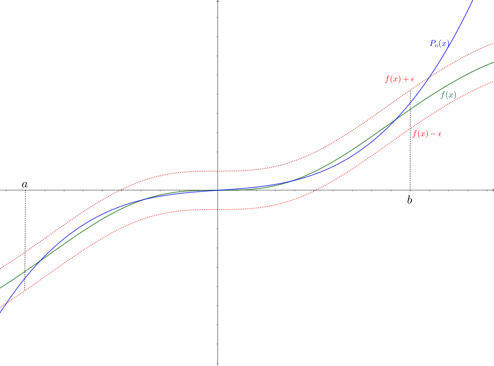
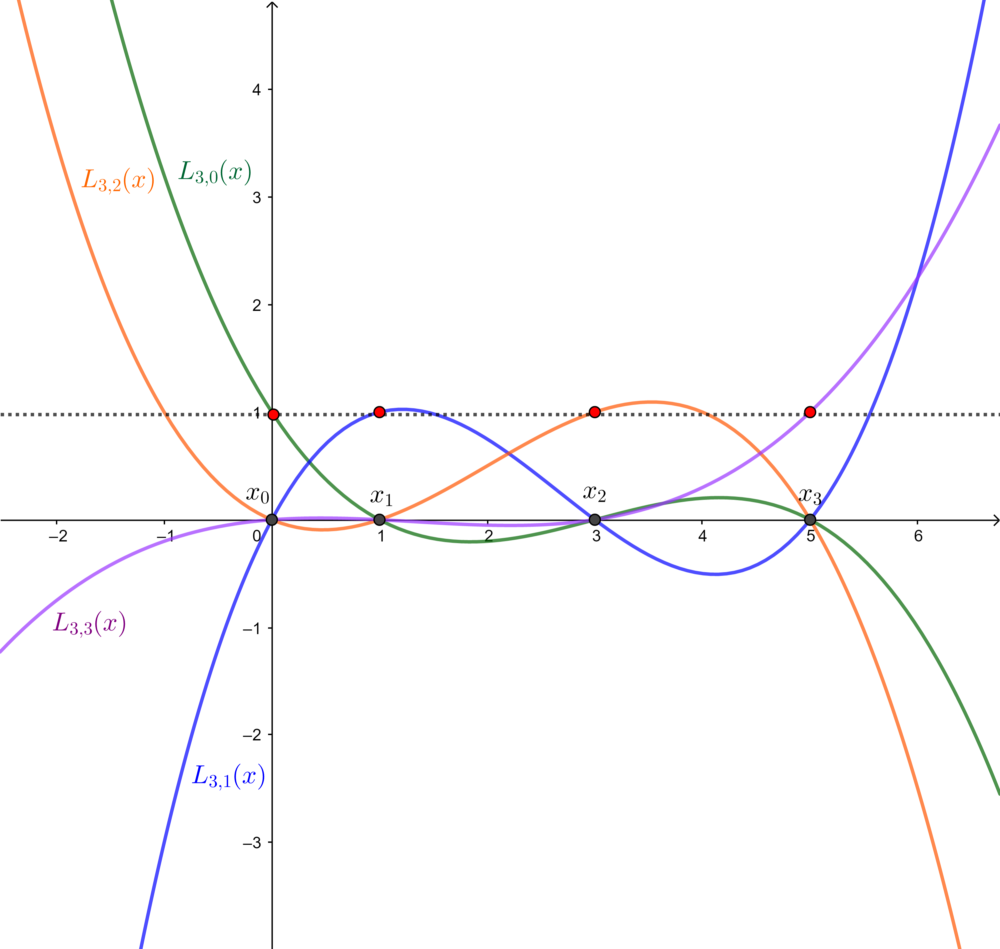
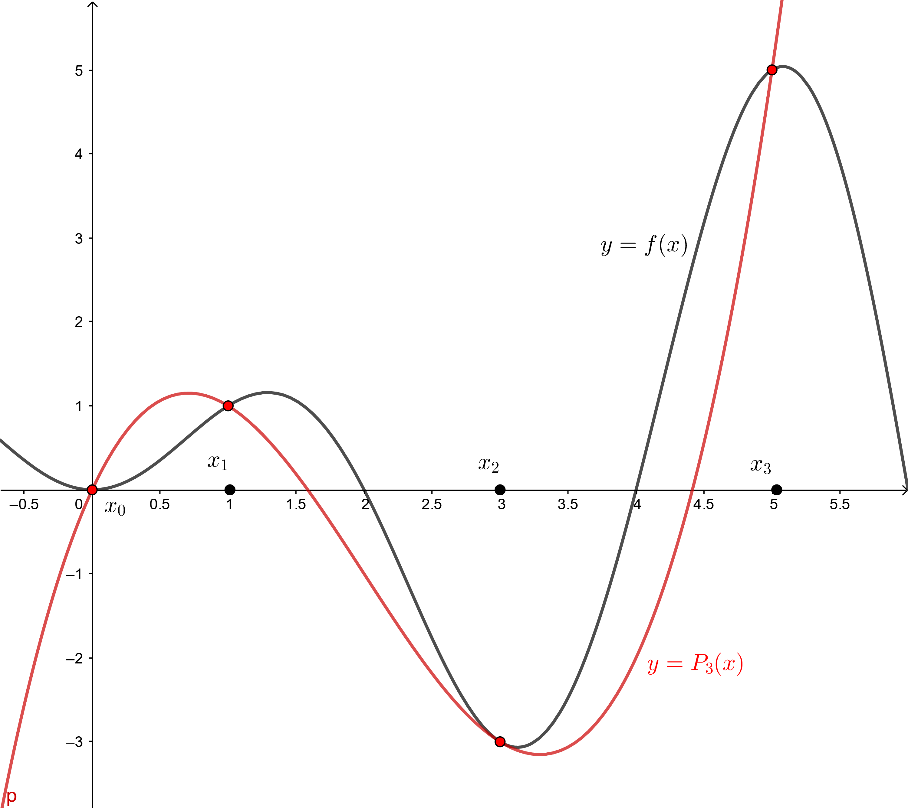
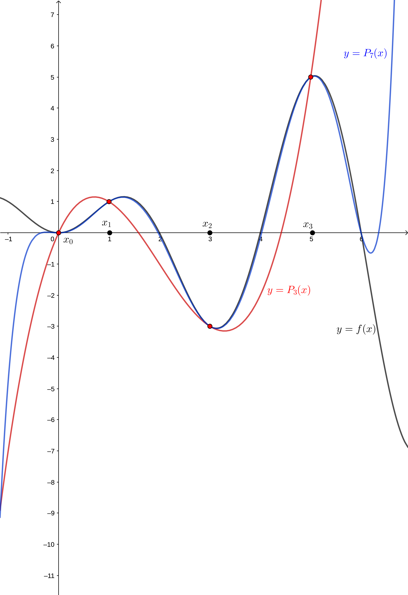
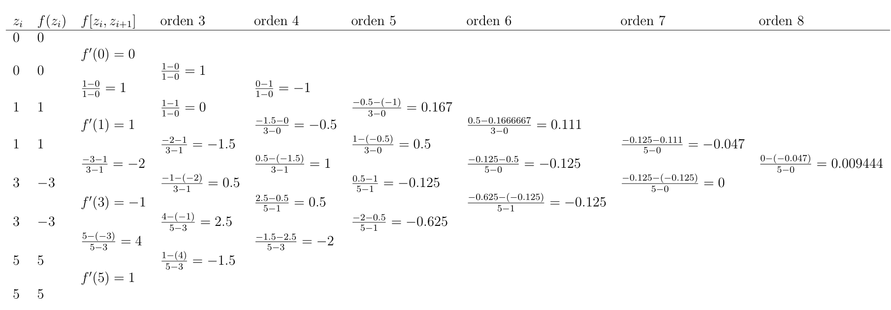
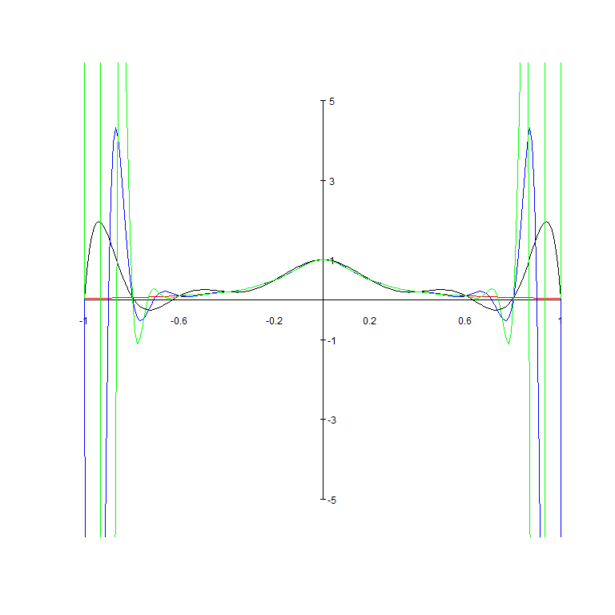
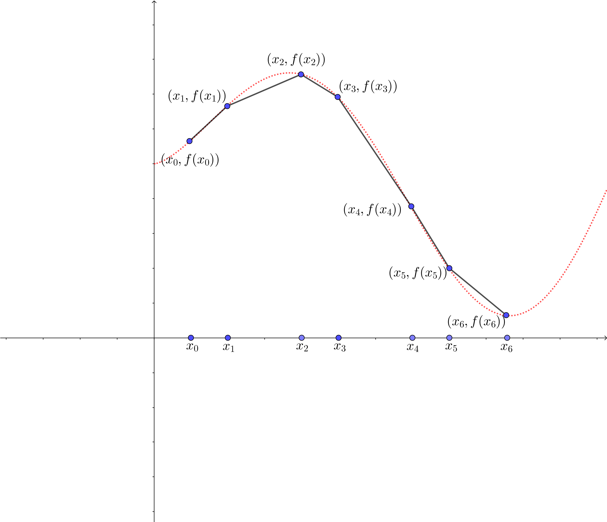
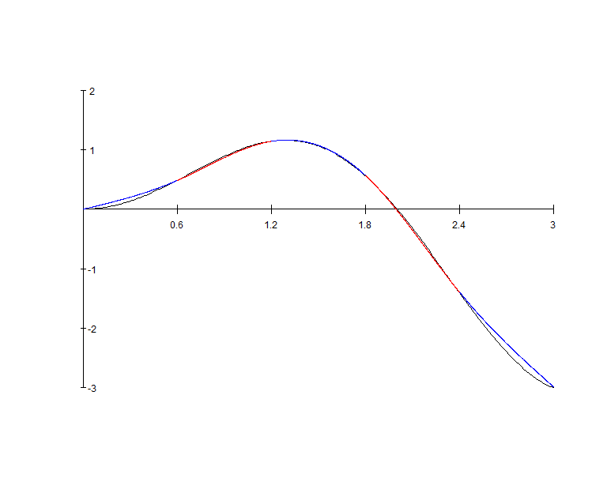
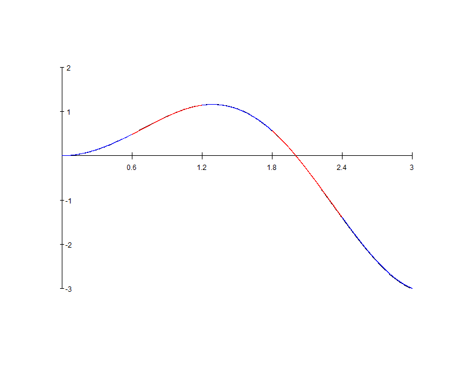

# Introducción

## Introducción

En este capítulo vamos a **aproximar** una función $f$ cualquiera por un miembro de la familia más conocida y más sencilla de tratar: **los polinomios**.

Recordemos que un **polinomio de grado $n$** tiene una expresión de la forma siguiente:
$$
P_n(x)=a_n x^n+a_{n-1}x^{n-1}+\cdots +a_1 x+a_0 = \sum_{i=0}^n a_i x^i,
$$
con $a_n\neq 0$ para que tenga grado $n$. 

Los valores $a_i$, $i=0,1,\ldots,n$ se denominan **coeficientes** del polinomio $P_n$.

Cuanto "mejor" sea la función $f$ a **aproximar**, es decir, cuanto más alto sea el valor de $k$ donde $f\in {\cal C}^k$, mejor **control** sobre el **error cometido** en la aproximación tendremos.

## Introducción
Para justificar la **aproximación** de una función $f$ por polinomios veamos el **Teorema de Weierstrass** que dice básicamente que cualquier función **continua** puede aproximarse por un polinomio con un **error** tan pequeño como se quiera:

<l class="prop">Teorema de Weierstrass.</l>
Sea $f\in {\cal C}^0[a,b]$ una función continua en un intervalo $[a,b]$. Entonces dado un valor $\epsilon >0$, existe un polinomio $P_n(x)$ de un grado determinado $n$ tal que:
$$
|f(x)-P_n(x)|<\epsilon,
$$
para todo valor $x\in [a,b]$.

## Introducción
<l class="observ">Observación.</l>
La aproximación anterior es **uniforme** en el sentido de que el "error" $\epsilon$ no depende del valor $x\in [a,b]$.

<div class="center">

</div>

## Introducción
El problema que intentamos resolver es el siguiente:

<l class="important">Problema:</l> 
Dados $n$ valores $(x_0,y_0),(x_1,y_1),\ldots,(x_n,y_n)$, hallar el **polinomio** $P_n$ de grado mínimo tal que $P_n(x_i)=y_i$, $i=0,\ldots,n$.

Es decir, dados $n+1$ puntos en el plano, hallar un polinomio de grado mínimo, (más adelante veremos que dicho grado es $n$) tal que $P_n(x_i)=y_i$, $i=0,\ldots,n$.

## Introducción
<l class="observ">Observaciones:</l>

* Si los puntos son parte de la **gráfica de una función $f$**, entonces $y_i=f(x_i)$ y las condiciones que debe verificar el polinomio $P_n(x)$ son $P_n(x_i)=f(x_i)$, $i=0,\ldots,n$.
* Tenemos en total $n+1$ **condiciones**, por tanto, el número de incógnitas debe ser $n+1$. Pensemos que un **polinomio de grado $n$** tiene en total $n+1$ coeficientes.

## Introducción
Sea pues $P_n(x)=a_0+a_1 x+\cdots +a_n x^n$ el polinomio que queremos hallar.

Las condiciones $P_n(x_i)=y_i$ serían las siguientes en función de los coeficientes $a_i$, $i=0,\ldots, n$:
$$
a_0+a_1 x_i+\cdots +a_n x_i^n=y_i, \ i=0,\ldots, n.
$$

Los **coeficientes** $a_i$ deben verificar el siguiente **sistema de ecuaciones lineal**:
$$
\left.
\begin{align*}
a_0+a_1 x_0+\cdots +a_n x_0^n = & y_0,\\
a_0+a_1 x_1+\cdots +a_n x_1^n = & y_1,\\
\vdots & \\
a_0+a_1 x_n+\cdots +a_n x_n^n = & y_n.
\end{align*}
\right\}
$$

## Introducción
Veamos que el **sistema lineal** anterior tiene solución única. 

El **determinante** del sistema es el siguiente:
$$
\left|
\begin{array}{cccc}
1 & x_0 & \cdots & x_0^n\\
1 & x_1 & \cdots & x_1^n\\
\vdots &\vdots & \vdots & \vdots\\
1 & x_n & \cdots & x_n^n
\end{array}
\right|.
$$

## Introducción
El determinante anterior se llama **determinante de Vandermonde** y su valor vale:
$$
\prod_{0\leq i <j\leq n} (x_i-x_j).
$$
Por tanto, si $x_i\neq x_j$ para $i\neq j$, el **determinante del sistema** no será cero y tendremos **solución única** para nuestro problema.

En resumen, tenemos el teorema siguiente:

<l class="prop">Teorema.</l>
Sean $(x_0,y_0),(x_1,y_1),\ldots,(x_n,y_n)$, $n$ valores con $x_i\neq x_j$, para $i\neq j$, (es decir, las abscisas son todas diferentes). Entonces existe un único polinomio $P_n(x)$ de grado $n$ tal que $P_n(x_i)=y_i$, $i=0,\ldots,n$.

# Interpolación de Lagrange

## Polinomios de Lagrange
Para hallar el polinomio $P_n(x)$ deberíamos resolver el **sistema anterior** para calcular los coeficientes del polinomio $a_i$, $i=0\ldots, n$.

Resolver el sistema lineal anterior es muy tedioso, sobre todo si el número de nodos $n+1$ es grande. Por dicho motivo, vamos a ver técnicas para obtener el **polinomio interpolador** sin tener que resolver dicho sistema.

## Polinomios de Lagrange
Una de dichas técnicas consiste en escribir el **polinomio interpolador** de forma explícita en función de unos polinomios especiales denominados **polinomios interpoladores de Lagrange**:

<l class="definition">Polinomios de Lagrange.</l>
Sean $x_0,\ldots, x_n$, $n+1$ nodos donde suponemos que $x_i\neq x_j$, para $i\neq j$.
Se define el polinomio de Lagrange $L_{n,k}(x)$ de grado $n$ asociado al nodo $x_k$ de la forma siguiente:
$$
\begin{array}{rl}
L_{n,k}(x)= & \displaystyle\frac{(x-x_0)\cdots (x-x_{k-1})\cdot (x-x_{k+1})\cdots (x-x_n)}{(x_k-x_0)\cdots (x_k-x_{k-1})\cdot (x_k-x_{k+1})\cdots (x_k-x_n)},\\ = &
\displaystyle\frac{\prod_{i\neq k} (x-x_i)}{\prod_{i\neq k} (x_k-x_i)}.
\end{array}
$$

## Polinomios de Lagrange
Los polinomios de Lagrange verifican la proposición siguiente:

<l class="prop">Proposición.</l>
Sean $x_0,\ldots, x_n$, $n+1$ nodos donde suponemos que $x_i\neq x_j$, para $i\neq j$. Sean $L_{n,k}(x)$ el polinomio de Lagrange de grado $n$ asociado al nodo $x_k$. Entonces dicho polinomio verifica que:
$$
L_{n,k}(x_i)=0,\mbox{ si }i\neq k,\ L_{n,k}(x_k)=1.
$$


## Polinomios de Lagrange

<div class="dem">
**Demostración**

Si $i\neq k$,
$$
L_{n,k}(x_i)=\frac{(x_i-x_0)\cdots (x_i-x_i)\cdots (x_i-x_{k-1})\cdot (x-x_{k+1})\cdots (x-x_n)}{(x_k-x_0)\cdots (x_k-x_i)\cdots (x_k-x_{k-1})\cdot (x_k-x_{k+1})\cdots (x_k-x_n)}=0,
$$
ya que tenemos el valor $x_i-x_i=0$ en el numerador.

Además,
$$
L_{n,k}(x_k)=\frac{(x_k-x_0)\cdots (x_k-x_{k-1})\cdot (x_k-x_{k+1})\cdots (x_k-x_n)}{(x_k-x_0)\cdots (x_k-x_{k-1})\cdot (x_k-x_{k+1})\cdots (x_k-x_n)}=1,
$$
ya el numerador y el denominador son iguales.
</div>

## Ejemplo


<div class="example">


Consideremos los nodos $x_0=0,\ x_1=1,\ x_2=3,\ x_3=5$.

Los polinomios de Lagrange asociados a los nodos anteriores son los siguientes:
$$
\begin{array}{rl}
L_{3,0}(x) = & \frac{(x-1)\cdot (x-3)\cdot (x-5)}{(0-1)\cdot (0-3)\cdot (0-5)}=\frac{1}{-15}\cdot (x-1)\cdot (x-3)\cdot (x-5)=\frac{1}{-15}\cdot (x^3-9 x^2+23x-15),\\
L_{3,1}(x)= &  \frac{x\cdot (x-3)\cdot (x-5)}{(1-0)\cdot (1-3)\cdot (1-5)}=\frac{1}{8}\cdot x\cdot (x-3)\cdot (x-5)=\frac{1}{8}\cdot (x^3-8 x^2+15x),\\
L_{3,2}(x)= &  \frac{x\cdot (x-1)\cdot (x-5)}{(3-0)\cdot (3-1)\cdot (3-5)}=\frac{1}{-12}\cdot x\cdot (x-1)\cdot (x-5)=\frac{1}{-12}\cdot (x^3-6 x^2+5x),\\
L_{3,3}(x)= &  \frac{x\cdot (x-1)\cdot (x-3)}{(5-0)\cdot (5-1)\cdot (5-3)}=\frac{1}{40}\cdot x\cdot (x-1)\cdot (x-3)=\frac{1}{40}\cdot (x^3-4 x^2+3x).
\end{array}
$$

<div class="center">
[{width=10%}](https://colab.research.google.com/drive/1FTjsDF9Txl7FwmezJzFaCQO5z-4VeaLs#scrollTo=o5KF2CpFlyb8)
</div>

</div>

## Polinomios de Lagrange


<div class="center">

</div>


## Polinomio interpolador
El Teorema siguiente nos dice cómo calcular el **polinomio interpolador** a partir de los **polinomios de Lagrange**:

<l class="prop">Teorema.</l>

Sean $n+1$ puntos $(x_0,y_0),(x_1,y_1),\ldots,(x_n,y_n)$ con $x_i\neq x_j$, con $i\neq j$. Entonces el **polinomio interpolador** $P_n(x)$ se puede expresar de la forma siguiente:
$$
\begin{array}{rl}
P_n(x)= & y_0\cdot L_{n,0}(x)+y_1\cdot L_{n,1}(x)+\cdots + y_n\cdot L_{n,n}(x)\\
= & \displaystyle\sum_{k=0}^n y_k\cdot L_{n,k}(x),
\end{array}
$$
donde $L_{n,k}(x)$ es el **polinomio de Lagrange** correspondiente al nodo $x_k$, $k=0,\ldots,n$.

## Polinomio interpolador
<l class="observ">Observación:</l>

Si los $n+1$ puntos forman parte de la **gráfica** de una función $f$, es decir $y_i=f(x_i)$, para $i=0.\ldots,n$, entonces el polinomio interpolador se escribiría de la forma siguiente:
$$
\begin{array}{rl}
P_n(x)= & f(x_0)\cdot L_{n,0}(x)+f(x_1)\cdot L_{n,1}(x)+\cdots + f(x_n)\cdot L_{n,n}(x)\\
= & \displaystyle\sum_{k=0}^n f(x_k)\cdot L_{n,k}(x),
\end{array}
$$


## Polinomio interpolador
<div class="dem">
**Demostración**

Usando que $L_{n,k}(x_i)=0$, si $i\neq k$ y $L_{n,k}(x_k)=1$, tenemos:
$$
P_n(x_i)=\sum_{k=0}^n y_k\cdot L_{n,k}(x_i)=y_i\cdot L_{n,i}(x_i)=y_i,
$$
para $i=0,\ldots,n$. Dicho en otras palabras, $P_n(x)$ interpola a los puntos $(x_0,y_0),\ldots,(x_n,y_n)$, tal como queríamos demostrar.
</div>


## Ejemplo


<div class="example">


Calculemos el polinomio interpolador en los nodos anteriores  $x_0=0,\ x_1=1,\ x_2=3,\ x_3=5$ para la función $f(x)=x\cdot \sin\left(\frac{\pi}{2}x\right)$. 

Los puntos a interpolar serían, por tanto:
$$
(0,0),\ (1,1),\ (3,-3),\ (5,5)
$$
El polinomio interpolador será:
$$
\begin{array}{rl}
P_3(x) = & 0\cdot \left(\frac{1}{-15}\cdot (x^3-9 x^2+23x-15)\right)+1\cdot\left(\frac{1}{8}\cdot (x^3-8 x^2+15x)\right)\\ &
-3\cdot\left(\frac{1}{-12}\cdot (x^3-
6 x^2+5x)\right)
+5\cdot\left(\frac{1}{40}\cdot (x^3-
4 x^2+3x)\right)\\
= & 0.5\cdot x^3-3\cdot x^2+3.5\cdot x.
\end{array}
$$

<div class="center">
[{width=10%}](https://colab.research.google.com/drive/1FTjsDF9Txl7FwmezJzFaCQO5z-4VeaLs#scrollTo=p_QCHPNsmiGk)
</div>

</div>

## Ejemplo


<div class="center">

</div>

# Error en la interpolación

## Introducción
Interpolar una función $f$ en unos nodos determinados puede interpretarse como una manera de **aproximar** la función $f$ en un **entorno** de los nodos, es decir, en un dominio que esté relativamente cerca de dichos nodos.

Es fundamental estimar de alguna manera el **error** cometido en un valor cualquiera cuando se intenta aproximar una función. El Teorema siguiente nos da una expresión del **error** cometido cuando **aproximamos** una función $f$ por un **polinomio interpolador**:


## Error en la interpolación
<l class="prop">Teorema. Error en la interpolación.</l>

Sea $f\in {\cal C}^{n+1}[a,b]$ una función de clase $n+1$ en un intervalo $[a,b]$. Consideramos $n+1$ nodos $x_0, x_1,\ldots,x_n$ en dicho intervalo $[a,b]$ con $x_i\neq x_j$, con $i\neq j$.
Sea $P_n(x)$ el **polinomio interpolador** de la función $f$ en los puntos $(x_0,f(x_0)),(x_1,f(x_1)),\ldots,(x_n,f(x_n))$. 

Sea $x$ un valor cualquiera dentro del intervalo $[a,b]$.
Entonces existe un valor $\xi(x)\in <x_0,\ldots,x_n,x>=(\min\{x_0,\ldots,x_n,x\},\max\{x_0,\ldots,x_n,x\})$ tal que:
$$
f(x)-P_n(x)=\frac{f^{(n+1)}(\xi(x))}{(n+1)!}\cdot (x-x_0)\cdot (x-x_1)\cdots (x-x_n).
$$

## Error en la interpolación
<l class="observ">Observación:</l>

El error cometido $f(x)-P_n(x)$ cuando interpolamos una función $f$ tiene tres partes bien diferenciadas:

* El producto $(x-x_0)\cdot (x-x_1)\cdots (x-x_n)$ nos dice que cuándo más cerca esté el valor $x$ de los nodos, mejor será la aproximación.
* El denominador $(n+1)!$ nos dice que cuantos más nodos tengamos en cuenta, mejor será la aproximación y menor el error cometido.
* La "caja negra" $f^{(n+1)}(\xi(x))$ que depende de la función $f$ nos dice que tenemos que tener "controladas" las derivadas de la función $f$ ya que si éstas van aumentando sin control, no tendrá ningun sentido interpolar ya que el error cometido puede aumentar indefinidamente.


## Error en la interpolación
<div class="dem">
**Demostración**

En primer lugar, recordemos que como $P_n(x)$ interpola $f(x)$ tenemos que $P_n(x_i)=f(x_i)$, $i=0,\ldots,n$.

Sea $x$ un valor cualquiera dentro del intervalo $[a,b]$ distinto de los nodos $x_i$. Para este valor, definimos la función siguiente dependiendo de la variable $t$ que tiene el valor $x$ anterior como parámetro:
$$
\begin{array}{rl}
G(t)= & f(t)-P_n(t)-\left(f(x)-P_n(x)\right)\cdot\frac{(t-x_0)\cdot (t-x_1)\cdots (t-x_n)}{(x-x_0)\cdot (x-x_1)\cdots (x-x_n)}\\ = &\displaystyle f(t)-P_n(t)-\left(f(x)-P_n(x)\right)\cdot\prod_{k=0}^n \frac{(t-x_k)}{(x-x_k)}.
\end{array}
$$

La función anterior también será de clase $n+1$ en el intervalo $[a,b]$ al serlo $f$.

Veamos cuánto vale $G(t)$ para $t=x_0,\ldots,x_n,x$:
$$
G(x_i)=  f(x_i)-P_n(x_i)-(f(x)-P_n(x))\cdot\prod_{k=0}^n \frac{(x_i-x_k)}{(x-x_k)}=0,
$$
para $i=0,\ldots,n$ ya que $f(x_i)=P_n(x_i)$ y en el productorio uno de los factores será $x_i-x_i=0$.


</div>


## Error en la interpolación
<div class="dem">
**Demostración** (continuación)

El valor de $G(x)$ será:
$$
G(x)=f(x)-P_n(x)-(f(x)-P_n(x))\cdot \prod_{k=0}^n \frac{(x-x_k)}{(x-x_k)}=f(x)-P_n(x)-(f(x)-P_n(x))=0.
$$

En resumen, la función $G(t)$ tiene $n+2$ ceros, $x_0,\ldots,x_n,x$. Usando el **Teorema del valor medio generalizado**, tenemos que existe un valor $\xi(x)$ tal que $G^{(n+1)}(\xi(x))=0$.

Calculemos la derivada $n+1$-ésima de $G(t)$:
$$
G^{(n+1)}(t)=f^{(n+1)}(t)-P_n^{(n+1)}(t)-(f(x)-P_n(x))\cdot \left(\prod_{k=0}^n \frac{(t-x_k)}{(x-x_k)}\right)^{(n+1)}.
$$
El valor $P_n^{(n+1)}(t)=0$ vale $0$ ya que en general la derivada $n+1$-ésima de un polinomio de grado $n$ es nula.

</div>


## Error en la interpolación
<div class="dem">
**Demostración** (continuación)

El valor $\displaystyle \left(\prod_{k=0}^n \frac{(t-x_k)}{(x-x_k)}\right)^{(n+1)}$ consiste en hallar la derivada $n+1$-ésima de un polinomio en $t$ de grado $n+1$ que valdrá el coeficiente del monomio de grado superior, es decir, el coeficiente de $t^{n+1}$ multiplicado por $(n+1)!$.

El coeficiente de $t^{n+1}$ del polinomio de grado $n+1$, $\displaystyle\prod_{k=0}^n \frac{(t-x_k)}{(x-x_k)}$ valdrá 
$$
\prod_{k=0}^n \frac{1}{(x-x_k)}=\frac{1}{\displaystyle\prod_{k=0}^n (x-x_k)}.
$$

Entonces:
$$
G^{(n+1)}(t)=f^{(n+1)}(t)-\frac{(n+1)!\cdot (f(x)-P_n(x))}{\displaystyle\prod_{k=0}^n (x-x_k)}.
$$

</div>


## Error en la interpolación
<div class="dem">
**Demostración** (continuación)

Como $G^{(n+1)}(\xi(x))=0$, tenemos que:
$$
\begin{array}{rl}
G^{(n+1)}(\xi(x))= & \displaystyle 0=f^{(n+1)}(\xi(x))-\frac{(n+1)!\cdot (f(x)-P_n(x))}{\prod_{k=0}^n (x-x_k)},\ \Rightarrow \\ f(x)-P_n(x)= & \displaystyle\frac{f^{(n+1)}(\xi(x))}{(n+1)!}\cdot \prod_{k=0}^n (x-x_k),
\end{array}
$$
tal como queríamos demostrar.


</div>


## Ejemplo anterior
<div class="example">

La expresión del error cometido en el ejemplo anterior donde recordemos que $f(x)=x\cdot \sin\left(\frac{\pi}{2}x\right)$ valdrá:
$$
f(x)-P_3(x)=\frac{f^{(4)}(\xi(x))}{4!}\cdot x\cdot (x-1)\cdot (x-3)\cdot (x-5).
$$

Hallemos $f^{(4)}(x)$:
$$
\begin{array}{rl}
f'(x)= & \sin\left(\frac{\pi}{2} x\right)+\frac{1}{2}\pi x\cos\left(\frac{\pi}{2} x\right),\\
f''(x)= & \pi \cos\left(\frac{\pi}{2} x\right)-\frac{1}{4}\pi^2 x\sin\left(\frac{\pi}{2} x\right),\\
f'''(x)= & -\frac{1}{8}\left(6 \sin\left(\frac{\pi}{2} x\right)+\pi x\cos\left(\frac{\pi}{2} x\right)\right),\\
f^{(4)}(x) = & \frac{1}{16}\pi^3\left(-8 \cos\left(\frac{\pi}{2} x\right)+\pi x \sin\left(\frac{\pi}{2} x\right)\right).
\end{array}
$$

La expresión del error será:
$$
f(x)-P_3(x) = \frac{\pi^3}{384}\left(-8 \cos\left(\frac{\pi}{2} \xi(x)\right)+\pi \xi(x) \sin\left(\frac{\pi}{2} \xi(x)\right)\right)\cdot x\cdot (x-1)\cdot (x-3)\cdot (x-5).
$$

</div>

## Ejemplo anterior

<div class="example">

Imaginemos que queremos acotar el error cometido $|f(x)-P_3(x)|$ para todo valor de $x$ en el intervalo $[0,5]$. Entonces, tendremos:
$$
|f(x)-P_3(x)|\leq  \frac{\pi^3 (8+5\pi)}{384}\cdot\max_{x\in [0,5]}|x\cdot (x-1)\cdot (x-3)\cdot (x-5)|.
$$

Para calcular el valor $\max_{x\in [0,5]}|x\cdot (x-1)\cdot (x-3)\cdot (x-5)|$ tenemos que derivar la función $h(x)=x\cdot (x-1)\cdot (x-3)\cdot (x-5)=x^4-9x^3+23x^2-15x$ ya que el valor máximo de la misma se alcanzará en el interior (en los extremos, $h(0)=h(5)=0$):
$$
h'(x)=4x^3-27x^2+46x-15.
$$
El siguiente paso es resolver la ecuación $h'(x)=0$. Para resolver la ecuación anterior, podemos usar un método numérico para hallar ceros como los métodos de **regula-falsi** o **Newton-Raphson**.

Usando el primer método anterior y la técnica de la deflación, podemos hallar los ceros del polinomio anterior:
$$
0.4257862,\ 2.0704646,\ 4.2537492.
$$

</div>

## Ejemplo anterior
<div class="example">

Los tres ceros se encuentran en el interior del intervalo $[0,5]$.

Las imágenes de los ceros anteriores para la función $g(x)=|x\cdot (x-1)\cdot (x-3)\cdot (x-5)|$ son las siguientes:
$$
\begin{array}{rl}
g(0.4257862)= & 2.878898,\\
g(2.0704646)= & 6.0353826,\\
g(4.2537492)= & 12.9494533.
\end{array}
$$
Entonces, $\displaystyle \max_{x\in [0,5]}|x\cdot (x-1)\cdot (x-3)\cdot (x-5)|=12.9494533$.

El error cometido al interpolar $f(x)$ en los nodos anteriores para $x\in [0,5]$ se puede acotar por:
$$
|f(x)-P_3(x)|\leq \frac{\pi^3 (8+5\pi)}{384}\cdot12.9494533\approx 24.7892891.
$$


</div>

## Ejemplo anterior
<div class="example">

La cota del error es muy grande ya que la longitud del intervalo es grande ($5$) hemos considerado sólo $4$ nodos. Si aumentamos el número de nodos, el error disminuiría.

De todas formas, es una cota muy "pesimista". Basta observar el gráfico de la función $f(x)$ y del polinomio interpolador $P_3(x)$ y ver "a ojo de buen cubero" que el error no es mayor que $4$ unidades.

Si hubiésemos acotado la derivada $f^{(4)}(x)$ hallando el valor máximo dentro del intervalo $[0,5]$ hubiésemos obtenido una cota más fina.

<div class="center">
[{width=10%}](https://colab.research.google.com/drive/1FTjsDF9Txl7FwmezJzFaCQO5z-4VeaLs#scrollTo=5u-EzmgtnaH7)
</div>
</div>

# Método de Neville

## Introducción
Muchas aplicaciones derivadas de la **interpolación** consisten en la interpolación de **datos tabulados**, es decir, datos que tenemos en una tabla de la forma:

<div class="center">
|$x$|$x_0$|$x_1$|$\cdots$|$x_n$|
|:---:|:---:|:---:|:---:|:---:|
|$y$|$y_0$|$y_1$|$\cdots$|$y_n$|
</div>

En estos casos, no necesitamos conocer explícitamente la expresión del **polinomio interpolador**.

En el caso de **datos tabulados**, al no conocer la función $f$ que interpolamos, no podemos aplicar la fórmula del **error en la interpolación** y no podemos saber cuál es el error cometido en un valor cualquiera $x$.

## Introducción
El método de Lagrange para hallar el **polinomio interpolador** tiene el siguiente problema:

* Imaginemos que hemos hallado el polinomio interpolador para los puntos $(x_0,f(x_0)),(x_1,f(x_1)),\ldots,(x_n,f(x_n))$ que forman parte de la gráfica de una cierta función $f$. 

* De cara a hallar una mejor aproximación de la función $f$, añadimos un nuevo punto $(x_{n+1},f(x_{n+1}))$. Entonces para hallar el nuevo polinomio interpolador en los puntos $(x_0,f(x_0)),(x_1,f(x_1)),\ldots,(x_n,f(x_n)),(x_{n+1},f(x_{n+1}))$ usando el **método de Lagrange**, tenemos que "empezar de nuevo" ya que los **polinomios de Lagrange** hallados previamente para los puntos $(x_0,f(x_0)),(x_1,f(x_1)),\ldots,(x_n,f(x_n))$ no nos sirven y hay que volver a hallar los "nuevos polinomios de Lagrange".

## Introducción
Lo dicho anteriormente hace que el **método de Lagrange** no sea apropiado para hallar el **polinomio interpolador** para datos tabulados.

Vamos a ver un método nuevo que aprovecha el trabajo realizado en interpolar los puntos $(x_0,f(x_0)),(x_1,f(x_1)),\ldots,(x_n,f(x_n))$ de cara a interpolar los puntos anteriores añadiendo un nuevo punto $(x_{n+1},f(x_{n+1}))$. Dicho método se llama **método de Neville**.

## Polinomios interpoladores de Lagrange 
En primer lugar necesitamos unas definiciones previas:

<l class="definition">Definición.</l>

Sea $f$ una función definida en los valores $x_0,x_1,\ldots,x_n$. Sean $m_1,m_2,\ldots,m_k$, $k$ enteros diferentes, con $m_i\in\{0,1,\ldots,n\}$, $i=1,\ldots,k$. El **polinomio interpolador de Lagrange ** que interpola los puntos $(x_{m_1},f(x_{m_1})),(x_{m_2},f(x_{m_2})),\ldots,(x_{m_k},f(x_{m_k}))$ se denota por $P_{m_1,m_2,\ldots,m_k}(x)$.


## Ejemplo anterior
<div class="example">

Consideremos los puntos $x_0=0, x_1=1, x_2=3$ y $x_3=5$ y la función $f(x)=x\cdot \sin\left(\frac{\pi}{2}x\right)$.

Los puntos a interpolar son los siguientes: $(0,0),(1,1),(3,-3), (5,5)$.

Hallemos el polinomio interpolador $P_{1,3}(x)$ que sería el polinomio interpolador en los puntos $x_1=1$ y $x_3=5$.

Los polinomios de Lagrange asociados a los nodos anteriores son los siguientes:
$$
L_{1,0}(x) =  \frac{x-5}{1-5}=\frac{1}{-4}(x-5),\quad
L_{1,1}(x)=   \frac{x-1}{5-1}=\frac{1}{4}(x-1).
$$
El polinomio interpolador será, pues:
$$
P_{1,3}(x)=1\cdot \left(\frac{1}{-4}(x-5)\right)+5\cdot\left(\frac{1}{4}(x-1)\right)=x.
$$
</div>

## Ejemplo anterior
<div class="example">

Hallemos el polinomio interpolador $P_{0,2,3}(x)$ que sería el polinomio interpolador en los puntos $x_0=0$, $x_2=3$ y $x_3=5$.


Los polinomios de Lagrange asociados a los nodos anteriores son los siguientes:
$$
\begin{array}{rl}
L_{2,0}(x) = & \frac{(x-3)\cdot (x-5)}{(0-3)\cdot (0-5)}=\frac{1}{15}\cdot (x-3)\cdot (x-5)=\frac{1}{15}\cdot (x^2-8 x+15),\\
L_{2,1}(x)= & \frac{x\cdot (x-5)}{(3-0)\cdot (3-5)}=\frac{1}{-6}\cdot x\cdot (x-5)=\frac{1}{-6}\cdot (x^2-5 x),\\
\\
L_{2,2}(x)= & \frac{x\cdot (x-3)}{(5-0)\cdot (5-3)}=\frac{1}{10}\cdot x\cdot (x-3)=\frac{1}{10}\cdot (x^2-3 x).
\end{array}
$$
El polinomio interpolador será:
$$
P_{0,2,3}(x) =  0\cdot \left(\frac{1}{15}\cdot (x^2-8 x +15)\right)-3\cdot\left(\frac{1}{-6}\cdot (x^2-5 x)\right)+5\cdot\left(\frac{1}{10}\cdot (x^2-
3 x)\right)=  x^2-4\cdot x.
$$


</div>

## Polinomio interpolador
El siguiente resultado nos dice cómo hallar el valor del **polinomio interpolador** en un punto $x$ a partir de los **Polinomios interpoladores de Lagrange ** introducidos anteriormente:

<l class="prop">Proposición.</l>

Sean $x_0,\ldots,x_n$, $n+1$ nodos, sea $f$ una función y sea $P_n(x)$ el **polinomio interpolador** de la función $f$ en los nodos anteriores.

Sean $x_i$ y $x_j$ dos nodos cualquiera con $i\neq j$. Sean $P_{0,1,\ldots,i-1,i+1,\ldots,n}(x)$ y $P_{0,1,\ldots,j-1,j+1,\ldots,n}(x)$ los **Polinomios interpoladores de Lagrange ** en los nodos $x_0,x_1,\ldots,x_{i-1},x_{i+1},\ldots,x_n$ y $x_0,x_1,\ldots,x_{j-1},x_{j+1},\ldots,x_n$, respectivamente.


## Polinomio interpolador
<l class="prop">Proposición.</l>(continuación)

Entonces el polinomio interpolador $P_n(x)$ que interpola todos los nodos $x_0,x_1,\ldots,x_n$ puede escribirse de la forma siguiente:
$$
P_n(x)=\frac{(x-x_j)P_{0,1,\ldots,j-1,j+1,\ldots,n}(x)-(x-x_i)P_{0,1,\ldots,i-1,i+1,\ldots,n}(x)}{x_i-x_j}.
$$

## Polinomio interpolador
<div class="dem">
**Demostración**

Para simplificar la notación escribiremos $Q_i(x)=P_{0,1,\ldots,i-1,i+1,\ldots,n}(x)$ y $Q_j(x)=P_{0,1,\ldots,j-1,j+1,\ldots,n}(x)$.

Notemos que $Q_i(x_j)=f(x_j)$ y $Q_j(x_i)=f(x_i)$ si $i\neq j$.

Veamos que $P_n(x_k)=f(x_k)$ para cualquier valor de $k$. Distinguimos los casos siguientes:

* $k\neq i,j$, en este caso
$$
\begin{align*}
P_n(x_k)= & \frac{(x_k-x_j)Q_j(x_k)-(x_k-x_i)Q_i(x_k)}{x_i-x_j}=\frac{(x_k-x_j)f(x_k)-(x_k-x_i)f(x_k)}{x_i-x_j}\\ = & 
\frac{f(x_k)(x_k-x_j-x_k+x_i)}{x_i-x_j}=f(x_k).
\end{align*}
$$
* $k=i$, en este caso
$$
P_n(x_i)=  \frac{(x_i-x_j)Q_j(x_i)-(x_i-x_i)Q_i(x_i)}{x_i-x_j}=\frac{(x_i-x_j)f(x_i)}{x_i-x_j} =  f(x_i).
$$
</div>

## Polinomio interpolador
<div class="dem">
**Demostración** (continuación)

* $k=j$, en este caso
$$
P_n(x_j)=  \frac{(x_j-x_j)Q_j(x_j)-(x_j-x_i)Q_i(x_j)}{x_i-x_j}=\frac{-(x_j-x_i)f(x_j)}{x_i-x_j} =  f(x_j),
$$
tal como queríamos demostrar.
</div>


## Polinomio interpolador
El **método de Neville** nos permite hallar los distintos polinomios de interpolación de forma recursiva.

* Los **polinomios interpoladores de Lagrange** de grado $0$ serían:
$$
P_0 =f(x_0),\ P_1=f(x_1),\ldots, P_n=f(x_n),
$$
en general $P_i=f(x_i)$, $i=0,\ldots,n$.


## Polinomio interpolador
* La proposición anterior nos da los **polinomios interpoladores de Lagrange** de grado $1$:
$$
\begin{align*}
P_{0,1}(x)= & \frac{(x-x_0)P_1-(x-x_1)P_0}{x_1-x_0},\\
P_{1,2}(x)= & \frac{(x-x_1)P_2-(x-x_2)P_1}{x_2-x_1},\\
\vdots &\\
P_{n-1,n}(x) = & \frac{(x-x_{n-1})P_n-(x-x_n)P_{n-1}}{x_n-x_{n-1}}.
\end{align*}
$$


## Polinomio interpolador
* Usando la misma técnica podemos obtener los **polinomios interpoladores de Lagrange** de grado $2$:

$$
\begin{align*}
P_{0,1,2}(x)= & \frac{(x-x_0)P_{1,2}(x)-(x-x_2)P_{0,1}(x)}{x_2-x_0},\\
P_{1,2,3}(x)= & \frac{(x-x_1)P_{2,3}(x)-(x-x_3)P_{1,2}(x)}{x_3-x_1},\\
\vdots &\\
P_{n-2,n-1,n}(x) = & \frac{(x-x_{n-2})P_{n-1,n}(x)-(x-x_n)P_{n-2,n-1}(x)}{x_n-x_{n-2}}.
\end{align*}
$$

* Y así sucesivamente.

## Polinomio interpolador 
Los polinomios generados anteriormente se pueden escribir en forma de tabla de la siguiente manera:

<div class="center">
|$x_i$|$P_i$|$P_{i-1,i}$|$P_{i-2,i-1,i}$|$P_{i-3,i-2,i-1,i}$|$\ldots$|
|:---:|:---:|:---:|:---:|:---:|:---:|
|$x_0$|$P_0$|||||
|$x_1$|$P_1$|$P_{0,1}$||||
|$x_2$|$P_2$|$P_{1,2}$|$P_{0,1,2}$|||
|$x_3$|$P_3$|$P_{2,3}$|$P_{1,2,3}$|$P_{0,1,2,3}$|$\ldots$|
|$\vdots$|$\vdots$|$\vdots$|$\vdots$|$\vdots$|$\vdots$|
</div>

## Simplificación de la notación
La manera de indicar los **polinomios de Lagrange interpoladores** es un poco tediosa ya que el número de subíndices va aumentando a medida que aumenta el número de nodos a interpolar.

Como los subíndices son consecutivos, basta tener en cuenta el subíndice del nodo en que empieza la interpolación y el número de nodos que se interpola. 

Por ejemplo, para indicar el **polinomio interpolador de Lagrange** $P_{2,3,4}$ bastaría "guardar" el valor $4$, es decir, el último nodo que se interpola $x_4$ y el número $3$ que es el número de nodos que se interpola ya que con estos dos valores ya quedaría claro que los nodos a interpolar serían $x_2,x_3$ y $x_4$.


## Simplificación de la notación
Por dicho motivo, introduciremos una nueva notación para indicar los **polinomios interpoladores de Lagrange**: para indicar el polinomio $P_{i-j,i-j+1,\ldots,i}$ definimos:
$$
Q_{i,j}:=P_{i-j,i-j+1,\ldots,i}.
$$

La tabla anterior sería en la nueva notación:

## Simplificación de la notación
<div class="center">
|$x_i$|$Q_{i,0}$|$Q_{i,1}$|$Q_{i,2}$|$Q_{i,3}$|$\ldots$|
|:---:|:---:|:---:|:---:|:---:|:---:|
|$x_0$|$Q_{0,0}$|||||
|$x_1$|$Q_{1,0}$|$Q_{1,1}$||||
|$x_2$|$Q_{2,0}$|$Q_{2,1}$|$Q_{2,2}$|||
|$x_3$|$Q_{3,0}$|$Q_{3,1}$|$Q_{3,2}$|$Q_{3,3}$|$\ldots$|
|$\vdots$|$\vdots$|$\vdots$|$\vdots$|$\vdots$|$\vdots$|
</div>


## Ejemplo anterior
<div class="example">

La tabla de **polinomios interpoladores de Lagrange** para los datos del ejemplo sería la siguiente:

<div class="center">
|$x_i$|$Q_{i,0}$|$Q_{i,1}$|$Q_{i,2}$|$Q_{i,3}$|
|:---:|:---|:---|:---|:---|
|$x_0=0$|$Q_{0,0}=0$||||
|$x_1=1$|$Q_{1,0}=1$|$\begin{array}{rl}Q_{1,1}= & \frac{(x-0) 1-(x-1)0}{1-0}\\ =& 1x\end{array}$|||
|$x_2=3$|$Q_{2,0}=-3$|$\begin{array}{rl} Q_{2,1}= & \frac{(x-1) (-3)-(x-3)1}{3-1}\\ = & -2x+3\end{array}$|$Q_{2,2}=-1x^2+2x$||
|$x_3=5$|$Q_{3,0}=5$|$\begin{array}{rl} Q_{3,1}= & \frac{(x-3) (5)-(x-5)(-3)}{5-3}\\ = & 4x -15\end{array}$|$Q_{3,2}=1.5x^2-8x+7.5$|$Q_{3,3}=0.5x^3-3x^2+3.5x$|
</div>
</div>


## Ejemplo anterior
<div class="example">

Los polinomios que faltan desarrollar en la tabla son los siguientes:
$$
\begin{align*}
Q_{2,2}(x)=& \frac{(x-0) Q_{2,1}(x)-(x-3) Q_{1,1}(x)}{3-0}= \frac{(x-0) (-2x+3)-(x-3) (1x)}{3-0} = -1x^2+2x,\\
Q_{3,2}(x) = & \frac{(x-1) Q_{3,1}(x)-(x-5) Q_{2,1}(x)}{5-1}= \frac{(x-1) (4x-15)-(x-5) (-2x+3)}{5-1} \\ = &  1.5x^2-8x+7.5,\\
Q_{3,3}(x) = & \frac{(x-0) Q_{3,2}(x)-(x-5) Q_{2,2}(x)}{5-0}= \frac{(x-0) (1.5x^2-8x+7.5)-(x-5) (-1x^2+2x)}{5-0} \\ = &  0.5x^3-3x^2+3.5x. 
\end{align*}
$$
</div>

## Ejemplo anterior
<div class="example">

Así por ejemplo, 

* el polinomio $Q_{1,1}(x)=1x$ interpola los puntos $(x_0=0,y_0=0)$ y $(x_1=1,y_1=1)$,
* el polinomio $Q_{2,1}(x)=-2x+3$ interpola los puntos $(x_1=1,y_1=1)$ y $(x_2=3,y_2=-3)$,
* el polinomio $Q_{3,1}(x)=4x -15$ interpola los puntos $(x_2=3,y_2=-3)$ y $(x_3=5,y_3=5)$,
* el polinomio $Q_{2,2}(x)=-1x^2+2x$ interpola los puntos $(x_0=0,y_0=0)$, $(x_1=1,y_1=1)$ y $(x_2=3,y_2=-3)$,
* el polinomio $Q_{3,2}(x)=1.5x^2-8x+7.5$ interpola los puntos $(x_1=1,y_1=1)$, $(x_2=3,y_2=-3)$ y $(x_3=5,y_3=5)$,
* el polinomio $Q_{3,3}(x)=0.5x^3-3x^2+3.5x$ es el polinomio de interpolación de todos los puntos: $(x_0=0,y_0=0)$, $(x_1=1,y_1=1)$, $(x_2=3,y_2=-3)$ y $(x_3=5,y_3=5)$.

<div class="center">
[{width=10%}](https://colab.research.google.com/drive/1FTjsDF9Txl7FwmezJzFaCQO5z-4VeaLs#scrollTo=CMQEDFdOn6ES)
</div>

</div>

## Polinomios interpoladores de Lagrange 
Los **polinomios interpoladores de Lagrange** rara vez se calculan.

Lo que habitualmente se hace es usar el algoritmo anterior para evaluar el valor de $P_n(x)$ para un valor determinado $x$. 

De esta manera, la tabla de los $Q_{i,j}$ no son polinomios sino valores. 

De hecho, el valor de $Q_{i,i}$ es el valor de polinomio interpolador en los valores $(x_0,y_0),\ldots (x_i,y_i)$ en el punto $x$.

Por tanto, $Q_{n,n}(x)$ es el valor de $P_n(x)$.


## Ejemplo anterior
<div class="example">

Calculemos el valor de $P_n(2)$ para los puntos del ejemplo que vamos tratando.

La tabla sería la siguiente:
<div class="center">
|$x_i$|$Q_{i,0}$|$Q_{i,1}$|$Q_{i,2}$|$Q_{i,3}$|
|:---:|:---|:---|:---|:---|
|$0$|$0$||||
|$1$|$1$|$\frac{(2-0) 1-(2-1)0}{1-0}= 2$|||
|$3$|$-3$|$\frac{(2-1) (-3)-(2-3)1}{3-1}=  -1$|$\frac{(2-0)(-1)-(2-3)2}{3-0}=0$||
|$5$|$5$|$\frac{(2-3) (5)-(2-5)(-3)}{5-3} = -7$|$\frac{(2-1)(-7)-(2-5)(-1)}{5-1}=-2.5$|$\frac{(2-0)(-2.5)-(2-5)0}{5-0}=-1$|
</div>
</div>

</div>

## Ejemplo anterior
<div class="example">

Por tanto, 

* el valor del polinomio interpolador en los puntos $(0,0)$ y $(1,1)$ vale $2$ para $x=2$,
* el valor del polinomio interpolador en los puntos $(1,1)$ y $(3,-3)$ vale $-1$ para $x=2$,
* el valor del polinomio interpolador en los puntos $(3,-3)$ y $(5,5)$ vale $-7$ para $x=2$,
* el valor del polinomio interpolador en los puntos $(0,0)$, $(1,1)$ y $(3,-3)$ vale $0$ para $x=2$,
* el valor del polinomio interpolador en los puntos $(1,1)$, $(3,-3)$ y $(5,5)$ vale $-2.5$ para $x=2$,
* el valor del polinomio interpolador en los puntos $(0,0)$, $(1,1)$, $(3,-3)$ y $(5,5)$ vale $-1$ para $x=2$.


</div>

## Ejemplo anterior
<div class="example">

Imaginemos que añadimos un nuevo punto a interpolar, digamos el $(6,0)$ y queremos hallar el valor del nuevo polinomio interpolador en $x=2$ en los puntos anteriores y $(6,0)$, es decir, en los puntos $(0,0)$, $(1,1)$, $(3,-3)$, $(5,5)$ y $(6,0)$.

Para hallar dicho valor podemos aprovechar la tabla anterior. Sólo tenemos que calcular una nueva fila para hallar el valor del polinomio interpolador en $x=2$:
</div>

## Ejemplo anterior
<div class="example">

<div class="center">
|$x_i$|$Q_{i,0}$|$Q_{i,1}$|$Q_{i,2}$|$Q_{i,3}$|$Q_{i,4}$
|:---:|:---|:---|:---|:---|:---|
|$0$|$0$|||||
|$1$|$1$|$2$||||
|$3$|$-3$|$-1$|$0$|||
|$5$|$5$|$-7$|$-2.5$|$-1$||
|$6$|$0$|$\begin{array}{rl} & \frac{(2-5)0-(2-6)5}{6-5}\\ & =20\end{array}$|$\begin{array}{rl} & \frac{(2-3)20-(2-6)(-7)}{6-3}\\ & =-16\end{array}$|$\begin{array}{rl} & \frac{(2-1)(-16)-(2-6)(-2.5)}{6-1}\\ & =-5.2\end{array}$|$\begin{array}{rl} & \frac{(2-0)(-5.2)-(2-6)(-1)}{6-0}\\ & =-2.4\end{array}$|
</div>
</div>

## Ejemplo anterior
<div class="example">

Realizando los cálculos anteriores, tenemos que el valor del nuevo polinomio interpolador para $x=2$ vale $-2.4$.

Para hallar dicho valor, no ha hecho falta empezar de nuevo sino que hemos usado los cálculos de la tabla con los nodos "viejos".

Ésta es la ventaja del método de Neville, es decir, aprovecha los cálculos realizados al añadir un nuevo punto a interpolar.

<div class="center">
[{width=10%}](https://colab.research.google.com/drive/1FTjsDF9Txl7FwmezJzFaCQO5z-4VeaLs#scrollTo=AAxvaSLgpS6m)
</div>
</div>

## Método de Neville. Pseudocódigo
* `INPUT x, x_0, x_1,..., x_n`; (damos los valores $x$ y los nodos $x_0,x_1,\ldots,x_n$)
* `INPUT f(x_0), f(x_1),..., f(x_n)` (damos los valores $f(x_0),f(x_1),\ldots, f(x_n)$)
* `For i=0,...,n`
  * `Set Q_{i,0}=f(x_i)`. (guardamos los valores $f(x_i)$ en $Q_{i,0}$ para $i=0,1,\ldots,n$)

## Método de Neville. Pseudocódigo
* `For i=1,...,n`
  * `For j=1,...,i`
    * `Set Q_{i,j}=`
    
    `((x-x_{i-j})*Q_{i,j-1}-(x-x_i)*Q_{i-1,j-1})/(x_i-x_{i-j})`. (calculamos los valores $Q_{i,j}$ de la tabla)
* `Print Q_{n,n}` (damos el valor de $P_n(x)$)

# Método de Newton

## Diferencias divididas
El **método de Neville** anteriormente descrito se usa básicamente para hallar el valor del **polinomio interpolador** $P_n(x)$ en un valor concreto $x$.

El método de las **diferencias divididas** permite hallar el **polinomio interpolador** $P_n(x)$ de la función $f$ en los nodos $x_0,x_1,\ldots,x_n$ expresando $P_n(x)$ de la forma siguiente:
$$
\begin{align*}
P_n(x)= & a_0+a_1 (x-x_0)+a_2 (x-x_0)(x-x_1)+\cdots  \\ & + a_n (x-x_0)\cdots (x-x_{n-1}),
\end{align*}
$$
es decir escribimos el polinomio interpolador como combinación lineal de los elementos de *la base siguiente del espacio vectorial de polinomios de grado $n$*:
$$
1,\ (x-x_0),\ (x-x_0)(x-x_1),\ \ldots, (x-x_0)\cdots (x-x_{n-1}).
$$

## Diferencias divididas
Calculemos los primeros coeficientes $a_i$.

* Como $P_n(x_0)=f(x_0)$, deducimos que $a_0=f(x_0)$,
* Como $P_n(x_1)=a_0+a_1 (x_1-x_0)=f(x_1)$, deducimos $a_1=\frac{f(x_1)-f(x_0)}{x_1-x_0}$.

Para calcular los demás coeficientes $a_i$, necesitamos introducir las **diferencias divididas** de cierto **orden**:

## Diferencias divididas
<l class="definition">Definición de diferencias divididas.</l>

Las **diferencias divididas de orden $0$** valen $f[x_i]=f(x_i)$.

Las **diferencias divididas de orden $1$** valen $f[x_i,x_{i+1}]=\frac{f[x_{i+1}]-f[x_i]}{x_{i+1}-x_i}$.

Las **diferencias divididas de orden $2$** valen $f[x_i,x_{i+1},x_{i+2}]=\frac{f[x_{i+1},x_{i+2}]-f[x_i,x_{i+1}]}{x_{i+2}-x_i}$.

En general, las **diferencias divididas de orden $k$** se definen en función de las **diferencias divididas de orden $k-1$**:
$$
f[x_i,\ldots,x_{i+k}]=\frac{f[x_{i+1},\ldots,x_{i+k}]-f[x_i,\ldots, x_{i+k-1}]}{x_{i+k}-x_i}.
$$

## Polinomio interpolador
Entonces tenemos el siguiente Teorema:

<l class="prop">Teorema.</l>

El polinomio interpolador $P_n(x)$ de la función $f$ en los nodos $x_0,x_1\ldots,x_n$ vale en función de las **diferencias divididas**:
$$
\begin{align*}
P_n(x)= & f[x_0]+f[x_0,x_1](x - x_0)+\cdots \\ &  + f[x_0,\ldots,x_n](x-x_0)\cdots (x-x_{n-1}),\\
= & f[x_0]+\sum_{k=1}^n f[x_0,\ldots,x_k](x-x_0)\cdots (x-x_{k-1}).
\end{align*}
$$

## Polinomio interpolador
<l class="observ">Observación. </l>

El polinomio interpolador también puede escribirse como:
$$
\begin{align*}
P_n(x)= & f[x_n]+f[x_n,x_{n-1}](x - x_n)+f[x_n,x_{n-1},x_{n-2}](x-x_n)(x-x_{n-1})\cdots \\ &  + f[x_n,\ldots,x_0](x-x_n)(x-x_{n-1})\cdots (x-x_1),\\
= & f[x_n]+\sum_{k=n-1}^{0} f[x_n,\ldots,x_{k}](x-x_n)(x-x_{n-1})\cdots (x-x_{k+1})\\
= & f[x_n]+\sum_{k=0}^{n-1} f[x_k,\ldots,x_{n}](x-x_{k+1})\cdots (x-x_{n-1})(x-x_n).
\end{align*}
$$


## Polinomio interpolador
<div class="center">
|$x_i$|$f(x_i)$|orden $1$|orden $2$|orden $3$|
|:---:|:---:|:---|:---|:---|
|$x_0$|$f(x_0)$||||
|||$f[x_0,x_1]=\frac{f(x_1)-f(x_0)}{x_1-x_0}$|||
|$x_1$|$f(x_1)$||$f[x_0,x_1,x_2]=\frac{f[x_1,x_2]-f[x_0,x_1]}{x_2-x_0}$||
|||$f[x_1,x_2]=\frac{f(x_2)-f(x_1)}{x_2-x_1}$||$f[x_0,x_1,x_2,x_3]=\frac{f[x_1,x_2,x_3]-f[x_0,x_1,x_2]}{x_3-x_0}$|
|$x_2$|$f(x_2)$||$f[x_1,x_2,x_3]=\frac{f[x_2,x_3]-f[x_1,x_2]}{x_3-x_1}$||
|||$f[x_2,x_3]=\frac{f(x_3)-f(x_2)}{x_3-x_2}$||$f[x_1,x_2,x_3,x_4]=\frac{f[x_2,x_3,x_4]-f[x_1,x_2,x_3]}{x_4-x_1}$|
</div>


## Polinomio interpolador. Pseudocódigo


* `INPUT x_0,x_1,...,x_n, f(x_0), f(x_1),...,f(x_n)` (damos los valores de los nodos $x_i$ y sus valores a interpolar $f(x_i)$, $i=0,1,\ldots,n$)
* `For i=0,...,n`
  * `Set F_{i,0}=f(x_i)`. (Definimos $F_{i,j}=f[x_{i-j},\ldots,x_i]$. Los coeficientes $a_i=f[x_0,\ldots,x_n]$ serán $F_{i,i}$. Por tanto, $F_{i,0}=f[x_i]=f(x_i)$)
* `For i=1,...,n`
  * `For j=1,...,i`
    * `Set F_{i,j}=(F_{i,j-1}-F_{i-1,j-1})/(x_i-x_{i-j})`. (Calculamos $F_{i,j}=f[x_{i-j},\ldots,x_i]$ en función de $F_{i,j-1}=f[x_{i-j+1},\ldots,x_i]$ y $F_{i-1,j-1}=f[x_{i-j},\ldots,x_{i-1}]$)
* `Print F_{0,0},...,F_{n,n}`. (damos los coeficientes $a_0\ldots, a_n$)


## Ejemplo

<div class="example">


Calculemos el polinomio interpolador en los nodos anteriores  $x_0=0,\ x_1=1,\ x_2=3,\ x_3=5$ para la función $f(x)=x\cdot \sin\left(\frac{\pi}{2}x\right)$. 

Los valores $f(x_i)$, $i=0,1,2,3$ valen $0,1, -3, 5.$

La tabla para calcular los coeficientes $a_i$ es la siguiente:


</div>


## Ejemplo
<div class="example">
<div class="center">
|$x_i$|$f(x_i)$|orden $1$|orden $2$|orden $3$|
|:---:|:---:|:---|:---|:---|
|$\scriptstyle 0$|$\scriptstyle 0$||||
|||$\scriptstyle f[0,1]=\frac{1-0}{1-0}=1$|||
|$\scriptstyle 1$|$\scriptstyle 1$||$\scriptstyle f[x_0,x_1,x_2]=\frac{-2-1}{3-0}=-1$||
|||$\scriptstyle  f[1,3]=\frac{-3-1}{3-1}=-2$||$\scriptstyle f[0,1,3,5]=\frac{1.5+1}{5-0}=0.5$|
|$\scriptstyle 3$|$\scriptstyle -3$||$\scriptstyle f[x_1,x_2,x_3]=\frac{4+2}{5-1}=1.5$||
|||$\scriptstyle f[3,5]=\frac{5+3}{5-3}=4$|||
|$\scriptstyle 5$|$\scriptstyle 5$||||
</div>
</div>


## Ejemplo
<div class="example">


El polinomio interpolador será:
$$
\begin{align*}
P_3(x)= & 0+1(x-0)-1(x-0)(x-1)+0.5(x-0)(x-1)(x-3),\\
= & x-x(x-1)+0.5x(x-1)(x-3)
\end{align*}
$$


Tal como hemos indicado, dicho polinomio también puede escribirse como:
$$
P_3(x)= 5+4 (x-5)+1.5(x-5)(x-3)+0.5(x-5)(x-3)(x-1).
$$

La implementación del primer método se puede encontrar en:
<div class="center">
[{width=10%}](https://colab.research.google.com/drive/1FTjsDF9Txl7FwmezJzFaCQO5z-4VeaLs#scrollTo=xc9uXNx6pma7)
</div>

</div>


## Diferencias divididas

El teorema siguiente nos da la relación entre las **diferencias divididas** y la función que interpolamos $f$:

<l class="prop">Teorema.</l>

Sea $f\in{\cal C}^n$ una función de classe ${\cal C}^n$ en un intervalo $[a,b]$ que contenga los nodos a interpolar $x_0,x_1,\ldots, x_n$. Entonces existe un número $\xi\in (a,b)$ tal que 
$$
f[x_0,x_1,\ldots,x_n]=\frac{f^{(n)}(\xi)}{n!}.
$$

## Diferencias divididas
<div class="dem">
**Demostración**

Sea $g(x)=f(x)-P_n(x)$, donde $P_n(x)$ es el polinomio interpolador en los puntos $(x_i,f(x_i))$ para $i=0,1,\ldots,n$.

Como $f(x_i)=P_n(x_i)$, $i=0,1,\ldots,n$, la función $g$ tiene $n+1$ ceros distintos en $[a,b]$. Aplicando el **Teorema de Rolle generalizado**, tenemos que existe un valor $\xi\in (a,b)$ tal que $g^{(n)}(\xi)=0$.

Ahora bien, como $P_n(x)$ es un polinomio de grado $n$, su derivada $n$-ésima será constante de valor $P_n^{(n)}(x)=n!\cdot\mbox{coeficiente principal}=n! f[x_0,x_1,\ldots,x_n]$. Por tanto,
$$
g^{(n)}(\xi)=f^{(n)}(\xi)-P_n^{(n)}(\xi)=f^{(n)}(\xi)-n! f[x_0,x_1,\ldots,x_n]=0,\ \Rightarrow f[x_0,x_1,\ldots,x_n]=\frac{f^{(n)}(\xi)}{n!},
$$
como queríamos demostrar.
</div>

# Nodos equiespaciados

## Introducción
Supongamos que los nodos son equiespaciados, esto es, que la diferencia entre dos nodos consecutivos es constante, o $x_{i}-x_{i-1}=h$, donde $h$ es independiente del nodo considerado.

En este caso, podemos escribir los nodos de la siguiente manera, suponiendo que el primero $x_0$ es el menor de todos ellos:
$$
x_i=x_0+i\cdot h,\ i=0,1,\ldots,n.
$$
Así por ejemplo, $x_1=x_0+h$, $x_2=x_0+2h$, y así sucesivamente hasta llegar a $x_n=x_0+n\cdot h.$

Vamos a hallar una expresión del **polinomio interpolador** en los nodos anteriores para una determinada función $f$ en una forma **simplificada**.

## Introducción
Recordemos que el **polinomio interpolador** se escribía como:
$$
P_n(x)= f[x_0]+\sum_{k=1}^n f[x_0,\ldots,x_k](x-x_0)\cdots (x-x_{k-1}).
$$

Sea $x$ un valor cualquiera. Asociamos a este valor $x$ un valor $s$ tal que $x=x_0+s\cdot h$, o, si se quiere, $s=\frac{x-x_0}{h}$. El polinomio interpolador anterior valdrá en función de $s$:
$$
\begin{align*}
P_n(x)=& P_n(x_0+sh) \\ = &  f[x_0]+\sum_{k=1}^n f[x_0,\ldots,x_k](x_0+sh-x_0)\cdots (x_0+sh-(x_0+(k-1)h)),\\
= & f[x_0]+\sum_{k=1}^n f[x_0,\ldots,x_k] s(s-1)\cdots (s-k+1)\cdot h^k.
\end{align*}
$$

## Introducción

Si definimos el **número binomial** $\binom{s}{k}$ como $\binom{s}{k}=\frac{s(s-1)\cdots (s-k+1)}{k!}$, podemos escribir el **polinomio interpolador** en los **nodos equiespaciados** como:
$$
P_n(x)= f[x_0]+\sum_{k=1}^n \binom{s}{k} k! h^k f[x_0,\ldots,x_k],
$$
donde $s=\frac{x-x_0}{h}$.

A continuación, vamos a escribir la parte $f[x_0,\ldots,x_k]$ de una forma más *compacta* usando las **diferencias hacia adelante** introducidas en el capítulo de ceros cuando se explicó el **Método de Aitken**.

## Diferencias hacia adelante
<l class="definition">Definición de diferencias hacia delante.</l>

Sean $x_0,x_1\ldots, x_n$, $n+1$ nodos equiespaciados y $f$ una función que queremos interpolar.
Definimos las diferencias $\Delta^k f(x_i)$ de forma recurrente de la siguiente manera:
$$
\Delta^0 f(x_i)=f(x_i),\ i=0,\ldots, n,\ \Delta^k f(x_i)=\Delta^{k-1}f(x_{i+1})-\Delta^{k-1}f(x_{i}).
$$

Así por ejemplo,
$$
\begin{align*}
\Delta^0 f(x_0)= & f(x_0),\\
\Delta^1 f(x_0)= & \Delta f(x_0)=f(x_1)-f(x_0),\\
\Delta^2 f(x_0)= & \Delta f(x_1)-\Delta f(x_0)=f(x_2)-f(x_1)-(f(x_1)-f(x_0))\\ = & f(x_2)-2f(x_1)+f(x_0).
\end{align*}
$$

## Diferencias hacia adelante
Los valores de $f[x_0,x_1]$ y $f[x_0,x_1,x_2]$ serán en función de las **diferencias hacia adelante** $\Delta f(x_0)$ y $\Delta^2 f(x_0)$:
$$
\begin{align*}
f[x_0,x_1]= & \frac{f(x_1)-f(x_0)}{x_1-x_0}=\frac{1}{h}\Delta f(x_0),\\
f[x_0,x_1,x_2]= & \frac{f[x_1,x_2]-f[x_0,x_1]}{x_2-x_0}=\frac{\frac{1}{h}\left(\Delta f(x_1)-\Delta f(x_0)\right)}{2h}\\ = & \frac{1}{2h^2}\Delta^2 f(x_0).
\end{align*}
$$
En general, puede demostrarse por inducción que:
$$
f[x_0,x_1,\ldots,x_k]=\frac{1}{k!h^k}\Delta^k f(x_0).
$$

## Diferencias hacia adelante
Usando la expresión anterior, el **polinomio de interpolación** de la función $f$ en los nodos equiespaciados se puede escribir como:
$$
P_n(x)= f[x_0]+\sum_{k=1}^n \binom{s}{k} \Delta^k f(x_0).
$$

## Diferencias hacia atrás
Vamos a hacer los mismo pero en lugar de introducir **diferencias hacia adelante**, introduciremos las **diferencias hacia atrás**:

<l class="definition">Definición de diferencias hacia atrás</l>

Sean $x_0,x_1\ldots, x_n$, $n+1$ nodos equiespaciados y $f$ una función que queremos interpolar.
Definimos las diferencias $\nabla^k f(x_i)$ de forma recurrente de la siguiente manera:
$$
\nabla^0 f(x_i)=f(x_i),\ i=0,\ldots, n,\ \nabla^k f(x_i)=\nabla^{k-1}f(x_{i})-\nabla^{k-1}f(x_{i-1}).
$$


## Diferencias hacia atrás
Los valores de $f[x_n,x_{n-1}]$ y $f[x_n,x_{n-1},x_{n-2}]$ serán en función de las **diferencias hacia atrás** $\nabla f(x_n)$ y $\nabla^2 f(x_n)$:
$$
\begin{align*}
f[x_n,x_{n-1}]= & \frac{f(x_{n-1})-f(x_n)}{x_{n-1}-x_n}=\frac{1}{h}\nabla f(x_n),\\
f[x_n,x_{n-1},x_{n-2}]= & \frac{f[x_{n-1},x_{n-2}]-f[x_n,x_{n-1}]}{x_{n-2}-x_n}=\frac{\frac{1}{h}\left(\nabla f(x_{n-1})-\nabla f(x_n)\right)}{-2h}\\ = & \frac{1}{2h^2}\nabla^2 f(x_n).
\end{align*}
$$

En general, puede demostrarse por inducción que:
$$
f[x_n,x_{n-1},\ldots,x_k]=\frac{1}{(n-k)!h^{n-k}}\nabla^{n-k} f(x_n).
$$


## Diferencias hacia atrás
Recordemos que el **polinomio de interpolación** de la función $f$ en los nodos equiespaciados se podía expresar como:
$$
P_n(x)= f[x_n]+\sum_{k=0}^{n-1} f[x_k,\ldots,x_{n}](x-x_{k+1})\cdots (x-x_{n-1})(x-x_n).
$$

Dado un valor $x$, sea $s$ tal que $x=x_n-sh$, donde $h=x_i-x_{i-1}$.

Entonces $x_i=x_n-(n-i)h$ y $x-x_i=x_n-sh-(x_n-(n-i)h)=(n-i-s)h$.

## Diferencias hacia atrás
El productorio $\pi_{k,n}=(x-x_{k+1})\cdots (x-x_{n-1})(x-x_n)$ se puede expresar como:
$$
\begin{align*}
\pi_{k,n}= & (n-(k+1)-s)\cdots (n-(n-1)-s)(n-n-s)h^{n-k}\\ 
= & (-1)^{n-k}h^{n-k}s (s-1)\cdots (s-n+k+1)\\ = &  (-1)^{n-k}h^{n-k}(n-k)!\binom{s}{n-k}.
\end{align*}
$$

## Diferencias hacia atrás
El polinomio interpolador será:
$$
\begin{align*}
P_n(x)= & f[x_n]+\sum_{k=0}^{n-1}f[x_k,\ldots,x_{n}](-1)^{n-k}h^{n-k}(n-k)!\binom{s}{n-k}\\
= &  f[x_n]+\sum_{k=0}^{n-1}(-1)^{n-k}\binom{s}{n-k}\nabla^{n-k} f(x_n)\\
= & f[x_n]+\sum_{k=1}^{n}(-1)^{k}\binom{s}{k}\nabla^{k} f(x_n).
\end{align*}
$$


## Ejemplo


<div class="example">


Consideremos la función $f(x)=\frac{1}{1+\cos^2\left(\frac{\pi}{2}x\right)}$ y $n+1$ nodos equiespaciados en el intervalo $[-1,1]$:
$$
x_0=-1,\ x_1=-1+\frac{2}{n},\ldots, x_n=1,
$$
en general $x_i=-1+\frac{2i}{n}$, $i=0,1,\ldots,n$.

Consideremos por ejemplo $n=5$. Los nodos serán $-1,\ -0.6,\ -0.2,\ 0.2,\ 0.6,\ 1$.

Hallemos el polinomio interpolador usando diferencias hacia adelante.

Los valores de $\Delta^k f(x_0)=\Delta^k f(-1)$, para $k=1,2,3,4,5$ son los siguientes:

</div>

## Ejemplo (continuación)


<div class="example">

* $k=1$:
$$
\begin{align*}
\Delta f(-1)= & f(-0.6)-f(-1)=0.7432228-1=-0.2567772,\\
\Delta f(-0.6)= & f(-0.2)-f(-0.6)=0.5250699-0.7432228=-0.218153,\\
\Delta f(-0.2)= & f(0.2)-f(-0.2)=0.5250699-0.5250699=0,\\
\Delta f(0.2)= & f(0.6)-f(0.2)=0.7432228-0.5250699=0.218153,\\
\Delta f(0.6)= & f(1)-f(0.6)=1-0.7432228=0.2567772.
\end{align*}
$$


* $k=2$:
$$
\begin{align*}
\Delta^2 f(-1)= & \Delta f(-0.6)-\Delta f(-1)=-0.218153-(-0.2567772)=0.0386242,\\
\Delta^2 f(-0.6)= & \Delta f(-0.2)-\Delta f(-0.6)=0-(-0.218153)=0.218153,\\
\Delta^2 f(-0.2)= & \Delta f(0.2)-\Delta f(-0.2)=0.218153-0=0.218153,\\
\Delta^2 f(0.2)= & \Delta f(0.6)-\Delta f(0.2)=0.2567772-(0.218153)=0.0386242.
\end{align*}
$$

</div>

## Ejemplo (continuación)


<div class="example">
 

* $k=3$:
$$
\begin{align*}
\Delta^3 f(-1)= & \Delta^2 f(-0.6)-\Delta^2 f(-1)=0.218153-0.0386242=0.1795288,\\
\Delta^3 f(-0.6)= & \Delta^2 f(-0.2)-\Delta^2 f(-0.6)=0.218153-0.218153=0,\\
\Delta^3 f(-0.2)= & \Delta^2 f(0.2)-\Delta^2 f(-0.2)=0.0386242-0.218153=-0.1795288.
\end{align*}
$$

* $k=4$:
$$
\begin{align*}
\Delta^4 f(-1)= & \Delta^3 f(-0.6)-\Delta^3 f(-1)=0-0.1795288=-0.1795288,\\
\Delta^4 f(-0.6)= & \Delta^3 f(-0.2)-\Delta^3 f(-0.6)=-0.1795288-0=-0.1795288.
\end{align*}
$$


* $k=5$:
$$
\Delta^5 f(-1)=  \Delta^4 f(-0.6)-\Delta^4 f(-1)=-0.1795288-(-0.1795288)=0.
$$
</div>

## Ejemplo (continuación)


<div class="example">
 

Los valores $\binom{s}{k}$ para $k=1,2,3,4,5$ valen:
$$
\begin{align*}
\binom{s}{1}= & s,\\
\binom{s}{2}= & \frac{s(s-1)}{2},\\
\binom{s}{3}= & \frac{s(s-1)(s-2)}{6},\\
\binom{s}{4}= & \frac{s(s-1)(s-2)(s-3)}{24},\\
\binom{s}{5}= & \frac{s(s-1)(s-2)(s-3)(s-4)}{120},\\
\end{align*}
$$

## Ejemplo (continuación)


<div class="example">
 

El polinomio interpolador será:
$$
\begin{align*}
P_5(x)= & f(-1)+s\cdot \Delta f(-1)+\frac{s(s-1)}{2}\cdot \Delta^2 f(-1)+\frac{s(s-1)(s-2)}{6}\cdot \Delta^3 f(-1)\\ & + \frac{s(s-1)(s-2)(s-3)}{24}\cdot \Delta^4 f(-1) + \frac{s(s-1)(s-2)(s-3)(s-4)}{120}\cdot \Delta^5 f(-1) \\
= & 1-0.2567772 s+\frac{0.0386242}{2} s (s-1)+\frac{0.1795288}{6} s (s-1) (s-2)\\
& -\frac{0.1795288}{24} s (s-1)(s-2)(s-3)
+\frac{0}{120} s (s-1)(s-2)(s-3)(s-4)\\
= & 1-0.2567772 s+0.0193121 s (s-1)+0.0299215 s (s-1) (s-2)\\
& -0.0074804 s (s-1)(s-2)(s-3),
\end{align*}
$$
donde $s=\frac{x-(-1)}{0.4}=2.5(x+1)$.

<div class="center">
[{width=10%}](https://colab.research.google.com/drive/1FTjsDF9Txl7FwmezJzFaCQO5z-4VeaLs#scrollTo=t6lUHVUTqBGE)
</div>
</div>

## Ejemplo (continuación)


<div class="example">
 

Calculemos el polinomio interpolador usando diferencias hacia atrás.

Los valores de $\nabla^k f(x_n)=\nabla^k f(1)$, para $k=1,2,3,4,5$ son los siguientes:

* $k=1$:
$$
\begin{align*}
\nabla f(1)= & f(1)-f(0.6)=1-0.7432228=0.2567772,\\
\nabla f(0.6)= & f(0.6)-f(0.2)=0.7432228-0.5250699=0.218153,\\                    \nabla f(0.2)= & f(0.2)-f(-0.2)=0.5250699-0.5250699=0,\\                    \nabla f(-0.2)= & f(-0.2)-f(-0.6)=0.5250699-0.7432228=-0.218153,\\                    \nabla f(-0.6)= & f(-0.6)-f(-1)=0.7432228-1=-0.2567772. 
\end{align*}
$$

* $k=2$:                                                                                                    $$
\begin{align*}
\nabla^2 f(1)= & \nabla f(1)-\nabla f(0.6)=0.2567772-0.218153=0.0386242,\\                                                                                     \nabla^2 f(0.6)= & \nabla f(0.6)-\nabla f(0.2)=0.218153-0=0.218153,\\                                                                                     \nabla^2 f(0.2)= & \nabla f(0.2)-\nabla f(-0.2)=0-(-0.218153)=0.218153,\\                                                                                       \nabla^2 f(-0.2)= & \nabla f(-0.2)-\nabla f(-0.6)=-0.218153-(-0.2567772)=0.0386242.                                                                                       \end{align*}
$$     

</div>

## Ejemplo (continuación)

<div class="example">
 

* $k=3$:                                                                                                    $$                                                                                                          \begin{align*}                                                                                              \nabla^3 f(1)= & \nabla^2 f(1)-\nabla^2 f(0.6)=0.0386242-0.218153=-0.1795288,\\ 
\nabla^3 f(0.6)= & \nabla^2 f(0.6)-\nabla^2 f(0.2)=0.218153-0.218153=0,\\
\nabla^3 f(0.2)= & \nabla^2 f(0.2)-\nabla^2 f(-0.2)=0.218153-0.0386242=0.1795288.                                                                         \end{align*}
$$                                                                                                          

* $k=4$:                                                                                                  
$$
\begin{align*}                                                                                              \nabla^4 f(1)= & \nabla^3 f(1)-\nabla^3 f(0.6)=-0.1795288-0=-0.1795288,\\
\nabla^4 f(0.6)= & \nabla^3 f(0.6)-\nabla^3 f(0.2)=0-0.1795288=-0.1795288.
\end{align*}
$$                                                                                                          

* $k=5$:
$$
\nabla^5 f(1)=  \nabla^4 f(1)-\nabla^4 f(0.6)=-0.1795288-(-0.1795288)=0.
$$


</div>

## Ejemplo (continuación)

<div class="example">
 


El polinomio interpolador será:
$$
\begin{align*}
P_5(x)= & f(1)-s\cdot \nabla f(1)+\frac{s(s-1)}{2}\cdot \nabla^2 f(1)-\frac{s(s-1)(s-2)}{6}\cdot \nabla^3 f(1)\\ & + \frac{s(s-1)(s-2)(s-3)}{24}\cdot \nabla^4 f(1) - \frac{s(s-1)(s-2)(s-3)(s-4)}{120}\cdot \nabla^5 f(1) \\
= & 1-0.2567772 s+\frac{0.0386242}{2} s (s-1)+\frac{0.1795288}{6} s (s-1) (s-2)\\
& -\frac{0.1795288}{24} s (s-1)(s-2)(s-3)+\frac{0}{120} s (s-1)(s-2)(s-3)(s-4)\\= & 1-0.2567772 s+0.0193121 s (s-1)+0.0299215 s (s-1) (s-2)\\                         & -0.0074804 s (s-1)(s-2)(s-3), 
\end{align*}
$$
donde $s=\frac{1-x}{0.4}=2.5 (1-x).$

<div class="center">
[{width=10%}](https://colab.research.google.com/drive/1FTjsDF9Txl7FwmezJzFaCQO5z-4VeaLs#scrollTo=ANnJ_eohqheA)
</div>


</div>

# Interpolación de Hermite

## Introducción
Vamos a generalizar el concepto de **interpolación**.

Hasta ahora, hemos estudiado cómo dada una función $f$ y unos nodos $x_0,x_1,\ldots, x_n$ distintos, hallar el **único polinomio interpolador** $P_n(x)$ en los nodos anteriores, es decir, $P_n(x_i)=f(x_i)$, $i=0,1,\ldots, n$.

Imaginemos que queremos hacer lo mismo pero no nos "conformamos" en que en el nodo $x_i$, la función $f(x)$ y el polinomio $P_n(x)$ coincidan, sino que exigimos que dichas funciones coincidan en sus **derivadas** en el nodo $x_i$ hasta cierto orden $m_i$, donde para cada nodo $x_i$, tendremos un orden de coincidencia $m_i$, para $i=0,1,\ldots, n$.

A dicho polinomio se le denomina **polinomio osculador** de aproximación de $f$ en los nodos $x_0,x_1,\ldots,x_n$ con **órdenes de coincidencia** $m_0,m_1,\ldots, m_n$: 

## Polinomio osculador
<l class="definition">Definición de polinomio osculador.</l>

Sea $x_0,x_1,\ldots,x_n,$ $n+1$ nodos diferentes y sean $m_0,m_1,\ldots,m_n,$ $n+1$ enteros positivos. Sea $N=\displaystyle\sum_{i=0}^n m_i$. Consideremos una función $f\in {\cal C}^m$ de clase ${\cal C}^m$, con $m=\max\{m_0,m_1,\ldots,m_n\}$. Entonces el polinomio osculador $P_{N+n}(x)$ de grado menor o igual que $N+n$ es el que verifica:
$P_{N+n}^{(j)}(x_i)=f^{(j)}(x_i)$, $j=0,1,\ldots, m_i$, $i=0,1,\ldots,n$, con $f^{(0)}=f$.

<l class="observ">Observación.</l>

Para calcular el **polinomio osculador** tenemos en total $N=(m_0+1)+(m_1+1)+\cdots + (m_n+1)=N+n+1$ condiciones. Por tanto, el **polinomio osculador** tendrá grado $N+n$ al tener en total $N+n+1$ coeficientes.

## Polinomios de Hermite
En este curso vamos estudiar en detalle la **interpolación de Hermite** para el caso en que quisiéramos interpolar la función $f$ y su derivada $f'$. 

Es decir, estudiaremos el caso en que $m_0=m_1=\cdots =m_n=1$. 

El grado del **polinomio interpolador** será $N+n=1+\cdots +1+n=n+1+n=2n+1$.

El problema que nos planteamos, pues, es el siguiente:

## Problema a resolver
<l class="prop">Problema:</l>

Sean $x_0,x_1,\ldots, x_n$, $n+1$ nodos distintos. Sea $f\in {\cal C}^1$ una función de clase ${\cal C}^1$, es decir, la función y su primera derivada son funciones continuas. 

El problema es hallar un polinomio $P_{2n+1}(x)$ de grado menor o igual que $2n+1$ tal que la función $f$ y el polinomio anterior $P_{2n+1}$ coincidan en los puntos $x_0,x_1,\ldots, x_n$ y tengan la misma recta tangente dichos puntos, o que las pendientes de las rectas tangentes coincidan:
$$
P_{2n+1}(x_i)=f(x_i),\ P'_{2n+1}(x_i)=f'(x_i),\ i=0,1,\ldots,n.
$$

## Polinomios de Hermite 
El teorema siguiente nos da la expresión del polinomio $P_{2n+1}(x)$:

<l class="prop">Teorema.</l>
Sea $f\in {\cal C}^1[a,b]$ una función de clase ${\cal C}^1$ en un intervalo $[a,b]$ y sean $x_0,x_1,\ldots,x_n$, $n+1$ valores distintos en $[a,b]$, $x_i\in [a,b]$, $i=0,1,\ldots,n$. El único polinomio $P_{2n+1}(x)$ de grado menor o igual que $2n+1$ que coincide con $f$ y $f'$ en los nodos anteriores es el siguiente:
$$
P_{2n+1}(x)=\sum_{j=0}^n f(x_j)H_{n,j}(x)+\sum_{j=0}^n f'(x_j)\hat{H}_{n,j}(x),
$$
donde los polinomios $H_{n,j}(x)$ y $\hat{H}_{n,j}(x)$ son los siguientes ($L_{n,j}(x)$ es el $j$-ésimo polinomio de Lagrange de grado $n$):
$$
\begin{align*}
H_{n,j}(x)= & (1-2(x-x_j)L'_{n,j}(x_j)) L_{n,j}^2(x),\\
\hat{H}_{n,j}(x) = & (x-x_j)L_{n,j}^2 (x).
\end{align*}
$$

## Polinomios de Hermite
<l class="prop">Teorema (continuación).</l>

Además, si $f\in {\cal C}^{2n+2}[a,b]$, entonces el error cometido $f(x)-P_{2n+1}(x)$ en un punto $x\in [a,b]$ vale:
$$
f(x)-P_{2n+1}(x)=\frac{(x-x_0)^2\cdots (x-x_n)^2}{(2n+2)!}f^{(2n+2)}(\xi(x)),
$$
donde $\xi(x)$ es un valor que está en el intervalo $(a,b)$: $\xi(x)\in (a,b)$.

<l class="observ">Observación.</l>

El polinomio del teorema anterior tiene como máximo grado $2n+1$ ya que como el grado de $L_{n,j}(x)=n$, el grado de $H_{n,j}(x)$ será $1+2n$ y el de $\hat{H}_{n,j}(x)$, también. Por tanto, como $P_{2n+1}(x)$ es una *combinación lineal* de los polinomios anteriores, tendrá grado $2n+1$.

## Polinomios de Hermite
<div class="dem">
**Demostración**

Recordemos que los **polinomios de Lagrange** $L_{n,j}(x)$ cumplen:
$$
L_{n,j}(x_i)=0,\ \mbox{si }i\neq j, \ L_{n,j}(x_j)=1.
$$

Entonces,
$$
\begin{align*}
H_{n,j}(x_i)= & (1-2(x_i-x_j) L_{n,j}'(x_j)) L_{n,j}(x_i)^2 =0,\ \mbox{si }i\neq j,\\
H_{n,j}(x_j)= & (1-2(x_j-x_j) L_{n,j}'(x_j)) L_{n,j}(x_j)^2 =1\cdot L_{n,j}(x_j)^2=1\cdot 1^2=1,\\
\hat{H}_{n,j}(x_i) = & (x_i-x_j)L_{n,j}(x_i)^2 =0,\ \mbox{si }i\neq j,\\
\hat{H}_{n,j}(x_j) = & (x_j-x_j)L_{n,j}(x_j)^2 =0,\\
H_{n,j}'(x_i)= & (-2 L_{n,j}'(x_j)) L_{n,j}(x_i)^2- (1-2(x_i-x_j) L_{n,j}'(x_j))2 L_{n,j}(x_i) L_{n,j}'(x_i)=0, \ \mbox{si }i\neq j,\\
H_{n,j}'(x_j)= & (-2 L_{n,j}'(x_j)) L_{n,j}(x_j)^2+ (1-2(x_j-x_j) L_{n,j}'(x_j))2 L_{n,j}(x_j) L_{n,j}'(x_i)\\ = & -2 L_{n,j}'(x_j)+2L_{n,j}'(x_j)=0,\\
\hat{H}_{n,j}'(x_i)= & L_{n,j}(x_i)^2 +(x_i-x_j)2 L_{n,j}(x_i)L_{n,j}'(x_i)=0,\ \mbox{si }i\neq j,\\
\hat{H}_{n,j}'(x_j)= & L_{n,j}(x_j)^2 +(x_j-x_j)2 L_{n,j}(x_j)L_{n,j}'(x_j)=1.
\end{align*}
$$
</div>

## Polinomios de Hermite
<div class="dem">
**Demostración** (continuación)

Veamos que $P_{2n+1}(x_i)=f(x_i)$ y que $P_{2n+1}'(x_i)=f'(x_i)$, $i=0,1,\ldots,n$:
$$
\begin{align*}
P_{2n+1}(x_i)= & \sum_{j=0}^n f(x_j)H_{n,j}(x_i)+\sum_{j=0}^n f'(x_j)\hat{H}_{n,j}(x_i)=f(x_i)H_{n,i}(x_i)=f(x_i),\\
P_{2n+1}'(x_i)= & \sum_{j=0}^n f(x_j)H_{n,j}'(x_i)+\sum_{j=0}^n f'(x_j)\hat{H}_{n,j}'(x_i)=f'(x_i)\hat{H}_{n,i}'(x_i)=f'(x_i),
\end{align*}
$$
como queríamos ver.

</div>

## Polinomios de Hermite
<div class="dem">
**Demostración** (continuación)

Pasemos a demostrar la fórmula del error. 

Sea $x\in [a,b]$, con $x\neq x_i,$, $i=0,1,\ldots,n$. Consideremos la función que tiene el valor $x$ como parámetro:
$$
g(t)=f(t)-P_{2n+1}(t)-(f(x)-P_{2n+1}(x))\frac{(t-x_0)^2 (t-x_1)^2\cdots (t-x_n)^2}{(x-x_0)^2 (x-x_1)^2\cdots (x-x_n)^2}.
$$
Dicha función tiene $n+2$ ceros distintos ya que para $i=0,\ldots,n$:
$$
\begin{align*}
g(x_i)= & f(x_i)-P_{2n+1}(x_i)-(f(x)-P_{2n+1}(x))\frac{(x_i-x_0)^2 \cdots (x_i-x_i)^2\cdots (x_i-x_n)^2}{(x-x_0)^2 (x-x_1)^2\cdots (x-x_n)^2}=0,\\
g(x) = & f(x)-P_{2n+1}(x)-(f(x)-P_{2n+1}(x))\frac{(x-x_0)^2 (x-x_1)^2\cdots (t-x_n)^2}{(x-x_0)^2
(x-x_1)^2\cdots (x-x_n)^2}  \\ = & f(x)-P_{2n+1}(x)-(f(x)-P_{2n+1}(x))=0.
\end{align*}
$$
Usando el **Teorema de Rolle** tenemos que $g'(t)$ tiene $n+1$ ceros **distintos** de los nodos $x_i$, $i=0,1,\ldots,n$ y de $x$.

</div>

## Polinomios de Hermite
<div class="dem">
**Demostración** (continuación)

Además, la función $g'(x)$ tiene $n+1$ ceros más ya que:
$$
g'(x_i)=f'(x_i)-P_{2n+1}'(x_i)-\frac{(f(x)-P_{2n+1}(x))}{(x-x_0)^2 (x-x_1)^2\cdots (x-x_n)^2}\left((t-x_0)^2 (t-x_1)^2\cdots (t-x_n)^2\right)'_{|t=x_i}.
$$
Por un lado tenemos que $f'(x_i)-P_{2n+1}'(x_i)=0$ y por otro al ser $x_i$ cero doble del polinomio $(t-x_1)^2\cdots (t-x_n)^2$, $\left((t-x_0)^2 (t-x_1)^2\cdots (t-x_n)^2\right)'_{|t=x_i}=0$. En conclusión, $g'(x_i)=0$, para $i=0,1,\ldots,n$.

Por tanto, $g'(t)$ tiene en total $n+1+n+1=2(n+1)$ ceros: los $n+1$ hallados anteriormente y los nodos $x_i$, $i=0,1,\ldots,n$.

Aplicando el **Teorema de Rolle generalizado**, tenemos que $g^{2n+2}$ tiene un cero $\xi(x)$, es decir, existe un valor $\xi(x)\in (a,b)$ tal que $g^{(2n+2)}(\xi(x))=0$.
</div>

## Polinomios de Hermite
<div class="dem">
**Demostración** (continuación)

El valor de $g^{2n+2}(t)$ será:
$$
\begin{align*}
 & g^{(2n+2)}(t)=f^{(2n+2)}(t)-P_{2n+1}^{(2n+2)}(t)\\ & -\frac{(f(x)-P_{2n+1}(x))}{(x-x_0)^2 (x-x_1)^2\cdots (x-x_n)^2}\left((t-x_0)^2 (t-x_1)^2\cdots (t-x_n)^2\right)^{(2n+2)}.
\end{align*}
$$
El valor $P_{2n+1}^{(2n+2)}(t)=0$ ya que la derivada $2n+2$-ésima de un polinomio de grado máximo $2n+1$ es nula.

El valor $\left((t-x_0)^2 (t-x_1)^2\cdots (t-x_n)^2\right)^{(2n+2)}$ es constante ya que el polinomio que se deriva tiene grado $2n+2$ y la derivada $2n+2$-ésima de un polinomio del mismo grado es constante. Dicho valor será:
$$
(2n+2)!\cdot \mbox{coeficiente de $t^{2n+2}$}=(2n+2)!.
$$
</div>

## Polinomios de Hermite
<div class="dem">
**Demostración** (continuación)

En resumen:
$$
g^{(2n+2)}(\xi(x))=f^{(2n+2)}(\xi(x))-\frac{(f(x)-P_{2n+1}(x))}{(x-x_0)^2 (x-x_1)^2\cdots (x-x_n)^2}\cdot (2n+2)!=0,
$$
de lo que deducimos que:
$$
f(x)-P_{2n+1}(x)=\frac{(x-x_0)^2\cdots (x-x_n)^2}{(2n+2)!}f^{(2n+2)}(\xi(x)),
$$
tal como queríamos ver.
</div>

## Ejemplo
<div class="example">

Vamos a calcular el polinomio de interpolación de Hermite en los nodos $x_0=0,\ x_1=1,\ x_2=3,\ x_3=5$ para la función $f(x)=x\cdot \sin\left(\frac{\pi}{2}x\right)$. 

La función $f'(x)$ vale 
$$
f'(x)= \sin\left(\frac{\pi}{2}x\right)+x\cdot \cos\left(\frac{\pi}{2}x\right)\frac{\pi}{2}= \sin\left(\frac{\pi}{2}x\right)+\frac{\pi x}{2}\cdot \cos\left(\frac{\pi}{2}x\right).
$$
Los valores $f(x_i)$ y $f'(x_i)$ se muestran en la tabla siguiente:


<div class="center">
||$x_0$|$x_1$|$x_2$|$x_3$|
|:---:|:---:|:---:|:---:|:---:|
|$f(x_i)$|$0$|$1$|$-3$|$5$|
|$f'(x_i)$|$0$|$1$|$-1$|$1$|
</div>


</div>

## Ejemplo (continuación)
<div class="example">
Para calcular los polinomios $H_{3,j}$ y $\hat{H}_{3,j}$, necesitamos primero los polinomios de Lagrange $L_{3,j}$, $j=0,1,2,3$:
$$
\begin{array}{rl}
L_{3,0}(x) = & \frac{(x-1)\cdot (x-3)\cdot (x-5)}{(0-1)\cdot (0-3)\cdot (0-5)}=\frac{1}{-15}\cdot (x-1)\cdot (x-3)\cdot (x-5)=\frac{1}{-15}\cdot (x^3-9 x^2+23x-15),\\
L_{3,1}(x)= &  \frac{x\cdot (x-3)\cdot (x-5)}{(1-0)\cdot (1-3)\cdot (1-5)}=\frac{1}{8}\cdot x\cdot (x-3)\cdot (x-5)=\frac{1}{8}\cdot (x^3-8 x^2+15x),\\
L_{3,2}(x)= &  \frac{x\cdot (x-1)\cdot (x-5)}{(3-0)\cdot (3-1)\cdot (3-5)}=\frac{1}{-12}\cdot x\cdot (x-1)\cdot (x-5)=\frac{1}{-12}\cdot (x^3-6 x^2+5x),\\
L_{3,3}(x)= &  \frac{x\cdot (x-1)\cdot (x-3)}{(5-0)\cdot (5-1)\cdot (5-3)}=\frac{1}{40}\cdot x\cdot (x-1)\cdot (x-3)=\frac{1}{40}\cdot (x^3-4 x^2+3x).
\end{array}
$$

</div>

## Ejemplo (continuación)
<div class="example">
Los polinomios $H_{3,j}$ son los siguientes:
$$
\begin{align*}
H_{3,0}(x)=&(1-2 x L_{n,0}'(0))L_{n,0}^2 (x)=(1-2x (-1.5333))\left(\frac{1}{-15}\cdot (x^3-9 x^2+23x-15)\right)^2\\ = & 0.0136296 x^7-0.2408889x^6+1.650963x^5-5.4871111x^4+8.9167407x^3-5.8533333x^2+1,\\
H_{3,1}(x)=&(1-2 (x-1) L_{n,1}'(1))L_{n,1}^2 (x)=(1-2 (x-1) (0.25))\left(\frac{1}{8}\cdot (x^3-8 x^2+15x)\right)^2\\ = & -0.0078125 x^7+0.1484375x^6-1.109375x^5+4.078125x^4-7.3828125x^3+5.2734375x^2,\\
H_{3,2}(x)=&(1-2 (x-3) L_{n,2}'(3))L_{n,2}^2 (x)=(1-2 (x-3) (0.3333))\left(\frac{1}{-12}\cdot (x^3-6 x^2+5x)\right)^2\\ = & -0.0046296 x^7+0.0763889x^6-0.462963x^5+1.2361111x^4-1.3657407x^3+0.5208333x^2,\\
H_{3,3}(x)=&(1-2 (x-5) L_{n,3}'(5))L_{n,3}^2 (x)=(1-2 (x-5) (0.95))\left(\frac{1}{40}\cdot (x^3-4 x^2+3x)\right)^2\\ = & -0.0011875 x^7+0.0160625x^6-0.078625x^5+0.172875x^4-0.1681875x^3+0.0590625x^2,\\
\end{align*}
$$
</div>


## Ejemplo (continuación)
<div class="example">
Los polinomios $\hat{H}_{3,j}$ son los siguientes:
$$
\begin{align*}
\hat{H}_{3,0}(x)=&x L_{n,0}^2 (x)\\ = &   0.0044444 x^7-0.08x^6+0.5644444x^5-1.9733333x^4+3.5511111x^3-3.0666667x^2+1x,\\
\hat{H}_{3,1}(x)=&(x-1) L_{n,1}^2 (x) \\ = & 0.015625 x^7-0.265625x^6+1.71875x^5-5.21875x^4+7.265625x^3-3.515625x^2,\\
\hat{H}_{3,2}(x)=& (x-3) L_{n,2}^2 (x)\\ = &   0.0069444 x^7-0.1041667x^6+0.5694444x^5-1.375x^4+1.4236111x^3-0.5208333x^2,\\
\hat{H}_{3,3}(x)=& (x-5) L_{n,3}^2 (x)\\ = &  0.000625 x^7-0.008125x^6+0.03875x^5-0.08375x^4+0.080625x^3-0.028125x^2,\\
\end{align*}
$$
</div>


## Ejemplo (continuación)
<div class="example">

El polinomio interpolador de Hermite será el siguiente:
$$
\begin{align*}
P_{7}(x) = &  0H_{3,0}(x)+1 H_{3,1}(x)-
3 H_{3,2}(x)+5H_{3,3}(x)+0\hat{H}_{3,0}(x)+1\hat{H}_{3,1}(x)-1\hat{H}_{3,2}(x)+1\hat{H}_{3,3}(x)\\ = & +1 (-0.0078125 x^7+0.1484375x^6-1.109375x^5+4.078125x^4-7.3828125x^3+5.2734375x^2)\\
 & - 3 (-0.0046296 x^7+0.0763889x^6-0.462963x^5+1.2361111x^4-1.3657407x^3+0.5208333x^2)\\
 & + 5 (-0.0011875 x^7+0.0160625x^6-0.078625x^5+0.172875x^4-0.1681875x^3+0.0590625x^2)\\ & +1(0.015625 x^7-0.265625x^6+1.71875x^5-5.21875x^4+7.265625x^3-3.515625x^2)
 \\ & -1 (0.0069444 x^7-0.1041667x^6+0.5694444x^5-1.375x^4+1.4236111x^3-0.5208333x^2)\\ & +1 (0.000625 x^7-0.008125x^6+0.03875x^5-0.08375x^4+0.080625x^3-0.028125x^2) \\ = & 0.0094444 x^7-0.17x^6+1.0744444x^5-2.6933333x^4+1.7961111x^3+0.9833333x^2.
\end{align*}
$$

<div class="center">
[{width=10%}](https://colab.research.google.com/drive/1FTjsDF9Txl7FwmezJzFaCQO5z-4VeaLs#scrollTo=TbbiW5rrqmR4)
</div>
</div>

## Ejemplo


<div class="center">

</div>

## Diferencias divididas en interpolación de Hermite
El método anterior para el cálculo del **polinomio interpolador de Hermite** es muy tedioso ya que hay que calcular en total 

* $n+1$ polinomios de Lagrange $L_{n,j}(x)$,
* $n+1$ polinomios $H_{n,j}(x)$,
* $n+1$ polinomios $\hat{H}_{n,j}(x)$,

lo que hace un total de $3(n+1)$ polinomios!

Otra forma de calcular el **polinomio interpolador de Hermite** es usar una fórmula parecida a la que teníamos para calcular el polinomio interpolador usando el método de Newton:
$$
P_n(x)= f[x_0]+\sum_{k=1}^n f[x_0,\ldots,x_k](x-x_0)\cdots (x-x_{k-1}).
$$

## Diferencias divididas en interpolación de Hermite
Para hallar una expresión parecida a la anterior para la **interpolación de Hermite** dados los nodos $x_0,x_1,\ldots, x_n$, introducimos los nodos $z_i$, $i=0,1,\ldots,2n+1$ de la forma siguiente:
$$
z_{2i}=z_{2i+1}=x_i,\ i=0,1,\ldots, n.
$$
Es decir,
$$
z_0=x_0,\ z_1=x_0,\ z_2=x_1,\ z_3=x_1,\ldots, z_{2n}=x_n,\ z_{2n+1}=x_{n}.
$$
La idea es repetir cada nodo $x_i$ dos veces.

## Diferencias divididas en interpolación de Hermite

Ahora vamos a aplicar la fórmula de las **diferencias divididas** a los nuevos nodos $z_i$.

El problema se plantea en hallar las **diferencias divididas de primer orden** $f[z_{2i},z_{2i+1}]$ ya que nos queda 
$$
f[z_{2i},z_{2i+1}]=\frac{f[z_{2i+1}]-f[z_{2i}]}{z_{2i+1}-z_{2i}}=\frac{f[x_{i}]-f[x_{i}]}{x_{i}-x_{i}}=\frac{0}{0}!
$$
Entonces es cuando surge usar el papel que juega la derivada. Definimos 
$$
f[z_{2i},z_{2i+1}]=f'(z_{2i})=f'(x_i),\ i=0,1,\ldots,n.
$$

Entonces el **polinomio de interpolación de Hermite** se escribe de la forma siguiente:
$$
P_{2n+1}(x)=f[z_0]+\sum_{k=1}^{2n+1}f[z_0,\ldots,z_k](x-z_0)(x-z_1)\cdots (x-z_{k-1}).
$$


<!-- ## Diferencias divididas en interpolación de Hermite -->
<!-- <div class="center"> -->
<!-- ```{r, echo=FALSE, label=urna32,out.width = "25950px"} -->
<!-- knitr::include_graphics("04Interpolacion_files/TablaHermite.png",dpi=6400) -->
<!-- ``` -->
<!-- </div> -->

## Diferencias divididas en interpolación de Hermite

<div class="center">

<!--  -->
</div>


## Pseudocódigo
* `INPUT x_0,...x_n, f(x_0),...,f(x_n), f'(x_0),...,f'(x_n).` (entramos los nodos $x_i$, $f(x_i)$ y $f'(x_i)$, Guardaremos en la matriz 
* `For i=0,1,...,n` (Definimos $Q[i,j]=F[z_{i-j},\ldots, z_i]$. Los coeficientes $a_i=f[z_0,\ldots,z_i]$ serán $Q_{i,i}$. Por tanto, $Q_{2i,0}=Q_{2i+1,0}=f[x_i]=f(x_i)$ y $Q_{2i+1,1}=f'(x_i)$)
  * `Set z[2i]=x_i;`
  * `Set z[2i+1]=x_i;`
  * `Set Q[2i+1,0]=f(x_i);`
  * `Set Q[2i+1,1]=f'(x_i);`
  * `If i!=0 then`
      * `Set Q[2i,1]=(Q[2i,0]-Q[2i-1,0])/(z[2i]-z[2i-1]).` 
      
## Pseudocódigo
*
    * `For i=2,...,2n+1`
        * `For j=2,...,i`
            * `Set Q[i,j]=(Q[i,j-1]-Q[i-1,j-1])/(z[i]-z[i-j])`.
* `Print Q[0,0],...,Q[2n+1,2n+1]`.


## Ejemplo
<div class="example">
Vamos a volver a calcular el polinomio de interpolación de Hermite en los nodos $x_0=0,\ x_1=1,\ x_2=3,\ x_3=5$ para la función $f(x)=x\cdot \sin\left(\frac{\pi}{2}x\right)$ usando el método de las diferencias divididas.

<div class="center">

<!--  -->

</div>
</div>

## Ejemplo
<div class="example">
El polinomio será el siguiente:
$$
\begin{align*}
P_7(x)= & 0+0(x-0)+1(x-0)^2 -1 (x-0)^2 (x-1)+0.167 (x-0)^2 (x-1)^2 \\ & +0.111 (x-0)^2 (x-1)^2 (x-3) -0.047 (x-0)^2 (x-1)^2 (x-3)^2\\ & +0.009 (x-0)^2 (x-1)^2 (x-3)^2 (x-5)\\ = & x^2 - x^2 (x-1)+0.167 x^2 (x-1)^2  +0.111 x^2 (x-1)^2 (x-3) -0.047 x^2 (x-1)^2 (x-3)^2\\ & +0.009 x^2 (x-1)^2 (x-3)^2 (x-5)
\end{align*}
$$


<div class="center">
[{width=10%}](https://colab.research.google.com/drive/1FTjsDF9Txl7FwmezJzFaCQO5z-4VeaLs#scrollTo=KZWgQhrgrBvD)
</div>
</div>


# Interpolación con splines cúbicos

## Introducción
La interpolación usando **polinomios de grados grandes** tiene el inconveniente que pueden **oscilar** mucho.

En la figura siguiente, podemos observar los polinomios de interpolación de grados $10$ (en negro), $20$ (en azul) y $30$ (en verde) de la función $f(x)=\frac{1}{1+25 x^2}$ en nodos equiespaciados en el intervalo $[-1,1]$. 

Observamos que los polinomios de interpolación oscilan muchísimo en los extremos lo que hace que, en este caso, la interpolación polinomial tenga un error muy alto para valores de $x$ cercanos a $-1$ y a $1$ y no sea viable.

A dicho fenómeno se le denomina **Fenómeno de Runge**.

## Introducción
<div class="center">
<!-- -->
</div>

## Introducción
Una alternativa para evitar este tipo de problemas es usar **interpolación por splines** o **interpolación a trozos**.

Dados $n+1$ nodos $x_0,x_1,\ldots,x_n$, dicha interpolación consiste en hallar en cada **subintervalo** $[x_i,x_{i+1}]$ un polinomio de grado bajo de tal manera que la función a interpolar tenga **grado de derivabilidad** lo más alto posible.

En esta sección veremos la **interpolación cúbica** ya que en este caso, se puede conseguir que la función interpoladora tenga grado de derivabilidad $2$ o que sea de clase ${\cal C}^2$ en el intervalo considerado.

En muchas aplicaciones, como por ejemplo en *informática gráfica*, es suficiente que la función interpoladora sea de clase ${\cal C}^2$ ya que el ojo humano no distingue grados de derivabilidad superior.

## Interpolación lineal a trozos
La **interpolación spline** más sencilla es la **lineal a trozos**. 

Dicha interpolación consiste en juntar de forma lineal los puntos $(x_0,f(x_0)), (x_1,f(x_1)),\ldots, (x_n,f(x_n))$. En la figura siguiente se muestra la interpolación lineal para $n=6$ donde la función que se interpola está en color rojo.

El problema de la interpolación lineal es que la función interpoladora sólo es **continua** y no es ni siquiera **derivable** en los nodos $x_i$.

Esto hace que la **interpolación lineal** sea inviable en aplicaciones donde se requiera **diferenciabilidad** de la función interpoladora.

## Interpolación lineal a trozos
<div class="center">
{ width=100% }
</div>

## Interpolación cúbica
Una manera de solventar el problema anterior es usar **interpolación cúbica** en lugar de **interpolación lineal**.

Es decir, dados $f(x_i)$ y $f'(x_i)$ para $i=0,1,\ldots,n$ hallar un polinomio de interpolación de grado $3$ para cada subintervalo usando **interpolación de Hermite**. 

El problema es que muchas veces no se conoce el valor de $f'(x_i)$. Por dicho motivo, vamos a explicar cómo realizar **interpolación por polinomios de grado menor o igual que $3$** sin tener conocimiento explícito de la derivada $f'(x)$.

Dicho tipo de interpolación se denomina **interpolación por splines cúbicos**.

## Splines cúbicos
<l class="definition">Definición de spline cúbico interpolador.</l>

Sea $f$ una función definida en un intervalo $[a,b]$ y sean $a=x_0<x_1<\cdots <x_n=b$, $n+1$ nodos en dicho intervalo. Una función **spline cúbico interpolador** $S$ para $f$ es una función que satisface las condiciones siguientes:

1) $S(x)$ es un polinomio de grado menor o igual que $3$, al que denotaremos por $S_j(x)$ en el subintervalo $x_i,x_{i+1}$, para $i=0,1,\ldots,n-1$.
1) $S_i(x_i)=f(x_i)$ y $S_i(x_{i+1})=f(x_{i+1})$ para $i=0,1,\ldots, n-1$.
1) $S_{i+1}'(x_{i+1})=S_i'(x_{i+1})$ para $i=0,1,\ldots, n-2$.
1) $S_{i+1}''(x_{i+1})=S_i''(x_{i+1})$ para $i=0,1,\ldots, n-2$.
1) Una de las condiciones siguientes debe cumplirse:
    1) $S''(x_0)=S''(x_n)=0$, (**frontera natural o libre**).
    1) $S'(x_0)=f'(x_0)$ y $S'(x_n)=f'(x_n)$ (**frontera fijada**).
    
## Splines cúbicos
<l class="observ">Observación.</l>

A partir de la condición 2. se deduce que el **spline cúbico interpolador** es una función continua:
$$
S_{i+1}(x_{i+1})=S_i(x_{i+1}) \mbox{ para }i=0,1,\ldots, n-2,
$$
y las condiciones 3. y 4. nos dicen que dicho spline es de clase ${\cal C}^2[a,b]$.


## Splines cúbicos
<l class="observ">Observación.</l>

Calcular el **spline cúbico interpolador** equivale a calcular en total $n$ polinomios de grado menor o igual que $3$, $S_i(x)$, $i=0,1,\ldots,n-1$. 

Por tanto, tenemos en total $4n$ incógnitas a calcular, $4$ para cada polinomio $S_i(x)$, $i=0,1,\ldots,n-1$.

Veamos cuantas condiciones tenemos:

* Condición 2: $2n$ condiciones.
* Condición 3: $n-1$ condiciones.
* Condición 4: $n-1$ condiciones.

En total tenemos $2n+n-1+n-1=4n-2$ condiciones. Quedan, por tanto, $2$ incógnitas "libres".
Las condiciones 5.1 o 5.2 nos fijan dichas incógnitas.

## Ejemplo
<div class="example">
Consideramos la función $f(x)=x\cdot \sin\left(\frac{\pi}{2}x\right)$ y los nodos $x_0=0$, $x_1=1$, $x_2=3$.

Vamos a hallar el **spline cúbico interpolador natural** que pase por los puntos $(x_0,f(x_0))=(0,0)$, $(x_1,f(x_1))=(1,1)$ y $(x_2,f(x_2))=(3,-3)$.

Tenemos que calcular en total dos polinomios de grado menor o igual que $3$ que escribimos de la siguiente manera:

* $S_0(x)=a_0+b_0 (x-x_0)+c_0 (x-x_0)^2+d_0 (x-x_0)^3=a_0+b_0x+c_0x^2+d_0 x^3$,
* $S_1(x)=a_1+b_1 (x-x_1)+c_1 (x-x_1)^2+d_1 (x-x_1)^3=a_1+b_1 (x-1)+c_1 (x-1)^2+d_1 (x-1)^3$.

Usando que 

* $S_0(x_0)=f(x_0), \ S_0(0)=0$ y $S_0(x_1)=f(x_1),\ S_0(1)=1$, tenemos que:
$$
a_0=0,\ a_0+b_0+c_0+d_0=1.
$$

* $S_1(x_1)=f(x_1), \ S_1(1)=1$ y $S_1(x_2)=f(x_2),\ S_1(3)=-3$, tenemos que:
$$
a_1=1,\ a_1+2b_1+4c_1+8d_1=-3.
$$

</div>

## Ejemplo
<div class="example">
Usando que:

* $S_0'(x_1)=S_1'(x_1), \ S_0'(1)=S_1'(1)$, tenemos que: ($S_0'(x)=b_0+2c_0 x+3 d_0x^2$ y $S_1'(x)=b_1+2c_1(x-1)+3d_1 (x-1)^2$)
$$
b_0+2 c_0+3 d_0=b_1.
$$
* $S_0''(x_1)=S_1''(x_1), \ S_0''(1)=S_1''(1)$, ($S_0''(x)=2c_0+6d_0x$ y $S_1''(x)=2c_1+6d_1(x-1)$) tenemos que:
$$
2c_0+6d_0=2c_1,\ \Rightarrow c_0+3d_0=c_1.
$$

Como el spline es natural, tenemos que:

* $S''(x_0)=0,\ S_0''(0)=0$:
$$
2c_0=0,\ \Rightarrow c_0=0.
$$
* $S''(x_2)=0,\ S_1''(3)=0$:
$$
2c_1+12d_1=0,\ c_1+6d_1=0.
$$

</div>

## Ejemplo
<div class="example">
El sistema a resolver es el siguiente donde ya sabemos que $a_0=0$, $a_1=1$ y $c_0=0$:
$$
\left.
\begin{align*}
b_0+d_0= & 1\\
2b_1+4c_1+8d_1= & -4\\
b_0+3 d_0= & b_1\\
3d_0=& c_1,\\
c_1+6d_1=& 0.
\end{align*}
\right\}
$$


La soluciones del sistema anterior son las siguientes:
$$
b_0=1.5,\ d_0=-0.5,\ b_1=0,\ c_1=-1.5,\ d_1=0.25.
$$
Los polinomios $S_0(x)$ y $S_1(x)$ son los siguientes:
$$
S_0(x)= 1.5 x-0.5 x^3,\quad
S_1(x)= 1-1.5(x-1)^2+0.25(x-1)^3.
$$
En el gráfico siguiente se muestra la función a interpolar junto con los polinomios $S_0(x)$ (en rojo) y $S_1(x)$ (en azul) y los nodos $(x_i,f(x_i))$.

</div>

## Ejemplo
<div class="center">
<div class="example">
<!-- -->
</div>
</div>

## Construcción de un spline cúbico
Vamos a dar un algoritmo para calcular los $n$ polinomios de grado menor o igual que $3$, $S_j(x)$.

Recordemos que los nodos son los siguientes: $a=x_0<x_1<\cdots < x_n=b$ y la función a interpolar era $f$. Por tanto, nuestra **función spline interpoladora** debe pasar por los puntos $(x_i,f(x_i))$, para $i=0,1,\ldots,n$.

En primer lugar, escribimos dichos polinomios de la forma siguiente:
$$
S_i(x)=a_i+b_i(x-x_i)+c_i(x-x_i)^2+d_i (x-x_i)^3,
$$
donde $a_i,b_i,c_i$ y $d_i$ son las incógnitas que debemos calcular para $i=0,1,\ldots,n-1$.

## Construcción de un spline cúbico

* Como $S_i(x_i)=f(x_i)$, tenemos que $a_i=f(x_i)$ para $i=0,1,\ldots,n-1$. Hemos reducido el número de incógnitas a $3n$ ya que $n$ de ellas ya están calculadas (las $a_i$)
* Como $a_{i+1}=f(x_{i+1})=S_{i+1}(x_{i+1})=S_i(x_{i+1})$, tenemos que:
$$
a_i+b_i(x_{i+1}-x_i)+c_i(x_{i+1}-x_i)^2+d_i (x_{i+1}-x_i)^3 =a_{i+1}, 
$$
para $i=0,1,\ldots,n-2$.

Sea $h_i=x_{i+1}-x_i$. La condición anterior será:
$$
a_i+b_i h_i+c_i h_i^2+d_i h_i^3=a_{i+1},\ i=0,1,\ldots,n-2.
$$
Si definimos $a_n=f(x_n)$, la condición anterior será cierta para $i=0,1,\ldots,n-1$ ya que la condición para $i=n-1$ equivale a decir que $S_{n-1}(x_n)=f(x_n)$.

## Construcción de un spline cúbico
Definimos $b_n=S'(x_n)=S'_{n-1}(x_n)$.

Los valores de $S_i'(x)$ son: 
$$
S_i'(x)=b_i+2c_i(x-x_i)+3d_i(x-x_i)^2.
$$
Por tanto $S_i'(x_i)=b_i$, para $i=0,1,\ldots,n-1$. 

Si expresamos la condición $S_{i}'(x_{i+1})=S_{i+1}'(x_{i+1})=b_{i+1}$, tenemos que:
$$
b_i+2c_i h_i+3 d_i h_i^2= b_{i+1},\ i=0,1,\ldots,n-1.
$$
La condición para $i=n-1$ es consecuencia de la definición de $b_n$ o de afirmar que $S'_{n-1}(x_n)=b_n$.

## Construcción de un spline cúbico
Definimos $c_n=\frac{S''(x_n)}{2}=\frac{S''_{n-1}(x_n)}{2}.$

Los valores de $S_i''(x)$ son:
$$
S_i''(x)=2c_i+6d_i(x-x_i).
$$
Por tanto $S_i''(x_i)=2c_i$, para $i=0,1,\ldots,n-1$.

Si expresamos la condición $S_{i}''(x_{i+1})=S_{i+1}''(x_{i+1})=2c_{i+1}$, tenemos que:
$$
2c_i +6 d_i h_i= 2c_{i+1},\ \Rightarrow  c_i+3d_ih_i=c_{i+1},\ i=0,1,\ldots,n-1.
$$
La condición para $i=n-1$ es consecuencia de la definición de $c_n$ o de afirmar que $\frac{S''_{n-1}(x_n)}{2}=c_n$.

## Construcción de un spline cúbico
Si despejamos los valores $d_i$ de las ecuaciones anteriores obtenemos que:
$$
d_i=\frac{c_{i+1}-c_i}{3h_i},\ i=0,1,\ldots,n-1.
$$
Sustituyendo estos valores en los conjuntos de ecuaciones anteriores para $b_i$ y $c_i$, obtenemos:
$$
\begin{align*}
a_i+b_i h_i+\frac{(c_{i+1}+2c_i)}{3} h_i^2= & a_{i+1},\\
b_i+(c_{i+1}+c_i) h_i= &  b_{i+1},
\end{align*}
$$
para $i=0,1,\ldots,n-1$.

## Construcción de un spline cúbico
Del primer conjunto de ecuaciones, podemos obtener los valores $b_i$:
$$
b_i=\frac{1}{h_i}(a_{i+1}-a_i)-\frac{h_i}{3}(c_{i+1}+2c_i),\ i=0,1,\ldots,n-1.
$$
Sustituyendo en el segundo sistema de ecuaciones obtenemos:
$$
h_{i+1}c_{i+2}+2(h_{i+1}+h_i)c_{i+1}+h_i c_i=\frac{3}{h_{i+1}}(a_{i+2}-a_{i+1})-\frac{3}{h_i}(a_{i+1}-a_i),
$$
para $i=0,1,\ldots,n-2$.

El último conjunto de ecuaciones es un sistema lineal con $n-1$ ecuaciones y $n+1$ incógnitas: $c_0,c_1,\ldots,c_n$ ya que recordemos que los valores $a_i=f(x_i)$ son conocidos.


## Construcción de un spline cúbico

Las dos incógnitas libres de las $c_i$ quedarán fijadas usando las  condiciones 5.1 (**splines naturales**) o 5.2 (**splines con frontera fija**).

Una vez hallados los coeficientes $c_i$, podemos hallar los coeficientes $b_i$ y $d_i$ a partir de las relaciones anteriores.

## Splines naturales
<l class="prop">Teorema de existencia y unicidad de splines naturales.</l>

Sea $f$ una función definida en un intervalo $[a,b]$ y sean $a=x_0<x_1<\cdots <x_n=b$, $n+1$ nodos en dicho intervalo. 

Entonces existe un **único spline natural interpolador $S$** de $f$ en los nodos anteriores. Es decir, $S$ interpola los nodos anteriores, es de clase ${\cal C}^2[a,b]$ en $[a,b]$ y además, $S''(a)=S''(b)=0$.

## Splines naturales
<div class="dem">
**Demostración**

Por un lado tenemos que $c_n=\frac{S''(x_n)}{2}=0$ y por otro, 
$$
0=S''(x_0)=S_0''(x_0)=2c_0+6d_0(x_0-x_0)=2c_0,\ \Rightarrow c_0=0.
$$
Entonces el sistema de ecuaciones asociado a las incógnitas $c_i$, $i=0,\ldots,n$ tendría $n-1$ ecuaciones y $n-1$ incógnitas: $c_1,\ldots,c_{n-1}$ ya que sabemos que $c_0=c_n=0$.

Dicho sistema se podría escribir matricialmente como $\mathbf{A}\mathbf{c}=\mathbf{y}$, con:
$$
\mathbf{A}=\begin{pmatrix}
2(h_0+h_1)&h_1&0&\cdots & 0\\
h_1&2(h_1+h_2)&h_2&\cdots & 0\\
\vdots &\vdots & \vdots & \vdots\\
0&0&\cdots & h_{n-2}& 2(h_{n-2}+h_{n-1})
\end{pmatrix},\ \mathbf{c}=\begin{pmatrix}c_1\\ c_2\\\vdots\\ c_n\end{pmatrix},
$$

</div>

## Splines naturales
<div class="dem">
**Demostración**(continuación)
$$
\mathbf{y}=\begin{pmatrix}\frac{3}{h_1}(a_2-a_1)-\frac{3}{h_0}(a_1-a_0)\\
\frac{3}{h_2}(a_3-a_2)-\frac{3}{h_1}(a_2-a_1)\\
\vdots\\
\frac{3}{h_{n-1}}(a_n-a_{n-1})-\frac{3}{h_{n-2}}(a_{n-1}-a_{n-2})
\end{pmatrix}
$$
Como la matriz del sistema $\mathbf{A}$ es **estrictamente diagonal dominante**, es decir, la suma en valor absoluto de los elementos de una fila cualquiera fuera de la diagonal es menor que el elemento de la diagonal,
$$
h_{i}+h_{i+1}< 2(h_i+h_{i+1}), \ i=0,1,\ldots,n-2,
$$
el sistema lineal usando conocimientos de **Álgebra lineal numérica** tiene solución única.

Una vez hallados los valores $c_i$, $i=1,\ldots,n-1$, con $c_0=c_n=0$, podemos hallar los valores $b_i$ y, por último, los valores $d_i$, para $i=0,\ldots, n-1$.

</div>

## Pseudocódigo
* `INPUT n; x_0,x_1,...,x_n; a_0=f(x_0), a_1=f(x_1),...,a_n=f(x_n)`. (Damos los valores de $n$, $x_0,x_1,\ldots,x_n$ y los valores de $a_0,a_1,\ldots,a_n$ con $a_i=f(x_i)$, $i=0,1,\ldots,n$)
* `For i=0,...,n-1`
  * `Set h_i=x_{i+1}-x_i` (Definimos los valores $h_i$, $i=0,1,\ldots,n-1$)
* `For i=1,...,n-1`
  * `Set y_i=(3/h_i)*(a_{i+1}-a_i)-(3/(h_{i-1})*(a_i-a_{i-1}))`. (Definimos el vector de términos independientes $\mathbf{y}$)
* `Set A=0`. (Vamos a definir la matriz del sistema $\mathbf{A}$. Primero la inicializamos a $0$ y seguidamente definiremos todas sus componentes)
* `Set A[1,1]=2*(h_0+h_1)`.
* `Set A[1,2]=h_1`.

## Pseudocódigo
* `For i=2,...,n-2`
  * `Set A[i,i-1]=h_{i-1}`;
  * `Set A[i,i]=2*(h_{i-1}+h_i)`;
  * `Set A[i,i+1]=h_i`.
* `Set A[n-1,n-2]=h_{n-2}`.
* `Set A[n-1,n-1]=2*(h_{n-2}+h_{n-1})`.
* `Resolvemos el sistema A*c=y usando un método de Álgebra lineal numérica directo como por ejemplo LU, o iterativo como Jacobi, Gauss-Seidel o SOR`.
* `Obtenemos c`.


## Pseudocódigo

* `For i=0,...,n-1` (Vamos a calcular los coeficientes $b_i$ y $d_i$, $i=0,1,\ldots,n-1$)
  * `Set b_i=(1/h_i)*(a_{i+1}-a_i)-(h_i/3)*(c_{i+1}+2*c_i)`;
  * `Set d_i=(1/(3*h_i))*(c_{i+1}-c_i)`.
* `Print a_i,b_i,c_i,d_i` (Damos los coeficientes de los polinomios $S_i(x)$, $i=0,1,\ldots,n-1$)

## Ejemplo


<div class="example">
Consideramos la función $f(x)=x\cdot \sin\left(\frac{\pi}{2}x\right)$ y los nodos equiespaciados en el intervalo $[0,3]$, $x_i=\frac{3i}{n}$, $i=0,\ldots,n$.

Vamos a hallar el **spline cúbico interpolador natural** que pase por los nodos anteriores considerando $n=5$. Los nodos serán:
$0, 0.6, 1.2, 1.8, 2.4, 3$ y los puntos por los que debe pasar el spline son:

<div class="center">
|$x_i$|$0$|$0.6$|$1.2$|$1.8$|$2.4$|$3$|
|:---:|:---:|:---:|:---:|:---:|:---:|:---:|
|$a_i=f(x_i)$|$0$|$0.4854102$|$1.1412678$|$0.5562306$|$-1.4106846$|$-3$|
</div>

Los valores $a_i$, para $i=0,1,2,3,4,5$ son los de la última fila de la tabla anterior.

Los valores $c_0$ y $c_5$ son cero: $c_0=c_5=0$.

Los valores $h_i$ son constantes e iguales a $h_i=0.6$.


</div>

## Ejemplo
<div class="example">
Para hallar los coeficientes $c_i$, tenemos que resolver el siguiente sistema  $\mathbf{A}\mathbf{c}=\mathbf{y}$, donde 
$$
\begin{align*}
y_1 = & \frac{3}{h_1}(a_2-a_1)-\frac{3}{h_0}(a_1-a_0)=\frac{3}{0.6}(1.1412678-0.4854102)-\frac{3}{0.6}(0.4854102-0)\\ = & 0.8522371,\\
y_2 = & \frac{3}{h_2}(a_3-a_2)-\frac{3}{h_1}(a_2-a_1)=\frac{3}{0.6}(0.5562306-1.1412678)-\frac{3}{0.6}(1.1412678-0.4854102)\\ = & -6.2044743,\\
y_3 = & \frac{3}{h_3}(a_4-a_3)-\frac{3}{h_2}(a_3-a_2)=\frac{3}{0.6}(-1.4106846-0.5562306)-\frac{3}{0.6}(0.5562306-1.1412678)\\ = & -6.9093898,\\
y_4 = & \frac{3}{h_4}(a_5-a_4)-\frac{3}{h_3}(a_4-a_3)=\frac{3}{0.6}(-3--1.4106846)-\frac{3}{0.6}(-1.4106846-0.5562306)\\ = & 1.887999.
\end{align*}
$$

</div>

## Ejemplo
<div class="example">
$$
\mathbf{A}=\begin{pmatrix}
2(h_0+h_1)&h_1&0&0\\
h_1&2(h_1+h_2)&h_2&0\\
0&h_2&2(h_2+h_3)&h_3\\
0&0&h_3&2(h_3+h_4)
\end{pmatrix} = \begin{pmatrix}
2.4&0.6&0&0\\
0.6&2.4&0.6&0\\
0&0.6&2.4&0.6\\
0&0&0.6&2.4
\end{pmatrix}
$$
La solución del sistema $\mathbf{A}\mathbf{c}=\mathbf{y}$ es la siguiente:
$$
\mathbf{c}=(c_1,c_2,c_3,c_4)=(0.8872953, -2.1287861, -2.7129413, 1.4649016).
$$
Usando que $c_0=c_5=0$, tenemos que los coeficientes $c_i$ son los siguientes:
$$
\mathbf{c}=(c_0,c_1,c_2,c_3,c_4,c_5)=(0, 0.8872953, -2.1287861, -2.7129413, 1.4649016, 0).
$$
</div>

## Ejemplo
<div class="example">
A continuación, calculamos los coeficientes $b_i$:
$$
\begin{align*}
b_0 = & \frac{1}{h_0}(a_1-a_0)-\frac{h_0}{3}(c_1+2c_0)=\frac{1}{0.6}(0.4854102-0)-\frac{0.6}{3}(0.8872953+2\cdot 0)=0.6315579,\\
b_1 = & \frac{1}{h_1}(a_2-a_1)-\frac{h_1}{3}(c_2+2c_1)\\ = & \frac{1}{0.6}(1.1412678-0.4854102)-\frac{0.6}{3}(-2.1287861+2\cdot 0.8872953)=1.1639351,\\
b_2 = & \frac{1}{h_2}(a_3-a_2)-\frac{h_2}{3}(c_3+2c_2)\\ = & \frac{1}{0.6}(0.5562306-1.1412678)-\frac{0.6}{3}(-2.7129413+2\cdot (-2.1287861))=0.4190407,\\
b_3 = & \frac{1}{h_3}(a_4-a_3)-\frac{h_3}{3}(c_4+2c_3)\\ = & \frac{1}{0.6}(-1.4106846-0.5562306)-\frac{0.6}{3}(1.4649016+2\cdot (-2.7129413))=-2.4859958,\\
b_4 = & \frac{1}{h_4}(a_5-a_4)-\frac{h_4}{3}(c_5+2c_4)\\ = & \frac{1}{0.6}(-3-(-1.4106846))-\frac{0.6}{3}(0+2\cdot 1.4649016)=-3.2348196.
\end{align*}
$$

</div>

## Ejemplo
<div class="example">
Y por último, los coeficientes $d_i$:
$$
\begin{align*}
d_0 = & \frac{c_1-c_0}{3h_0}=\frac{0.8872953-0}{3\cdot 0.6}=0.4929419,\\
d_1 = & \frac{c_2-c_1}{3h_1}=\frac{-2.1287861-0.8872953}{3\cdot 0.6}=-1.6756008,\\
d_2 = & \frac{c_3-c_2}{3h_2}=\frac{-2.7129413-(-2.1287861)}{3\cdot 0.6}=-0.3245307,\\
d_3 = & \frac{c_4-c_3}{3h_3}=\frac{1.4649016-(-2.7129413)}{3\cdot 0.6}=2.3210238,\\
d_4 = & \frac{c_5-c_4}{3h_4}=\frac{0-1.4649016}{3\cdot 0.6}=-0.8138342,\\
\end{align*}
$$

</div>

## Ejemplo
<div class="example">

El spline natural interpolador $S(x)$ es el siguiente:
$$
S(x)=
\begin{cases}
S_0(x)= & 0.6315579 x+0.4929419 x^3,\ \mbox{ si }x\in [0,0.6],\\
S_1(x)= & 0.4854102+1.1639351(x-0.6)+0.8872953(x-0.6)^2-1.6756008(x-0.6)^3,\\ &  \mbox{ si }x\in [0.6,1.2],\\
S_2(x)= & 1.1412678+0.4190407(x-1.2)-2.1287861(x-1.2)^2-0.3245307(x-1.2)^3,\\ &  \mbox{ si }x\in [1.2,1.8],\\
S_3(x)= & 0.5562306-2.4859958(x-1.8)-2.7129413(x-1.8)^2+2.3210238(x-1.8)^3,\\ &  \mbox{ si }x\in [1.8,2.4],\\
S_4(x)= & -1.4106846-3.2348196(x-2.4)+1.4649016(x-2.4)^2-0.8138342(x-2.4)^3, \\ &  \mbox{ si }x\in [2.4,3].
\end{cases}
$$

En el gráfico siguiente se muestra la función a interpolar $f(x)$ en color negro y en colores rojo y azul los distintos polinomios $S_i(x)$ que conforman el **spline natural interpolador**.

<div class="center">
[{width=10%}](https://colab.research.google.com/drive/1FTjsDF9Txl7FwmezJzFaCQO5z-4VeaLs#scrollTo=z3ziVa4Uj1P3)
</div>

</div>

## Ejemplo
<div class="example">
<div class="center">
<!-- -->
</div>
</div>

## Splines de frontera fija
<l class="prop">Teorema de existencia y unicidad de splines de frontera fija</l>

Sea $f$ una función definida en un intervalo $[a,b]$ y sean $a=x_0<x_1<\cdots <x_n=b$, $n+1$ nodos en dicho intervalo. 

Entonces existe un **único spline de frontera fija interpolador $S$** de $f$ en los nodos anteriores. Es decir, $S$ interpola los nodos anteriores, es de clase ${\cal C}^2[a,b]$ en $[a,b]$ y además, $S'(a)=f'(a)$ y $S'(b)=f'(b)$.

## Splines de frontera fija
<div class="dem">
**Demostración**

Como $S'(a)=S'(x_0)=S_0'(x_0)=f'(a)$, tenemos que: $b_0=f'(a)$. 

Usando la expresión obtenida para los coeficientes $b_i$ y aplicándola para el caso $i=0$, obtenemos:
$$
\begin{align*}
f'(a)= & b_0=\frac{1}{h_0}(a_1-a_0)-\frac{h_0}{3}(2c_0+c_1),\\
2h_0 c_0+h_0 c_1 = & \frac{3}{h_0}(a_1-a_0)-3 f'(a).
\end{align*}
$$

Usando un razonamiento similar, como $S'(b)=S'(x_n)=S_{n-1}'(x_n)=f'(b)$,
$$
b_n =f'(b)= S'_{n-1}(x_n)=b_{n-1}+2c_{n-1}h_{n-1}+3 d_{n-1}h_{n-1}^2.
$$
</div>

## Splines de frontera fija
<div class="dem">
**Demostración** (continuación)
<!--ARNAU la condicion mejor con i o con n????--> 
Usando que 
$$
b_{n-1} =  \frac{1}{h_{n-1}}(a_n-a_{n-1})-\frac{h_{n-1}}{3} (c_n+2 c_{n-1}),\quad
d_{n-1}= \frac{c_n-c_{n-1}}{3h_{n-1}},
$$
obtenemos la condición siguiente para los últimos coeficientes $c_i$:
$$
h_{n-1}c_{n-1}+2 h_{n-1}c_n=3 f'(b)-\frac{3}{h_{n-1}}(a_n-a_{n-1}).
$$

</div>

## Splines de frontera fija
<div class="dem">
**Demostración** (continuación)

El sistema de ecuaciones que verifican los coeficientes $c_i$, $i=0,1,\ldots, n$ es el siguiente:
$\mathbf{A}\mathbf{c}=\mathbf{y}$ donde
$$
\mathbf{y}=\begin{pmatrix}\frac{3}{h_0}(a_1-a_0)-3 f'(a)\\
\frac{3}{h_1}(a_2-a_1)-\frac{3}{h_0}(a_1-a_0)\\
\vdots\\
\frac{3}{h_{n-1}}(a_n-a_{n-1})-\frac{3}{h_{n-2}}(a_{n-1}-a_{n-2})\\
3 f'(b)-\frac{3}{h_{n-1}}(a_n-a_{n-1})
\end{pmatrix},
$$
$$
\mathbf{A}=\begin{pmatrix}
2h_0 & h_0 &0 &\cdots & 0\\
h_0& 2(h_0+h_1)&h_1&\cdots & 0\\
0& h_1&2(h_1+h_2)&h_2&\cdots\\
\vdots &\vdots & \vdots & \vdots\\
0&\cdots & h_{n-2}& 2(h_{n-2}+h_{n-1})& h_{n-1}\\
0&0&\cdots & h_{n-1} & 2h_{n-1}
\end{pmatrix},\ \mathbf{c}=\begin{pmatrix}c_0\\ c_1\\\vdots\\ c_n\end{pmatrix}.
$$
</div>

## Splines de frontera fija
<div class="dem">
**Demostración** (continuación)


Como la matriz del sistema $\mathbf{A}$ es **estrictamente diagonal dominante**,
el sistema lineal usando conocimientos de **Álgebra lineal numérica** tiene solución única.

Una vez hallados los valores $c_i$, $i=0,\ldots,n$, podemos hallar los valores $b_i$ y, por último, los valores $d_i$, para $i=0,\ldots, n-1$.

</div>

## Pseudocódigo
* `INPUT n; x_0,x_1,...,x_n; a_0=f(x_0), a_1=f(x_1),...,a_n=f(x_n), fp0, fpn`. (Damos los valores de $n$, $x_0,x_1,\ldots,x_n$ y los valores de $a_0,a_1,\ldots,a_n$ con $a_i=f(x_i)$, $i=0,1,\ldots,n$, `fp0`$=f'(a)$ y `fpn`$=f'(b)$)
* `For i=0,...,n-1`
  * `Set h_i=x_{i+1}-x_i.` (Definimos los valores $h_i$, $i=0,1,\ldots,n-1$)
* `Set y_0=3*(a_1-a_0)/h_0-3*fp0.` (Vamos a definir el vector de términos independientes $\mathbf{y}$)
* `For i=1,...,n-1`
  * `Set y_i=(3/h_i)*(a_{i+1}-a_i)-(3/(h_{i-1})*(a_i-a_{i-1}))`. 
* `Set y_n=3*fpn-3*(a_n-a_{n-1})/h_{n-1}.`


## Pseudocódigo
* `Set A=0`. (Vamos a definir la matriz del sistema $\mathbf{A}$. Primero la inicializamos a $0$ y seguidamente definiremos todas sus componentes)
* `Set A[1,1]=2*h_0`.
* `Set A[1,2]=h_0`.
* `For i=2,...,n`
  * `Set A[i,i-1]=h_{i-2}`;
  * `Set A[i,i]=2*(h_{i-2}+h_{i-1})`;
  * `Set A[i,i+1]=h_{i-1}`.
* `Set A[n+1, n]=h_{n-1}`.
* `Set A[n+1,n+1]=2*h_{n-1}`.


## Pseudocódigo
* `Resolvemos el sistema A*c=y usando un método de Álgebra lineal numérica directo como por ejemplo LU, o iterativo como Jacobi, Gauss-Seidel o SOR`.
* `Obtenemos c`.
* `For i=0,...,n-1` (Vamos a calcular los coeficientes $b_i$ y $d_i$, $i=0,1,\ldots,n-1$)
  * `Set b_i=(1/h_i)*(a_{i+1}-a_i)-(h_i/3)*(c_{i+1}+2*c_i)`;
  * `Set d_i=(1/(3*h_i))*(c_{i+1}-c_i)`.
* `Print a_i,b_i,c_i,d_i` (Damos los coeficientes de los polinomios $S_i(x)$, $i=0,1,\ldots,n-1$)


## Ejemplo


<div class="example">
Vamos a hallar el **spline interpolador de frontera fija** con la función anterior $f(x)=x\cdot \sin\left(\frac{\pi}{2}x\right)$ y los nodos equiespaciados anteriores en el intervalo $[0,3]$, $x_i=\frac{3i}{n}$, $i=0,\ldots,n$ con $n=5$: $0, 0.6, 1.2, 1.8, 2.4, 3$.

Recordemos los puntos por los que debe pasar el spline son:

<div class="center">
|$x_i$|$0$|$0.6$|$1.2$|$1.8$|$2.4$|$3$|
|:---:|:---:|:---:|:---:|:---:|:---:|:---:|
|$a_i=f(x_i)$|$0$|$0.4854102$|$1.1412678$|$0.5562306$|$-1.4106846$|$-3$|
</div>

Los valores $a_i$, para $i=0,1,2,3,4,5$ son los de la última fila de la tabla anterior.

Recordemos que los valores $h_i$ son constantes e iguales a $h_i=0.6$.

En este caso debemos calcular $f'(0)$ y $f'(3)$. La función $f'(x)$ vale:
$$
f'(x)=\sin \left(\frac{\pi  x}{2}\right)+\frac{1}{2} \pi  x \cos
   \left(\frac{\pi  x}{2}\right).
$$
Por tanto, $f'(0)=0$ y $f'(3)=-1$.

</div>

## Ejemplo
<div class="example">
Para hallar los coeficientes $c_i$, tenemos que resolver el siguiente sistema  $\mathbf{A}\mathbf{c}=\mathbf{y}$, donde 
$$
\begin{align*}
y_0 = & \frac{3(a_1-a_0)}{h_0}=\frac{3\cdot (0.4854102-0)}{0.6}=2.427051,\\
y_1 = & \frac{3}{h_1}(a_2-a_1)-\frac{3}{h_0}(a_1-a_0)=\frac{3}{0.6}(1.1412678-0.4854102)-\frac{3}{0.6}(0.4854102-0)\\ = & 0.8522371,\\
y_2 = & \frac{3}{h_2}(a_3-a_2)-\frac{3}{h_1}(a_2-a_1)=\frac{3}{0.6}(0.5562306-1.1412678)-\frac{3}{0.6}(1.1412678-0.4854102)\\ = & -6.2044743,\\
y_3 = & \frac{3}{h_3}(a_4-a_3)-\frac{3}{h_2}(a_3-a_2)=\frac{3}{0.6}(-1.4106846-0.5562306)-\frac{3}{0.6}(0.5562306-1.1412678)\\ = & -6.9093898,\\
y_4 = & \frac{3}{h_4}(a_5-a_4)-\frac{3}{h_3}(a_4-a_3)=\frac{3}{0.6}(-3-(-1.4106846))-\frac{3}{0.6}(-1.4106846-0.5562306)\\ = & 1.887999,\\
y_5 = & -3-\frac{3(a_n-a_{n-1})}{h_{n-1}}=-3-\frac{3\cdot (-3-(-1.4106846))}{0.6}=4.946577.
\end{align*}
$$

</div>

## Ejemplo
<div class="example">
$$
\begin{align*}
\mathbf{A}= & \begin{pmatrix}
2h_0&h_0&0&0&0&0\\
h_0&2(h_0+h_1)&h_1&0&0&0\\
0&h_1&2(h_1+h_2)&h_2&0&0\\
0&0&h_2&2(h_2+h_3)&h_3&0\\
0&0&0&h_3&2(h_3+h_4)&h_4\\
0&0&0&0&h_4&2h_4
\end{pmatrix}\\
= & \begin{pmatrix}
1.2&0.6&0&0&0&0\\
0.6& 2.4&0.6&0&0&0\\
0&0.6&2.4&0.6&0&0\\
0&0&0.6&2.4&0.6&0\\
0&0&0&0.6&2.4&0.6\\
0&0&0&0&0.6&1.2
\end{pmatrix}
\end{align*}
$$

</div>

## Ejemplo
<div class="example">
La solución del sistema $\mathbf{A}\mathbf{c}=\mathbf{y}$ es la siguiente:
$$
\mathbf{c}=(c_0,c_1,c_2,c_3,c_4,c_5)=(1.8123452, 0.4203945, -2.0735281, -2.4670726, 0.4261686, 3.9090632).
$$
</div>

## Ejemplo
<div class="example">
A continuación, calculamos los coeficientes $b_i$:
$$
\begin{align*}
b_0 = & \frac{1}{h_0}(a_1-a_0)-\frac{h_0}{3}(c_1+2c_0)=\frac{1}{0.6}(0.4854102-0)-\frac{0.6}{3}(0.4203945+2\cdot 1.8123452)=0,\\
b_1 = & \frac{1}{h_1}(a_2-a_1)-\frac{h_1}{3}(c_2+2c_1)\\ = & \frac{1}{0.6}(1.1412678-0.4854102)-\frac{0.6}{3}(-2.0735281+2\cdot 0.4203945)=1.3396438,\\
b_2 = & \frac{1}{h_2}(a_3-a_2)-\frac{h_2}{3}(c_3+2c_2)\\ = & \frac{1}{0.6}(0.5562306-1.1412678)-\frac{0.6}{3}(-2.4670726+2\cdot (-2.0735281))=0.3477637,\\
b_3 = & \frac{1}{h_3}(a_4-a_3)-\frac{h_3}{3}(c_4+2c_3)\\ = & \frac{1}{0.6}(-1.4106846-0.5562306)-\frac{0.6}{3}(0.4261686+2\cdot (-2.4670726))=-2.3765967,\\
b_4 = & \frac{1}{h_4}(a_5-a_4)-\frac{h_4}{3}(c_5+2c_4)\\ = & \frac{1}{0.6}(-3--1.4106846)-\frac{0.6}{3}(3.9090632+2\cdot 0.4261686)=-3.6011391.
\end{align*}
$$

</div>

## Ejemplo
<div class="example">
Y por último, los coeficientes $d_i$:
$$
\begin{align*}
d_0 = & \frac{c_1-c_0}{3h_0}=\frac{0.4203945-1.8123452}{3\cdot 0.6}=-0.7733059,\\
d_1 = & \frac{c_2-c_1}{3h_1}=\frac{-2.0735281-0.4203945}{3\cdot 0.6}=-1.3855126,\\
d_2 = & \frac{c_3-c_2}{3h_2}=\frac{-2.4670726-(-2.0735281)}{3\cdot 0.6}=-0.2186358,\\
d_3 = & \frac{c_4-c_3}{3h_3}=\frac{0.4261686-(-2.4670726)}{3\cdot 0.6}=1.6073562,\\
d_4 = & \frac{c_5-c_4}{3h_4}=\frac{3.9090632-0.4261686}{3\cdot 0.6}=1.9349414,\\
\end{align*}
$$

</div>

## Ejemplo
<div class="example">

El spline interpolador de frontera fija $S(x)$ es el siguiente:
$$
S(x)=
\begin{cases}
S_0(x)= & 1.8123452 x^2-0.7733059 x^3,\ \mbox{ si }x\in [0,0.6],\\
S_1(x)= & 0.4854102+1.3396438(x-0.6)+0.4203945(x-0.6)^2-1.3855126(x-0.6)^3,\\ &  \mbox{ si }x\in [0.6,1.2],\\
S_2(x)= & 1.1412678+0.3477637(x-1.2)-2.0735281(x-1.2)^2-0.2186358(x-1.2)^3,\\ &  \mbox{ si }x\in [1.2,1.8],\\
S_3(x)= & 0.5562306-2.3765967(x-1.8)-2.4670726(x-1.8)^2+1.6073562(x-1.8)^3,\\ &  \mbox{ si }x\in [1.8,2.4],\\
S_4(x)= & -1.4106846-3.6011391(x-2.4)+0.4261686(x-2.4)^2+1.9349414(x-2.4)^3, \\ &  \mbox{ si }x\in [2.4,3].
\end{cases}
$$

En el gráfico siguiente se muestra la función a interpolar $f(x)$ en color negro y en colores rojo y azul los distintos polinomios $S_i(x)$ que conforman el **spline interpolador de frontera fija**.

<div class="center">
[{width=10%}](https://colab.research.google.com/drive/1FTjsDF9Txl7FwmezJzFaCQO5z-4VeaLs#scrollTo=Y0uvmc-RlP-v)
</div>
</div>

## Ejemplo
<div class="example">
<!-- -->

## Splines de frontera fija
Desde el punto de vista visual,  la aproximación usando **splines de frontera fija** es mejor que la aproximación usando **splines naturales**. 

El siguiente resultado nos da una expresión del error cometido cuando usamos **splines de frontera fija**:

<l class="prop">Teorema.</l>
Sea $f\in {\cal C}^4[a,b]$ una función de clase ${\cal C}^4$ en el intervalo $[a,b]$. Sea $M=\max_{x\in [a,b]}|f^{(4)}(x)|$. Si $S$ es el único **spline cúbico de frontera fija** que interpola $f$ en los nodos $a=x_0<x_1<\cdots < x_n=b$. Entonces, para todo valor $x\in [a,b]$,

$$
|f(x)-S(x)|\leq \frac{5M}{384}\max_{i=0,\ldots,n-1}(x_{i+1}-x_i)^4.
$$
